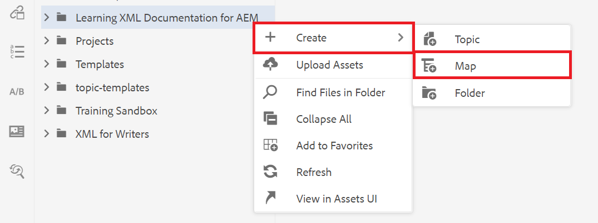
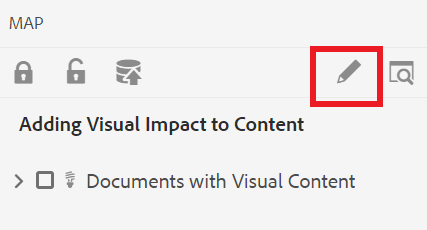

# Création d’une carte

Une carte est un outil organisationnel qui vous permet d’ajouter et d’organiser des informations dans une structure hiérarchique. Ces tâches vous montrent comment créer une carte et organiser le contenu dans la carte.

Vous pouvez télécharger des exemples de fichiers DITA à partir d’ici :

* [&#x200B; Documents-with-Visual-Content.dita](assets/working-with-maps/Documents-with-Visual-Content.dita)
* [Working-with-Tables.dita](assets/working-with-maps/Working-with-Tables.dita)

>[!VIDEO](https://video.tv.adobe.com/v/336725?quality=12&learn=on)

## Téléchargement des composants de mappage

Si vous le souhaitez, vous pouvez charger des fichiers d’exemple locaux dans AEM pour un ensemble de matériaux plus complet.

1. Faites glisser et déposez les fichiers locaux dans AEM pour les charger.
1. Répétez cette opération si nécessaire pour tous les fichiers, y compris les images et les rubriques.

## Création d’une carte

1. Pour ouvrir le menu [!UICONTROL Options], sélectionnez l’icône représentant des points de suspension sur votre dossier principal .

   

1. Sélectionnez **[!UICONTROL Créer]** > **[!UICONTROL Carte]**.

   

   La boîte de dialogue [!UICONTROL Créer une carte] s’affiche.

1. Dans le champ [!UICONTROL Modèle], sélectionnez **[!UICONTROL Bookmap]** dans le menu déroulant et attribuez un titre à votre carte.
1. Sélectionnez **[!UICONTROL Créer]**.

   Votre carte est créée et le rail de gauche passe automatiquement de la vue Référentiel à la vue Carte.

## Insérer les composants de mappage

1. Sélectionnez l’icône en forme de crayon dans le rail de gauche.

   

   Il s’agit de l’icône Modifier qui vous permet d’ouvrir la carte dans l’éditeur.

1. Revenez à la vue Repository en sélectionnant l’icône Repository .

   

1. Ajoutez une rubrique au mappage en la faisant glisser du référentiel vers le mappage de l’éditeur.

   L’indicateur de ligne indique l’emplacement de la rubrique.

1. Continuez à ajouter des rubriques selon vos besoins.

## Affichage de l’aperçu d’une carte

L’aperçu permet d’examiner rapidement le contenu à l’aide des formats par défaut. Il affiche les en-têtes, les paragraphes, les listes et tout autre contenu des rubriques.

1. Sélectionnez **[!UICONTROL Aperçu]** dans la barre de menu noire supérieure.

   

Votre contenu s’ouvre dans [!UICONTROL Preview].

1. Pour revenir à l’affichage Auteur et reprendre la modification de mappage, sélectionnez **Auteur.**

   

## Configuration de la structure de carte

Vous pouvez modifier la hiérarchie des rubriques dans la carte.

1. Cliquez sur l’icône d’une rubrique pour la sélectionner.
1. Utilisez les flèches pour rétrograder et promouvoir les éléments, respectivement.

   

## Enregistrer la carte comme nouvelle version

Maintenant que la carte est terminée, vous pouvez enregistrer votre travail en tant que nouvelle version et vos modifications.

1. Sélectionnez l&#39;icône **[!UICONTROL Enregistrer comme nouvelle version]** .

   

1. Dans le champ Commentaires pour la nouvelle version , saisissez un résumé bref mais clair des modifications.

1. Dans le champ Libellés de version , saisissez les libellés appropriés.

   Les libellés vous permettent de spécifier la version que vous souhaitez inclure lors de la publication.

   >[!NOTE]
   > 
   > Si votre programme est configuré avec des libellés prédéfinis, vous pouvez les sélectionner pour garantir un étiquetage cohérent.

1. Sélectionnez **Enregistrer**.

   Vous avez créé une nouvelle version de votre carte et le numéro de version est mis à jour.
