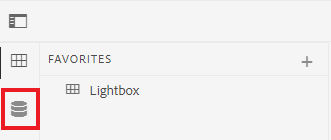
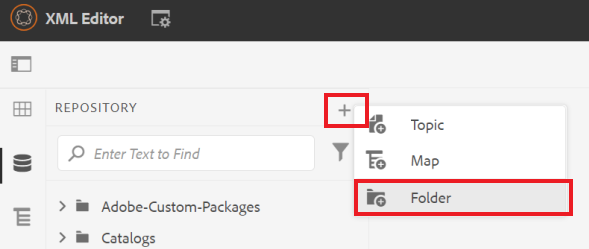
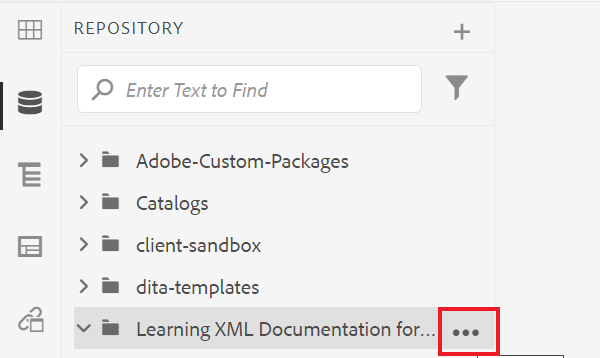
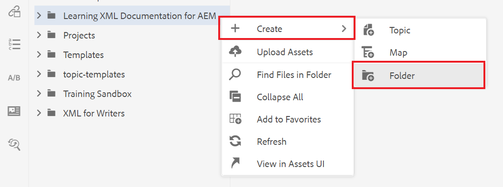
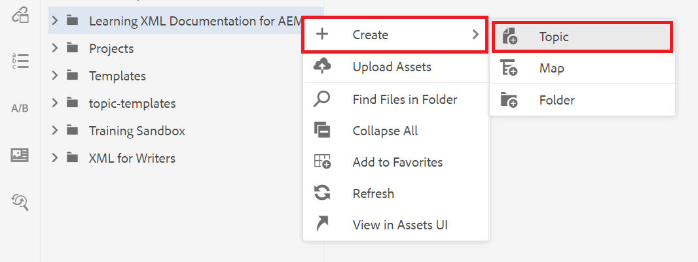
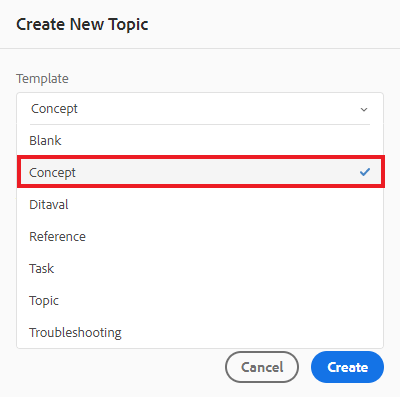
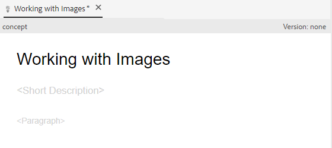

# Création et structuration de contenu

Une fois que vous vous êtes familiarisé avec l’interface utilisateur, vous pouvez commencer à créer et structurer votre propre contenu.

>[!VIDEO](https://video.tv.adobe.com/v/336657?quality=12&learn=on)

## Création d’un dossier

1. Sélectionnez l’icône **Référentiel** pour afficher vos dossiers et fichiers.

   

1. Sélectionnez l’icône **+** et **Dossier**.

   Icône 

1. Donnez un titre au dossier.
1. Sélectionnez **Créer**.
Vous avez créé un dossier qui s’affiche désormais dans le référentiel. Ce dossier sera votre page d’accueil pour tout le contenu du cours.

## Créer un sous-dossier

Nous pouvons maintenant créer un dossier à l’intérieur de votre nouveau dossier pour contenir des images ou d’autres contenus.

1. Pointez sur votre nouveau dossier dans le référentiel et sélectionnez l’icône représentant des points de suspension qui s’affiche.

   

   Le menu Options s’affiche.

1. Sélectionnez **Créer \> Dossier**.
   

1. Attribuez un titre au sous-dossier (par exemple, « images ») et sélectionnez **Créer**.

## Créer et remplir un nouveau concept

1. Pointez sur votre dossier parent dans le référentiel et sélectionnez l’icône représentant des points de suspension.

   

   Le menu Options s’affiche.

1. Sélectionnez **Créer \> Rubrique**.

   

   La boîte de dialogue Créer une rubrique s’affiche.

1. Dans le menu déroulant Modèle de la boîte de dialogue, sélectionnez **Concept**.

   

1. Donnez un titre à votre concept et sélectionnez **Créer**.

   Le nouveau concept s’affiche dans l’éditeur, renseigné avec son titre.

   

1. Renseignez le concept en cliquant sur la description courte ou le paragraphe et en saisissant votre contenu.

## Enregistrer et enregistrer comme nouvelle version

Vous pouvez enregistrer votre travail à tout moment en sélectionnant Enregistrer ou Enregistrer comme nouvelle version. Utilisez Enregistrer pour conserver vos modifications, puis cliquez sur Enregistrer comme nouvelle version pour créer une nouvelle version de votre rubrique avec les modifications actuelles.

### Enregistrement de votre travail sans contrôle de version

1. Sélectionnez l’icône **Enregistrer**.

   

### Enregistrement en tant que nouvelle version

1. Sélectionnez l’icône **Enregistrer en tant que nouvelle version** à droite de l’icône Enregistrer .

   

   La boîte de dialogue Enregistrer comme nouvelle version s’affiche.

1. Dans le champ Commentaires pour la nouvelle version , saisissez un résumé bref mais clair des modifications.
1. Dans le champ Libellés de version , saisissez les libellés appropriés.

   Les libellés vous permettent de spécifier la version à inclure lors de la publication.

   >[!NOTE]
   > 
   >Si votre programme est configuré avec des libellés prédéfinis, vous pouvez en choisir parmi ceux-ci pour garantir un étiquetage cohérent.

1. Sélectionnez **Enregistrer**.

   Vous avez créé une nouvelle version de votre rubrique, et le numéro de version est mis à jour.
