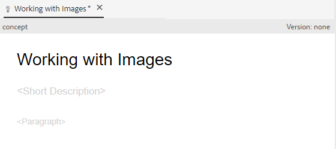

# Création et structure du contenu

Une fois que vous vous êtes familiarisé avec l’interface utilisateur, vous pouvez commencer à créer et à structurer votre propre contenu.

>[!VIDEO](https://video.tv.adobe.com/v/336657?quality=12&learn=on)

## Création d’un dossier

1. Sélectionnez l’icône **Repository** pour afficher vos dossiers et fichiers.

   

1. Sélectionnez l’icône **+** et **Dossier**.

   

1. Attribuez un titre au dossier.
1. Sélectionnez **Créer**.
Vous avez créé un dossier qui s’affiche désormais dans le référentiel. Ce dossier sera votre maison pour tout le contenu du cours.

## Création d’un sous-dossier

Nous pouvons maintenant créer un dossier dans votre nouveau dossier qui contiendra des images ou d’autres contenus.

1. Passez la souris sur votre nouveau dossier dans le référentiel et sélectionnez l’icône représentant des points de suspension qui s’affiche.

   

   Le menu Options s’affiche.

1. Sélectionnez **Créer \> Dossier**.
   

1. Donnez un titre au sous-dossier (par exemple, &quot;images&quot;) et sélectionnez **Créer**.

## Créer et renseigner un nouveau concept

1. Passez la souris sur votre dossier parent dans le référentiel et sélectionnez l’icône représentant des points de suspension.

   

   Le menu Options s’affiche.

1. Sélectionnez **Créer \> Rubrique**.

   

   La boîte de dialogue Créer une nouvelle rubrique s’affiche.

1. Dans le menu déroulant Modèle de la boîte de dialogue, sélectionnez **Concept**.

   

1. Donnez un titre à votre concept et sélectionnez **Créer**.

   Le nouveau concept s’affiche dans l’éditeur, avec son titre.

   

1. Renseignez le concept en cliquant dans la brève description ou le paragraphe et en saisissant votre contenu.

## Enregistrer et enregistrer comme nouvelle version

Vous pouvez enregistrer votre travail à tout moment à l’aide de l’option Enregistrer ou Enregistrer comme nouvelle version. Utilisez Enregistrer pour conserver vos modifications et Enregistrer comme nouvelle version pour créer une version de votre rubrique avec les modifications actuelles.

### Enregistrement de votre travail sans contrôle de version

1. Sélectionnez l&#39;icône **Enregistrer** .

   

### Enregistrement d’une nouvelle version

1. Sélectionnez l&#39;icône **Enregistrer comme nouvelle version** à droite de l&#39;icône Enregistrer.

   

   La boîte de dialogue Enregistrer comme nouvelle version s’affiche.

1. Dans le champ Commentaires pour la nouvelle version , saisissez un résumé bref mais clair des modifications.
1. Dans le champ Libellés de version , saisissez les libellés appropriés.

   Les libellés vous permettent de spécifier la version que vous souhaitez inclure lors de la publication.

   >[!NOTE]
   > 
   > Si votre programme est configuré avec des libellés prédéfinis, vous pouvez les sélectionner pour garantir un étiquetage cohérent.

1. Sélectionnez **Enregistrer**.

   Vous avez créé une nouvelle version de votre rubrique et le numéro de version est mis à jour.
