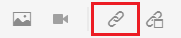
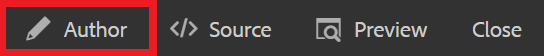

# Liaison à des sites web

Les liens Web dirigent les lecteurs vers des sites Web pour obtenir plus d&#39;informations, leur permettent d&#39;interagir avec du contenu externe ou donnent accès à des fichiers téléchargeables. Les étapes suivantes expliquent comment ajouter un lien web à un concept existant.

>[!VIDEO](https://video.tv.adobe.com/v/336656?quality=12&learn=on)

## Insérer un lien

1. Sélectionnez votre concept dans le référentiel et ouvrez-le dans l’éditeur.
1. Ajoutez une chaîne de texte à votre concept et mettez-la en surbrillance, ou mettez en surbrillance le texte existant de votre choix.

   Votre lien sera inséré dans ce texte en surbrillance.
1. Sélectionnez le bouton **Insérer une référence croisée** dans la barre d’outils.

   

   La boîte de dialogue Référence s’affiche.

1. Sélectionnez **Lien web** dans le menu de gauche.
1. Collez l’URL souhaitée, puis cliquez sur **Sélectionner**.

   Le lien est fonctionnel et ouvre une page web dans un nouvel onglet du navigateur lorsque l’utilisateur clique dessus.

## Utilisation de l’aperçu pour tester les liens

Le bouton Aperçu vous permet d’afficher un aperçu d’une rubrique. Ici, vous pouvez tester vos liens et les afficher comme le ferait votre audience.

1. Sélectionnez **Aperçu** dans la barre de menus noire supérieure.

   

   Votre concept s’ouvre dans l’aperçu.

1. Sélectionnez votre lien.
La destination du lien s’ouvre dans un autre onglet.
1. Revenez à la vue Auteur en sélectionnant **Auteur** dans la barre de menus supérieure noire.

   

## Enregistrement en tant que nouvelle version

Maintenant que vous avez ajouté plus de contenu à votre concept, vous pouvez enregistrer votre travail en tant que nouvelle version et enregistrer vos modifications.

1. Sélectionnez l’icône **Enregistrer en tant que nouvelle version**.

   

1. Dans le champ Commentaires pour la nouvelle version , saisissez un résumé bref mais clair des modifications.
1. Dans le champ Libellés de version , saisissez les libellés appropriés.

   Les libellés vous permettent de spécifier la version à inclure lors de la publication.

   >[!NOTE]
   > 
   Si votre programme est configuré avec des libellés prédéfinis, vous pouvez en choisir parmi ceux-ci pour garantir un étiquetage cohérent.

1. Sélectionnez **Enregistrer**.

   Vous avez créé une nouvelle version de votre rubrique, et le numéro de version est mis à jour.
