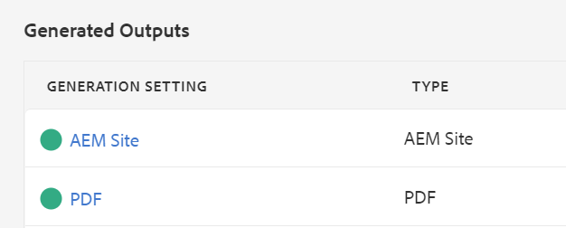

# Publication de la sortie par défaut

Une fois que vous disposez d’une carte terminée, vous pouvez publier votre contenu dans plusieurs formats de sortie.

>[!VIDEO](https://video.tv.adobe.com/v/336662?quality=12&learn=on)

## Publication de votre carte en tant que site AEM et PDF

Vous pouvez choisir un certain nombre de paramètres prédéfinis de sortie. Ce guide se concentrera sur les résultats du site AEM et du PDF.

1. Dans le référentiel, sélectionnez l’icône représentant des points de suspension sur votre carte pour ouvrir le menu Options, puis **Ouvrez dans Tableau de bord des cartes.**

   

   Le tableau de bord des cartes s’ouvre dans un autre onglet.

2. Dans l’onglet Paramètres prédéfinis de sortie, sélectionnez AEM Site et PDF.

   

3. Sélectionner **Générez.**

4. Accédez à la page Sorties pour afficher l’état des sorties générées.

   Un cercle vert indique que la génération est terminée.

   

## Sortie AEM site

Dans la sortie AEM site, les rubriques, listes, images, titres, tableaux et autres contenus créés avec l’éditeur XML sont automatiquement publiés par AEM dans un contenu compatible avec le web.

Vous pouvez consulter les rubriques Secondaires dans la table des matières ainsi que dans la section Informations connexes . Ces liens peuvent tous être utilisés pour naviguer.

## Sortie PDF

Le document de PDF terminé contient le titre par défaut de la carte en tant que titre principal sur la page de garde. Les pages de couverture de chapitre sont stylisées avec le numéro de chapitre et contiennent des liens vers les rubriques dans .
