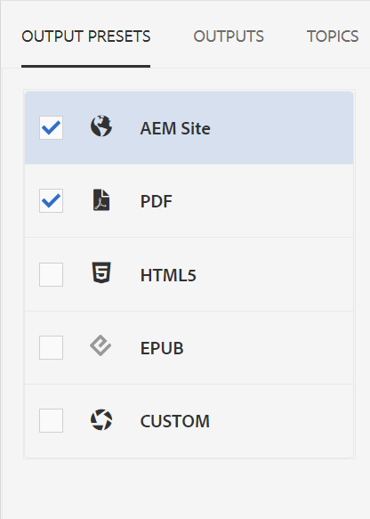
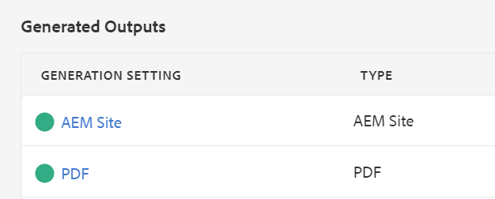

# Publication de la sortie par défaut

Une fois que vous disposez d’une carte terminée, vous pouvez publier votre contenu dans plusieurs formats de sortie.

>[!VIDEO](https://video.tv.adobe.com/v/336662?quality=12&learn=on)

## Publication de votre carte en tant que site AEM et PDF

Vous pouvez choisir parmi un certain nombre de paramètres prédéfinis de sortie. Ce guide se concentre sur les sorties du site AEM et de PDF.

1. Dans le référentiel, sélectionnez l’icône représentant des points de suspension sur votre carte pour ouvrir le menu Options, puis **Ouvrir dans le tableau de bord des cartes**.

   

   Le tableau de bord des cartes s’ouvre dans un autre onglet.

1. Dans l’onglet Paramètres prédéfinis de sortie , sélectionnez Site AEM et PDF.

   

1. Sélectionnez **Générer.**

1. Accédez à la page Sorties pour afficher le statut des sorties générées.

   Un cercle vert indique que la génération est terminée.

   

## Sortie de site AEM

Dans la sortie de site AEM, les rubriques, les listes, les images, les titres, les tableaux et tout autre contenu créé avec l’éditeur XML sont automatiquement publiés par AEM sur un contenu convivial sur le web.

Vous pouvez voir les rubriques subordonnées dans la table des matières ainsi que dans la section Informations connexes. Ces liens peuvent tous être utilisés pour naviguer.

## Sortie PDF

Le document PDF terminé contient le titre par défaut de la carte comme titre principal sur la page de garde. Les pages de garde des chapitres sont mises en forme avec le numéro de chapitre et contiennent des liens vers les rubriques qu’elles contiennent.
