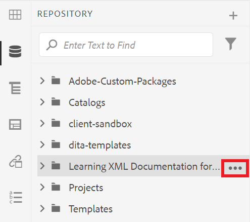
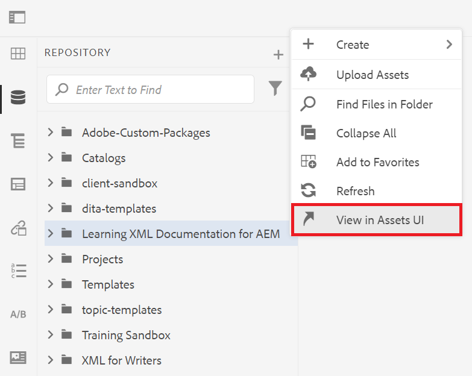
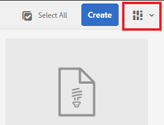
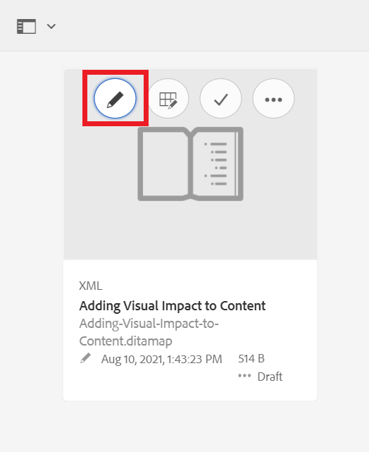

# Présentation de l’interface utilisateur d’AEM

Découvrez comment gérer les ressources, les fichiers et les dossiers dans l’éditeur XML pour Experience Manager.

>[!VIDEO](https://video.tv.adobe.com/v/336659?quality=12&learn=on)

## Accès à l’éditeur XML

1. Dans l’écran de connexion, saisissez votre nom d’utilisateur et votre mot de passe, puis sélectionnez **[!UICONTROL Se connecter]**.
1. Sélectionnez **[!UICONTROL Éditeur XML]** dans la page Navigation d’AEM.

## Vues de l’éditeur XML

Dans la barre latérale, vous pouvez choisir parmi plusieurs vues l’éditeur XML en fonction des besoins de votre organisation. Il s’agit notamment de la vue par défaut et de la [!UICONTROL vue du référentiel].

La vue par défaut affiche vos [!UICONTROL Favoris]. Vous pouvez le personnaliser davantage à l’aide de raccourcis, au besoin. À l’inverse, la [!UICONTROL vue du référentiel] affiche une structure de dossiers plus traditionnelle.

### Basculer vers la vue [!UICONTROL Référentiel] à partir de la vue par défaut

1. Dans le rail de gauche, sélectionnez **[!UICONTROL Vue du référentiel]**.

   

   La [!UICONTROL vue du référentiel] s’affiche.

## Interface utilisateur d’Assets

Dans l’interface , vous pouvez afficher les éléments suivants :

### Affichage du contenu dans l’interface utilisateur d’Assets

Vous pouvez effectuer des actions supplémentaires avec votre contenu. L’une de ces options consiste à afficher votre fichier dans l’interface utilisateur d’Assets.

1. Pointez sur un dossier ou une rubrique dans le référentiel et sélectionnez l’icône représentant des points de suspension qui s’affiche.

   

   Le menu Options s’affiche.

1. Dans le menu, sélectionnez **Afficher dans l’interface utilisateur d’Assets.**

   

### Sélectionner une vue

Vous pouvez choisir parmi plusieurs vues pour l’interface utilisateur d’Assets afin de répondre au mieux aux besoins de votre entreprise.

1. Sélectionnez l’icône **Sélecteur de vue** dans le coin supérieur droit.

   

   Un menu déroulant s’affiche.

1. Sélectionnez la vue que vous souhaitez utiliser.

### Vues de l’interface utilisateur d’Assets

| Nom | Description |
| --- | --- |
| Mode Carte | Affiche chaque ressource sous forme d’icône |
| Vue Colonnes | Affiche les ressources dans une structure de dossiers condensée et extensible. |
| Vue Liste | Affiche les ressources dans une liste, ainsi que leurs détails |

## Retour à l’éditeur XML

Vous pouvez revenir à l’éditeur XML à partir de n’importe quel mode de l’interface utilisateur d’Assets.

### Retour depuis la vue Liste et Colonnes

1. Sélectionnez la rubrique à modifier dans la liste.
La rubrique s’affiche dans l’interface utilisateur d’Assets.
1. Sélectionnez **Modifier** dans la barre d’outils supérieure.
Vous revenez à l’éditeur XML.

### Retour à partir du mode Carte

1. Sélectionnez l’icône en forme de crayon sur une rubrique de l’interface utilisateur d’.

   

   Vous revenez à l’éditeur XML.
