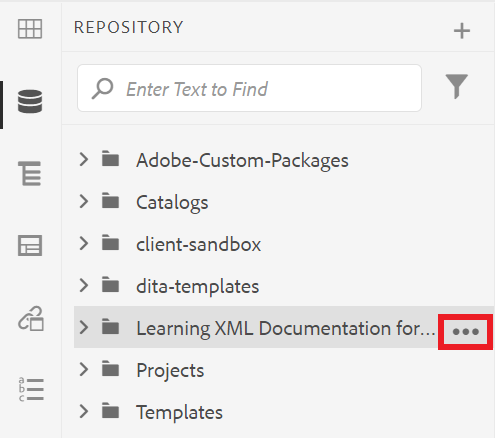

# Présentation de l’interface utilisateur AEM

Découvrez la gestion des ressources, des fichiers et des dossiers dans l’éditeur XML pour Experience Manager.

>[!VIDEO](https://video.tv.adobe.com/v/336659?quality=12&learn=on)

## Accès à l’éditeur XML

1. Dans l’écran de connexion, saisissez votre nom d’utilisateur et votre mot de passe, puis sélectionnez **[!UICONTROL Se connecter]**.
1. Sélectionnez **[!UICONTROL Éditeur XML]** sur la page de navigation AEM.

## Vues de l’éditeur XML

Dans la barre latérale, vous pouvez choisir parmi plusieurs vues pour l’éditeur XML en fonction de vos besoins organisationnels. Il s’agit de la vue par défaut et de la [!UICONTROL vue du référentiel].

La vue par défaut affiche vos [!UICONTROL Favoris]. Vous pouvez le personnaliser davantage à l’aide de raccourcis si nécessaire. Inversement, la [!UICONTROL vue du référentiel] affiche une structure de dossiers plus traditionnelle.

### Basculer vers la [!UICONTROL  vue du référentiel ] depuis la vue par défaut

1. Dans le rail de gauche, sélectionnez **[!UICONTROL Repository View]**.

   

   La [!UICONTROL vue du référentiel] s’affiche.

## L’interface utilisateur d’Assets

Dans l’interface [!UICONTROL Assets], vous pouvez afficher

### Affichage du contenu dans l’interface utilisateur d’Assets

Vous pouvez effectuer d’autres actions avec votre contenu. L’une de ces options consiste à afficher votre fichier dans l’interface utilisateur d’Assets.

1. Passez la souris sur un dossier ou une rubrique du référentiel et sélectionnez l’icône représentant des points de suspension qui s’affiche.

   

   Le menu Options s’affiche.

1. Dans le menu, sélectionnez **Afficher dans l’interface utilisateur d’Assets.**

   

### Sélection d’une vue

Vous pouvez choisir parmi plusieurs vues pour l’interface utilisateur d’Assets afin de mieux répondre aux besoins de votre entreprise.

1. Sélectionnez l’icône **Sélecteur d’affichage** dans le coin supérieur droit.

   

   Un menu déroulant s’affiche.

1. Sélectionnez la vue que vous souhaitez utiliser.

### Affichages de l’interface utilisateur d’Assets

| Nom | Description |
| --- | --- |
| Mode Carte | Affiche chaque ressource sous forme d’icône |
| Vue Colonnes | Affiche les ressources dans une structure de dossiers condensée et extensible |
| Vue Liste | Affiche les ressources dans une liste, ainsi que leurs détails. |

## Retour à l’éditeur XML

Vous pouvez revenir à l’éditeur XML à partir de n’importe quelle vue de l’interface utilisateur d’Assets.

### Retour depuis le mode Liste et Colonnes

1. Sélectionnez la rubrique à modifier dans la liste.
La rubrique s’affiche dans l’interface utilisateur d’Assets.
1. Sélectionnez **Modifier** dans la barre d’outils supérieure.
Vous êtes alors renvoyé à l’éditeur XML.

### Retour à partir du mode Carte

1. Sélectionnez l’icône en forme de crayon sur une rubrique dans l’interface utilisateur de [!UICONTROL Assets].

   

   Vous êtes alors renvoyé à l’éditeur XML.
