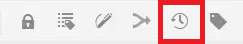

# Contenu de version

La création de versions d’un document crée un instantané de son état actuel. La création de plusieurs versions d’une rubrique ou d’un mappage vous permet de suivre vos modifications et de récupérer les tâches plus anciennes.

>[!VIDEO](https://video.tv.adobe.com/v/336724?quality=12&learn=on)

## Créer une nouvelle version

1. Sélectionnez l’icône Enregistrer comme nouvelle version .

   

   La boîte de dialogue Enregistrer comme nouvelle version s’affiche.

1. Dans le champ Commentaires pour la nouvelle version , saisissez un résumé bref mais clair des modifications.
1. Dans le champ Libellés de version , saisissez les libellés appropriés.

   Les libellés vous permettent de spécifier la version que vous souhaitez inclure lors de la publication.

   >[!NOTE]
   >
   >Si votre programme est configuré avec des libellés prédéfinis, vous pouvez les sélectionner pour garantir un étiquetage cohérent.

1. Sélectionnez **Enregistrer**.

   Vous avez créé une nouvelle version de votre rubrique et le numéro de version est mis à jour. La première version d’un document sera la version 1.0.

## Affichage de l’historique des versions

Une fois que vous disposez de plusieurs versions de votre contenu, vous pouvez explorer les différences entre elles.

1. Sélectionnez l’icône Historique de version dans la barre d’outils.

   

   La boîte de dialogue Historique des versions s’affiche.

1. Sélectionnez une version dans la liste déroulante pour comparer votre version actuelle.

   Vos modifications de version à version sont indiquées.

## Restauration vers une version sélectionnée

Si nécessaire, vous pouvez sélectionner une version et y revenir. Vous pouvez ainsi ignorer la version actuelle et revenir à l’utilisation d’une version antérieure.

1. Dans la boîte de dialogue Historique des versions , sélectionnez la version à restaurer dans la liste déroulante.
1. Sélectionner **Revenir à la version sélectionnée**.

La boîte de dialogue Rétablir la version s’affiche.

1. Ajoutez un commentaire descriptif sur la raison pour laquelle vous revenez à une version précédente.
1. Sélectionner **Confirmer**.

   Votre rubrique est revenue à la version spécifique.

## Utilisation de filtres pour comparer des versions

Vous pouvez également afficher les différences de version dans l’aperçu à l’aide des filtres Tracking et Afficher l’écart dans le rail de droite.

1. Sélectionner **Aperçu** dans la barre de menu supérieure.

   

   Votre rubrique s’ouvre dans Aperçu.

1. Dans la liste déroulante Suivi située sur le rail de droite, sélectionnez **Afficher le balisage**.
1. Dans la liste déroulante Afficher l’outil de comparaison, sélectionnez la version à comparer.

   Vos modifications s’affichent sous forme de contenu formaté.
