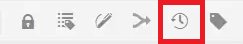
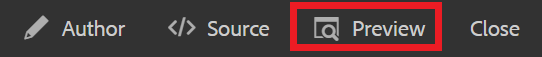

# Contrôle de version du contenu

Le contrôle de version d’un document crée un instantané de son état actuel. La création de plusieurs versions d&#39;une rubrique ou d&#39;un mappage vous permet de suivre vos modifications et de récupérer les anciennes tâches.

>[!VIDEO](https://video.tv.adobe.com/v/336724?quality=12&learn=on)

## Création d’une version

1. Sélectionnez l’icône Enregistrer en tant que nouvelle version .

   

   La boîte de dialogue Enregistrer comme nouvelle version s’affiche.

1. Dans le champ Commentaires pour la nouvelle version , saisissez un résumé bref mais clair des modifications.
1. Dans le champ Libellés de version , saisissez les libellés appropriés.

   Les libellés vous permettent de spécifier la version à inclure lors de la publication.

   >[!NOTE]
   >
   Si votre programme est configuré avec des libellés prédéfinis, vous pouvez en choisir parmi ceux-ci pour garantir un étiquetage cohérent.

1. Sélectionnez **Enregistrer**.

   Vous avez créé une nouvelle version de votre rubrique, et le numéro de version est mis à jour. La première version d&#39;un document sera la version 1.0.

## Affichage de l’historique des versions

Une fois que vous disposez de plusieurs versions de votre contenu, vous pouvez explorer les différences entre elles.

1. Sélectionnez l’icône Historique des versions dans la barre d’outils.

   

   La boîte de dialogue Historique des versions s’affiche.

1. Sélectionnez une version dans la liste déroulante pour comparer votre version actuelle.

   Vos modifications de version à version sont indiquées.

## Rétablissement d’une version sélectionnée

Si nécessaire, vous pouvez sélectionner une version et y revenir. Vous pouvez ainsi ignorer la version actuelle et revenir à une version antérieure.

1. Dans la boîte de dialogue Historique des versions , sélectionnez la version à laquelle vous souhaitez revenir dans la liste déroulante.
1. Sélectionnez **Revenir à la version sélectionnée**.

La boîte de dialogue Rétablir la version s’affiche.

1. Ajoutez un commentaire descriptif expliquant pourquoi vous revenez à une version précédente.
1. Sélectionnez **Confirmer**.

   Votre rubrique est revenue à la version spécifique.

## Utilisation de filtres pour comparer des versions

Vous pouvez également afficher les différences de version dans l’aperçu à l’aide des filtres Suivi et Afficher les différences dans le rail de droite.

1. Sélectionnez **Aperçu** dans la barre de menus supérieure.

   

   Votre rubrique s’ouvre dans l’aperçu.

1. Dans le menu déroulant Suivi du rail de droite, sélectionnez **Afficher le balisage**.
1. Dans le menu déroulant Afficher la différence , sélectionnez la version avec laquelle vous souhaitez effectuer la comparaison.

   Vos modifications s’affichent sous la forme de contenu formaté.
