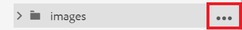
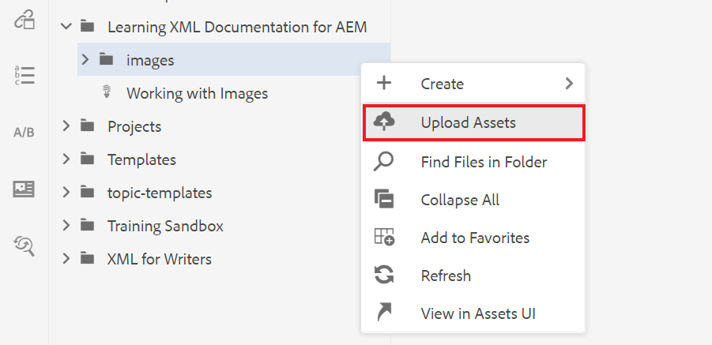
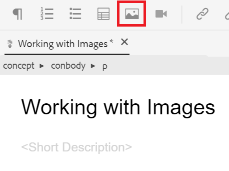
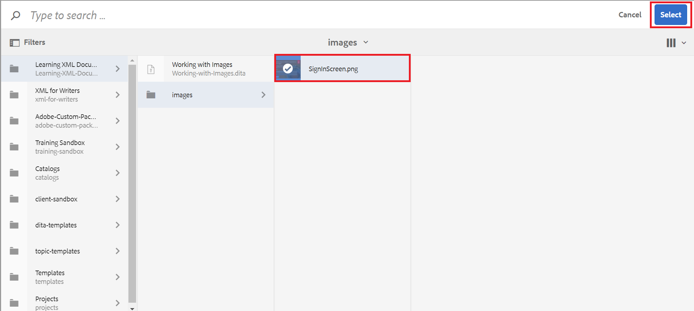

# Utilisation des images

Vous trouverez ci-dessous des instructions pour charger et insérer une image, ainsi que pour enregistrer une nouvelle version d’une rubrique.

Vous pouvez télécharger l’exemple de fichier image à partir de [ici.](assets/working-with-images/SignInScreen.png)

>[!VIDEO](https://video.tv.adobe.com/v/336661?quality=12&learn=on)

## Chargement d’une image

1. Pointez sur votre sous-dossier et sélectionnez l’icône représentant des points de suspension pour ouvrir le menu Options .

   

1. Sélectionnez **[!UICONTROL Charger Assets]**.

   

1. Sélectionnez l’image à charger à partir de votre système local, puis sélectionnez **Ouvrir**.

   La boîte de dialogue [!UICONTROL Télécharger Assets] s’affiche.

1. Sélectionnez **Charger**.

## Insérer une image dans une rubrique

Il existe plusieurs façons d’insérer une image dans votre rubrique.

Vous pouvez faire glisser et déposer une image de votre système local dans votre rubrique. Si votre image est déjà chargée, vous pouvez également la faire glisser directement dans votre rubrique à partir du rail de gauche. Vous pouvez également utiliser le bouton Insérer une image pour insérer des images qui ne sont actuellement pas visibles dans le rail de gauche, et pour configurer davantage votre image avant de l’insérer.

Pour les éléments suivants, assurez-vous que votre rubrique est ouverte dans l’éditeur de documents.

### Insérer une image par glisser-déposer

1. Sélectionnez le fichier image dans votre système local ou le rail de gauche, puis faites-le glisser et déposez-le dans votre rubrique.

   Votre image s’affiche dans l’éditeur.

### Insérer une image à l’aide du bouton Insérer une image

1. Sélectionnez l’icône **Insérer une image**.

   

   La boîte de dialogue Insérer une image s&#39;affiche.

1. Sélectionnez l’icône de dossier en regard du champ Sélectionner un fichier pour rechercher votre image ou accédez à son emplacement dans le référentiel.
1. Sélectionnez l’icône de l’image, puis **Sélectionner**.

   

   La boîte de dialogue Insérer une image s&#39;affiche avec les informations de l&#39;image choisie.

1. Saisissez du texte dans les champs Titre de la figure et Texte secondaire selon les besoins.
1. Sélectionnez **Insérer**.

   Votre image s’affiche dans l’éditeur avec le titre de la figure.

## Suppression d’une image d’une rubrique

1. Sélectionnez l’image dans l’éditeur de documents et appuyez sur la touche **Supprimer**.

## Enregistrement d’une nouvelle version d’une rubrique

Le contrôle de version vous permet de vérifier et de comparer différentes versions. Vous pouvez même restaurer une version précédente.

Étant donné que vous avez apporté un changement important à votre rubrique, vous trouverez peut-être utile d’enregistrer votre travail actuel en tant que nouvelle version.

1. Sélectionnez l’icône **Enregistrer en tant que nouvelle version**.

   

   La boîte de dialogue **Enregistrer comme nouvelle version** s’affiche.

1. Dans le champ Commentaires pour la nouvelle version , saisissez un résumé bref mais clair des modifications.
1. Dans le champ Libellés de version , saisissez les libellés appropriés.

   Les libellés vous permettent de spécifier la version à inclure lors de la publication.

   >[!NOTE]
   > 
   Si votre programme est configuré avec des libellés prédéfinis, vous pouvez en choisir parmi ceux-ci pour garantir un étiquetage cohérent.

1. Sélectionnez **Enregistrer**.

   Vous avez créé une nouvelle version de votre rubrique, et le numéro de version est mis à jour.
