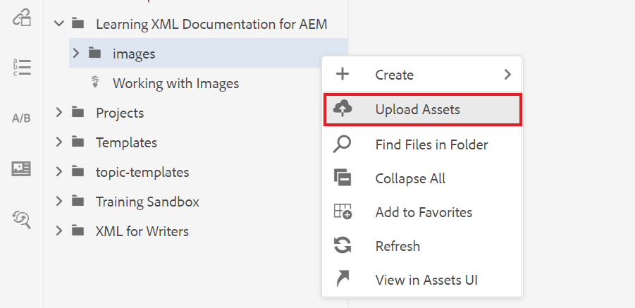

# Utilisation d’images

Vous trouverez ci-dessous des instructions pour télécharger et insérer une image, ainsi que pour enregistrer une nouvelle version d’une rubrique.

Vous pouvez télécharger l’exemple de fichier image à partir de [ici.](assets/working-with-images/SignInScreen.png)

>[!VIDEO](https://video.tv.adobe.com/v/336661?quality=12&learn=on)

## Chargement d’une image

1. Passez la souris sur votre sous-dossier et sélectionnez l’icône représentant des points de suspension pour ouvrir le menu Options.

   

1. Sélectionner **[!UICONTROL Chargement de ressources]**.

   

1. Sélectionnez l’image que vous souhaitez télécharger depuis votre système local, puis sélectionnez **Ouvrir**.

   Le [!UICONTROL Chargement de ressources] s’affiche.

1. Sélectionnez **Télécharger**.

## Insérer une image dans une rubrique

Il existe plusieurs façons d’insérer une image dans votre rubrique.

Vous pouvez faire glisser une image de votre système local vers votre rubrique. Si votre image est déjà téléchargée, vous pouvez également la faire glisser et la déposer directement dans votre rubrique à partir du rail de gauche. Vous pouvez également utiliser le bouton Insérer l’image pour insérer des images qui ne sont actuellement pas visibles dans le rail de gauche, puis configurer davantage votre image avant de l’insérer.

Pour ce qui suit, assurez-vous que votre rubrique est ouverte dans l’éditeur de document.

### Insertion d’une image par glisser-déposer

1. Sélectionnez le fichier image sur votre système local ou le rail de gauche, puis faites-le glisser et déposez-le dans votre rubrique.

   Votre image s’affiche dans l’éditeur.

### Insérer une image à l’aide du bouton Insérer une image

1. Sélectionnez la **Insérer une image** icône .

   

   La boîte de dialogue Insérer une image s’affiche.

1. Sélectionnez l’icône de dossier en regard du champ Sélectionner un fichier pour rechercher votre image ou accédez à son emplacement dans le référentiel.
1. Sélectionnez l’icône de l’image, puis **Sélectionner**.

   

   La boîte de dialogue Insérer une image s’affiche avec les informations de l’image choisie.

1. Saisissez du texte dans les champs Titre de la figure et Texte secondaire si nécessaire.
1. Sélectionner **Insérer**.

   Votre image s’affiche dans l’éditeur, ainsi que son titre.

## Suppression d’une image d’une rubrique

1. Sélectionnez l’image dans l’éditeur de document et appuyez sur la touche **Supprimer** clé.

## Enregistrement d’une nouvelle version d’une rubrique

Le contrôle de version vous permet de passer en revue et de comparer différentes versions. Vous pouvez même restaurer une version précédente.

Comme vous avez apporté une modification importante à votre rubrique, il vous sera peut-être utile d’enregistrer votre travail actuel en tant que nouvelle version.

1. Sélectionnez la **Enregistrer comme nouvelle version** icône .

   

   Le **Enregistrer comme nouvelle version** s’affiche.

1. Dans le champ Commentaires pour la nouvelle version , saisissez un résumé bref mais clair des modifications.
1. Dans le champ Libellés de version , saisissez les libellés appropriés.

   Les libellés vous permettent de spécifier la version que vous souhaitez inclure lors de la publication.

   >[!NOTE]
   > 
   > Si votre programme est configuré avec des libellés prédéfinis, vous pouvez les sélectionner pour garantir un étiquetage cohérent.

1. Sélectionnez **Enregistrer**.

   Vous avez créé une nouvelle version de votre rubrique et le numéro de version est mis à jour.
