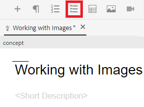

# Utiliser les listes

Vous pouvez avoir besoin de listes à puces et numérotées pour organiser vos informations. Vous trouverez ci-dessous des instructions sur l’insertion et l’utilisation de listes dans un concept existant.

>[!VIDEO](https://video.tv.adobe.com/v/336658?quality=12&learn=on)

## Listes à puces

Une liste à puces ou non triée doit être utilisée lorsque les composants de liste n’ont pas besoin d’être organisés dans un certain ordre.

### Insérer une liste à puces

1. Sélectionnez l’icône **Insérer une liste à puces** dans la barre d’outils.

   

   Une puce s’affiche. C&#39;est le début de votre liste.

1. Saisissez votre premier élément de liste.
1. Appuyez sur Entrée pour créer une deuxième entrée et saisir votre contenu.
1. Continuez à ajouter des éléments de liste selon vos besoins.

## Listes numérotées

Une liste numérotée doit être utilisée lorsque les composants de liste doivent être triés ou structurés d’une certaine manière.

### Insérer une liste ordonnée

1. Sélectionnez l’icône **Insérer une liste numérotée** dans la barre d’outils.

   

   Un nombre s’affiche. C&#39;est le début de votre liste.

1. Saisissez votre premier élément de liste.
1. Appuyez sur Entrée pour créer une deuxième entrée et saisir votre contenu.
1. Continuez à ajouter des éléments de liste selon vos besoins.

## Enregistrement en tant que nouvelle version

Maintenant que vous avez ajouté plus de contenu à votre concept, vous pouvez enregistrer votre travail en tant que nouvelle version et enregistrer vos modifications.

1. Sélectionnez l’icône **Enregistrer en tant que nouvelle version**.

   

1. Dans le champ Commentaires pour la nouvelle version , saisissez un résumé bref mais clair des modifications.
1. Dans le champ Libellés de version , saisissez les libellés appropriés.

   Les libellés vous permettent de spécifier la version à inclure lors de la publication.

   >[!NOTE]
   > 
   Si votre programme est configuré avec des libellés prédéfinis, vous pouvez en choisir parmi ceux-ci pour garantir un étiquetage cohérent.

1. Sélectionnez **Enregistrer**.

   Vous avez créé une nouvelle version de votre rubrique, et le numéro de version est mis à jour.
