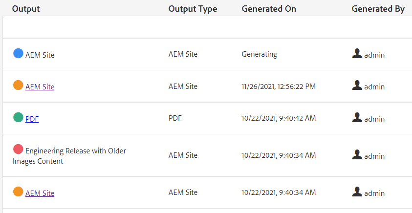

# Publication en bloc

Lors de la publication, plusieurs types de documentation sont souvent nécessaires. À l’aide des collections de cartes, vous pouvez contrôler le nombre et les types de sorties qui seront assemblés et générés et déclencher la publication en bloc. Le tableau de bord Publish vous permet d’afficher les tâches de publication actives. Le tableau de bord Publish en bloc permet d’activer les collections en bloc.

>[!VIDEO](https://video.tv.adobe.com/v/338985?quality=12&learn=on)

## Utilisation des collections de cartes

À l’aide des collections de cartes, vous pouvez contrôler les types de sortie qui seront générés pour une ou plusieurs cartes.

### Création de collections de cartes

1. Dans le menu de navigation, cliquez sur **Assets**.

1. Sélectionnez Mapper les collections.

1. Cliquez sur **Créer**.

1. Saisissez un Titre de collection.

   

1. Cliquez sur **Créer**.
1. Fermez le message de réussite.

1. Ouvrez la collection de cartes (cliquez sur la section grise sous la mosaïque).

1. Cliquez sur **Modifier**.

1. Ajoutez des mappages selon les besoins.

1. Sélectionnez ou désélectionnez **Paramètres prédéfinis de sortie** pour chaque mappage.
1. Cliquez sur **Terminé**.

### Filtrage des paramètres prédéfinis de carte

1. Ouvrez un paramètre prédéfini de carte.

1. Sous **Filtre**, développez et sélectionnez des options selon vos besoins.

### Génération de contenu dans une collection de cartes

1. Ouvrez un paramètre prédéfini de carte.

1. Si vous le souhaitez, cliquez sur **Générer tout**.

1. Ou, sélectionnez les mappages et les types de sortie à générer, puis cliquez sur **Générer la sélection**.

1. Si nécessaire, passez à l’onglet Sorties .

1. Vérifiez la sortie.

## Affichage des tâches de publication actives dans le tableau de bord Publish

Le tableau de bord Publish vous permet d’afficher les
tâches de publication. Elle affiche une liste dynamique des cartes et leur état actuel. Vous pouvez effectuer le suivi, gérer ou annuler les workflows de publication.

1. Dans la vue Navigation, cliquez sur l’icône **Outils**.

1. Cliquez sur **[!DNL Guides]**.

1. Sélectionnez la mosaïque **Tableau de bord Publish** .

       Si le tableau de bord est vide, aucune tâche de publication n’est en cours d’exécution.
       
   
1. Filtrez le tableau de bord selon les besoins pour afficher toutes les tâches de publication.

### Utilisation du tableau de bord Publish en bloc

Le tableau de bord Publish en bloc vous permet d’utiliser des collections d’activation en bloc et de contrôler plusieurs types de sorties.

### Création d’une collection d’activation en bloc

1. Dans la vue Navigation, cliquez sur l’icône **Outils**.

1. Cliquez sur **[!DNL Guides]**.

1. Sélectionnez la mosaïque **Tableau de bord Publish en bloc** .

1. Saisissez un Titre de collection.

1. Cliquez sur **Créer**.

1. Cliquez sur **Ouvrir**.

1. Ouvrez la collection de cartes (cliquez sur la section grise sous la mosaïque).

1. Cliquez sur **Modifier**.

1. Ajoutez des mappages selon les besoins.

1. Sélectionnez ou désélectionnez **Paramètres prédéfinis de sortie** pour chaque mappage.
1. Cliquez sur **Terminé**.
1. Fermez la collection de cartes lorsque vous avez terminé.

### Publish rapide : collection d’activation en bloc

1. Sélectionnez une mosaïque Collection d’activation en bloc .
1. Cliquez sur **Ouvrir**.
1. Sélectionnez une ou plusieurs cartes.
1. Cliquez sur **Quick Publish**.
