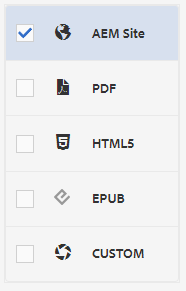

# Création et publication avec des lignes de base

L’utilisation d’une ligne de base vous permet de créer une version de vos rubriques de mappage et du contenu de référence associé. Cela peut être basé sur une date, une heure ou des étiquettes spécifiques.

>[!VIDEO](https://video.tv.adobe.com/v/338993?quality=12&learn=on)

## Accès à l’onglet Lignes de base dans le tableau de bord des cartes

Vous pouvez accéder à vos lignes de base dans le tableau de bord des cartes.

1. Repository View, sélectionnez l’icône représentant des points de suspension sur votre carte pour ouvrir le menu Options, puis **Ouvrez le tableau de bord de la carte.**

   
Le tableau de bord des cartes s’ouvre dans un autre onglet.

2. Sélectionner **Lignes de base**.

   

L’onglet Lignes de base s’affiche.

## Création d’une ligne de base à partir de libellés

1. Dans l’onglet Lignes de base , sélectionnez **Créer**.

   

   Les informations de la nouvelle ligne de base s’affichent. Son nom par défaut dépend de sa date de création.

2. Si nécessaire, donnez un nouveau nom à votre ligne de base.

3. Sous l’en-tête &quot;Définir la version sur&quot;, sélectionnez le cercle correspondant au libellé.
   

   >[!NOTE]
   >
   >REMARQUE : Le *Utiliser la dernière version si l’étiquette n’est pas présente* est sélectionnée par défaut. Si cette option n’est pas sélectionnée et que des rubriques ou des fichiers multimédias sans le libellé choisi existent dans votre carte, le processus de création de ligne de base échoue.

4. Saisissez le libellé que vous souhaitez utiliser.

5. Sélectionnez **Enregistrer**.

Votre ligne de base est créée. Un tableau de toutes les rubriques et des informations associées s’affiche.

### Utilisation de la fonction Parcourir toutes les rubriques

La fonction Parcourir toutes les rubriques vous permet d’afficher les informations de la rubrique, y compris la version et le libellé, ainsi que de spécifier la version utilisée. Vous pouvez y accéder en sélectionnant **Parcourir toutes les rubriques** lors de la création ou de la modification de la ligne de base.

## Création d’une ligne de base basée sur la date et l’heure

Vous pouvez également créer des lignes de base qui sont un instantané dans le temps.

1. Assurez-vous que l’onglet Lignes de base est ouvert et sélectionnez Créer.

   

2. Sous l’en-tête &quot;Définir la version sur&quot;, sélectionnez le cercle correspondant à &quot;Version activée&quot;.

   

3. Sélectionnez l’icône du calendrier et indiquez la date et l’heure de votre choix.

   

4. Si nécessaire, donnez un nouveau nom à votre ligne de base.

5. Sélectionnez **Enregistrer**.

Votre ligne de base est créée. Un tableau de toutes les rubriques et des informations associées s’affiche.

### Ajout de libellés à votre ligne de base

Vous pouvez attribuer une nouvelle étiquette en bloc à tout le contenu de votre carte.

1. Sélectionnez la ligne de base pour laquelle vous souhaitez ajouter des libellés.

2. Sélectionner **Ajouter des étiquettes**.

   

   La boîte de dialogue Ajouter un libellé s’affiche.

3. Saisissez le libellé à attribuer, puis sélectionnez **Ajouter**.

Le libellé a été ajouté à toutes les rubriques.

## Génération d’une sortie de site AEM à l’aide d’une ligne de base

1. Accédez à l’onglet Paramètres prédéfinis de sortie dans le tableau de bord des cartes.

2. Cochez la case AEM site .

   

3. Sélectionnez **Modifier**.

   

   Une nouvelle page s’affiche.

4. Cochez la case Utiliser la ligne de base , puis sélectionnez la ligne de base que vous souhaitez utiliser dans la liste déroulante.

   

5. Sélectionnez **Terminé**.

   

6. Sélectionner **Générer**.

   

   Votre sortie a été générée avec une ligne de base.

## Affichage de la sortie générée

1. Accédez à l’onglet Sorties du tableau de bord des cartes.

2. Sélectionnez le texte de la colonne Paramètre de génération pour ouvrir la sortie.
   

## Suppression d’une ligne de base

1. Dans l’onglet Lignes de base , sélectionnez la ligne de base à supprimer.

2. Sélectionner **Supprimer**.

   

   La boîte de dialogue Supprimer la ligne de base s’affiche.

3. Sélectionner **Supprimer**.

La ligne de base est supprimée.

## Duplication d’une ligne de base

1. Dans l&#39;onglet Lignes de base , sélectionnez la ligne de base que vous souhaitez dupliquer.

2. Sélectionner **Dupliquer**.

   

3. Sélectionnez **Enregistrer**.

   

La ligne de base en double est créée.

## Modification d’une ligne de base

Vous pouvez directement spécifier la version d’une rubrique utilisée dans une ligne de base.

1. Dans l&#39;onglet Lignes de base , sélectionnez la ligne de base que vous souhaitez modifier.
2. Sélectionnez **Modifier**.

   

3. Sélectionner **Parcourir toutes les rubriques**.

   

   Un tableau des rubriques et des informations associées s’affiche.

4. Pour les rubriques que vous souhaitez modifier, sélectionnez la version souhaitée dans la liste déroulante sous la colonne Version .

   

5. Sélectionnez **Enregistrer**.

Vos modifications ont été enregistrées. Votre ligne de base utilise désormais les versions de la rubrique que vous avez spécifiée.

## Création d’un paramètre prédéfini de sortie de site AEM personnalisé

Il est difficile de faire la distinction entre les sorties par défaut du même type dans l’onglet Sorties . L’utilisation d’un paramètre prédéfini de sortie personnalisé avec un nom unique et convivial vous permet de résoudre ce problème.

Dans ce cas, nous créons un paramètre prédéfini de sortie basé sur une ligne de base.

1. Accédez à l’onglet Paramètres prédéfinis de sortie dans le tableau de bord des cartes.

2. Sélectionnez **Créer**.

   

   Une nouvelle page de paramètres prédéfinis de sortie s’affiche, appelée Nouvelle sortie.
3. Dans le champ Nom du paramètre , saisissez un nom convivial.

4. Cochez la case Utiliser la ligne de base , puis sélectionnez la ligne de base souhaitée dans le menu déroulant.

   

5. Sélectionnez **Terminé**.

Votre nouveau paramètre prédéfini de sortie a été créé et s’affiche sur la page des paramètres prédéfinis de sortie.
