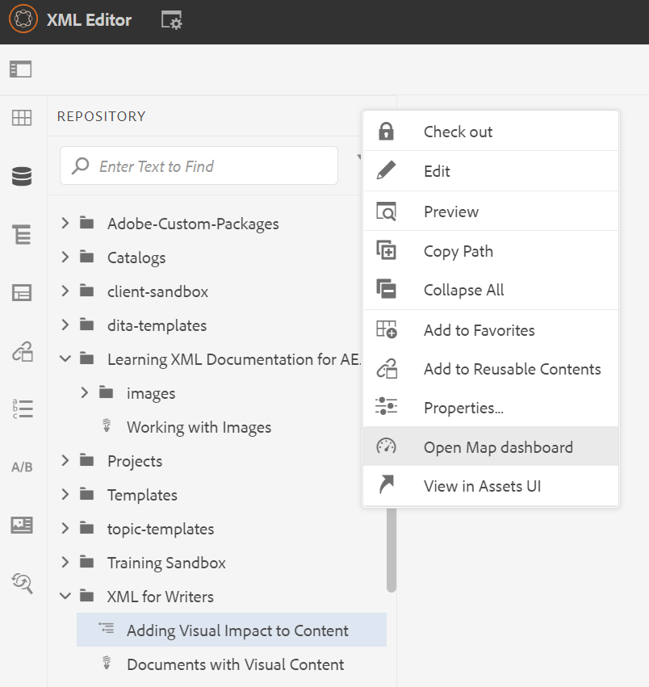
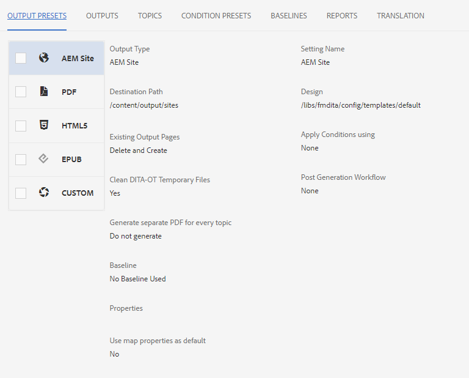
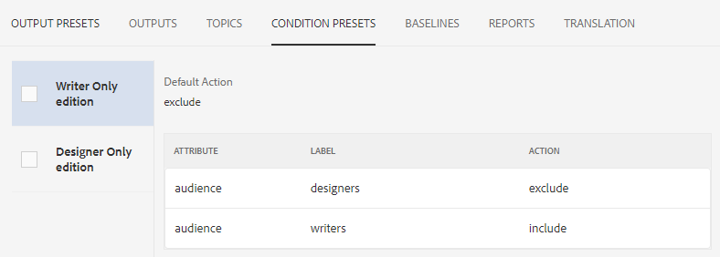
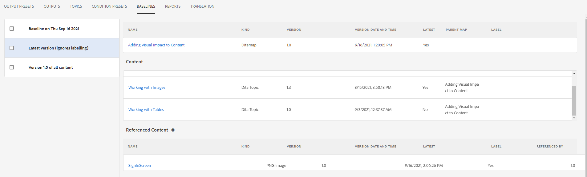
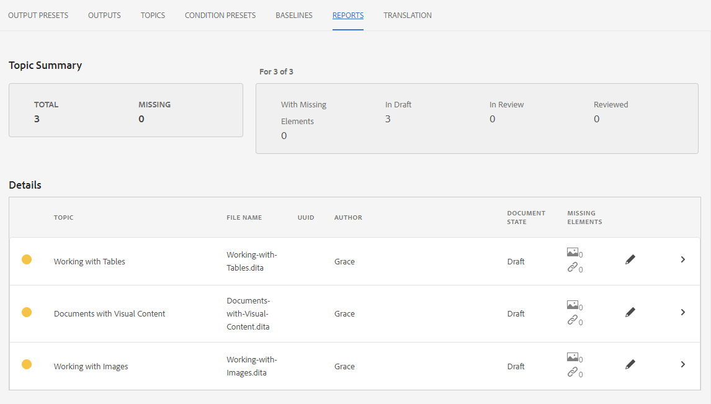

# Présentation du tableau de bord des cartes

Vous trouverez ci-dessous un aperçu des principales fonctionnalités du tableau de bord de carte.

>[!VIDEO](https://video.tv.adobe.com/v/339040?quality=12&learn=on)

## Ouvrir une carte dans le Map Dashboard

1. En mode Référentiel, sélectionnez l’icône représentant des points de suspension sur votre carte pour ouvrir le menu Options, puis Ouvrir le tableau de bord de la carte.
   

   Le tableau de bord des cartes s’ouvre dans un autre onglet.

## Composants du tableau de bord des cartes

Le tableau de bord des cartes contient plusieurs onglets, notamment les paramètres prédéfinis de sortie, les résultats de sortie, la rubrique utilisée, les lignes de base, etc.

### Paramètres prédéfinis de sortie

L’onglet Paramètres prédéfinis de sortie affiche les paramètres prédéfinis par défaut pour les différents types de sorties : Site AEM, PDF, HTML5, ePub et Personnalisé.

Vous pouvez sélectionner un paramètre prédéfini de sortie pour afficher les détails de ses paramètres, y compris le nom de la transformation, le chemin de destination, les lignes de base et les conditions appliquées.

### Sorties

L’onglet Sorties affiche toutes les sorties générées précédemment et en cours de génération.

Un cercle vert sous la colonne Paramètres de génération indique que la sortie a été générée avec succès. Le texte de cette colonne agit comme un lien hypertexte actif, et vous pouvez les sélectionner pour ouvrir la sortie générée. Les entrées de la colonne Type indiquent le type de sortie.
D’autres informations de génération de sortie sont également affichées ici, notamment le nom de l’utilisateur qui a généré la sortie, la date et l’heure de la génération, ainsi que le temps nécessaire à la génération. En cas d’erreur lors de la génération, vous pouvez sélectionner la date et l’heure de la génération sous la colonne Généré à pour ouvrir et consulter le journal des erreurs.

### Sujets

L’onglet Rubriques affiche une liste de toutes les rubriques dans la carte.

La sélection de la case à cocher d’une rubrique vous permet d’effectuer des actions supplémentaires. Vous pouvez la modifier, la régénérer et afficher, appliquer ou masquer ses balises.

### Paramètres prédéfinis de statut

L’onglet Paramètres prédéfinis de condition affiche les paramètres d’inclusion ou d’exclusion d’un contenu conditionnel spécifique.

Ici, le fait de cocher la case pour l’édition en lecture seule génère une sortie qui exclut tout le contenu avec l’attribut « audience » qui a le libellé « concepteurs » et inclut tout le contenu avec le libellé « auteurs ».

### Niveaux de référence

L&#39;onglet Niveaux de référence vous permet d&#39;afficher vos niveaux de référence.

Les lignes de base agissent comme des instantanés dans le temps et vous permettent de créer une version de vos rubriques et ressources pour publication. Par exemple, une ligne de base qui capture du contenu à une date et une heure spécifiques peut utiliser la version 1.3 d’une rubrique et la version 1.0 d’une autre rubrique, en fonction de leurs versions respectives à ce moment.
Si aucune ligne de base n’est spécifiée, la sortie est générée avec les dernières versions de tout le contenu.

### Rapports

L’onglet Rapports affiche un résumé des informations sur le sujet, y compris le nombre total de sujets utilisés, les éléments manquants dans ces sujets et l’état du document.

S’il manque un élément à une rubrique, vous pouvez sélectionner la flèche la plus à droite de la ligne pour développer l’entrée et afficher les détails de l’erreur.
