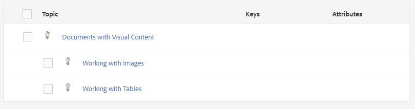

# Présentation du tableau de bord des cartes

Vous trouverez ci-dessous un aperçu des principales fonctionnalités du tableau de bord de carte.

>[!VIDEO](https://video.tv.adobe.com/v/339040)

## Ouvrir une carte dans le tableau de bord des cartes

1. En mode Référentiel, sélectionnez l’icône représentant des points de suspension sur votre carte pour ouvrir le menu Options, puis Ouvrir le tableau de bord de carte.
   

   Le tableau de bord des cartes s’ouvre dans un autre onglet.

## Composants du tableau de bord de carte

Le tableau de bord des cartes contient plusieurs onglets, notamment des paramètres prédéfinis de sortie, des résultats de sortie, une rubrique utilisée, des lignes de base, etc.

### Paramètres prédéfinis de sortie

L’onglet Paramètres prédéfinis de sortie affiche les paramètres prédéfinis par défaut pour les différents types de sorties : AEM Site, PDF, HTML5, ePub et personnalisé.

Vous pouvez sélectionner un paramètre prédéfini de sortie pour afficher les détails de ses paramètres, notamment le nom de la transformation, le chemin de destination, les lignes de base et les conditions appliquées.

### Sorties

L’onglet Sorties affiche toutes les sorties générées précédemment et qui génèrent actuellement des sorties.

Un cercle vert sous la colonne Paramètres de génération indique que la sortie a été générée avec succès. Le texte de cette colonne agit comme un principal lien hypertexte et vous pouvez les sélectionner pour ouvrir la sortie générée. Les entrées situées sous la colonne Type indiquent le type de sortie.
D’autres informations de génération de sortie sont également affichées ici, notamment le nom de l’utilisateur qui a généré la sortie, la date et l’heure de génération, ainsi que le temps nécessaire à la génération. En cas d’erreur au cours de la génération, vous pouvez sélectionner la date et l’heure de génération sous la colonne Généré à pour ouvrir et consulter le journal des erreurs.

### Sujets

L’onglet Rubriques affiche une liste de toutes vos rubriques dans le mappage.

La sélection de la case à cocher d’une rubrique vous permet d’effectuer des actions supplémentaires. Vous pouvez le modifier, le régénérer et afficher, appliquer ou masquer ses balises.

### Paramètres prédéfinis de condition

L’onglet Paramètres prédéfinis de condition affiche les paramètres pour le contenu conditionnel spécifique à inclure ou à exclure.

Dans ce cas, si vous cochez la case pour l’édition Writer uniquement , vous obtiendrez une sortie qui exclut tout le contenu avec l’attribut &quot;audience&quot; qui comporte l’étiquette &quot;designers&quot; et inclut tout le contenu avec l’étiquette &quot;authors&quot;.

### Lignes de base

L’onglet Lignes de base vous permet d’afficher vos lignes de base.

Les lignes de base agissent comme des instantanés dans le temps et vous permettent de créer une version de vos rubriques et ressources à publier. Par exemple, une ligne de base qui capture le contenu à une date et une heure spécifiques peut utiliser la version 1.3 d’une rubrique et la version 1.0 d’une autre rubrique, en fonction de leurs versions respectives à l’époque.
Si aucune ligne de base n’est spécifiée, la sortie est générée avec les dernières versions de tout le contenu.

### Rapports

L’onglet Rapports affiche un résumé des informations sur les rubriques, y compris le nombre total de rubriques utilisées, les éléments manquants dans ces rubriques et l’état du document.

Si un élément est manquant dans une rubrique, vous pouvez sélectionner la flèche la plus à droite de la ligne pour développer l’entrée et afficher les détails sur l’erreur.
