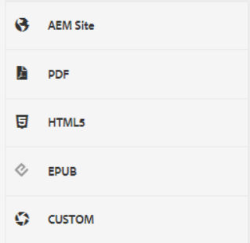
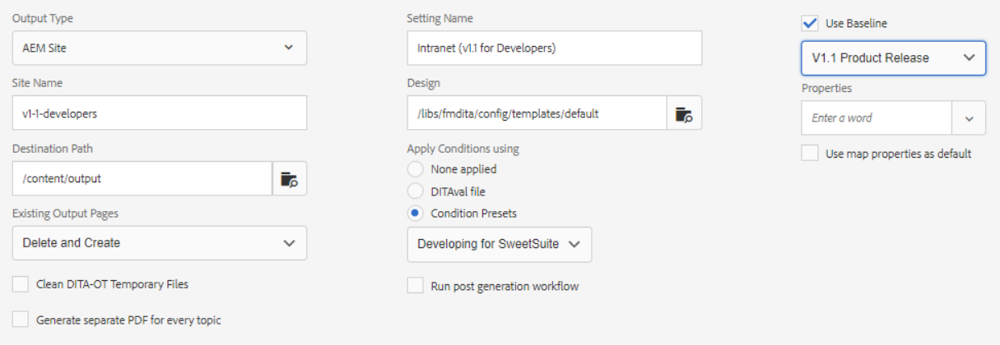

# Paramètres prédéfinis de sortie

Un paramètre prédéfini de sortie est un ensemble de propriétés de publication qui ont été affectées à un mappage. Ils peuvent être créés ou modifiés si nécessaire.

>[!VIDEO](https://video.tv.adobe.com/v/338989?quality=12&learn=on)

## Accès aux paramètres prédéfinis de sortie

Un paramètre prédéfini de sortie s’affiche lorsqu’une carte dans l’éditeur XML est ouverte dans le tableau de bord des cartes. Les paramètres prédéfinis peuvent inclure des informations sur un type de sortie spécifique, un chemin de destination, des instructions sur la gestion des pages de sortie existantes et d’autres paramètres pouvant être appliqués à une carte pour générer la sortie.

## Création d’un paramètre prédéfini de sortie

>[!NOTE]
>
>REMARQUE : Certaines des fonctionnalités utilisées par un paramètre prédéfini de sortie peuvent dépendre du développement initial d’une ligne de base ou d’un paramètre prédéfini de condition. Si vous en avez besoin, vous devez les configurer à l’aide des onglets appropriés.

1. Sélectionnez un paramètre prédéfini de sortie de ligne de base. Par exemple, AEM ou PDF peut être sélectionné si le nouveau paramètre prédéfini à créer est destiné à un site ou à fournir du contenu Adobe PDF.

2. Cliquez sur **Créer**.

3. Si nécessaire, sélectionnez un type de sortie.

4. Configurez les options en fonction du type de sortie.

5. Cliquez sur **Terminé**.

## Modification d’un paramètre prédéfini de sortie

Les paramètres prédéfinis de sortie sont prédéfinis, mais peuvent être personnalisés selon les besoins.

1. Ouvrez le tableau de bord des cartes.

2. Sélectionnez la **Paramètres prédéfinis de sortie** .

3. Sélectionnez un paramètre prédéfini de sortie.

4. Cliquez sur **Modifier**.

5. Modifiez les paramètres selon vos besoins.

   

6. Cliquez sur **Terminé**.
