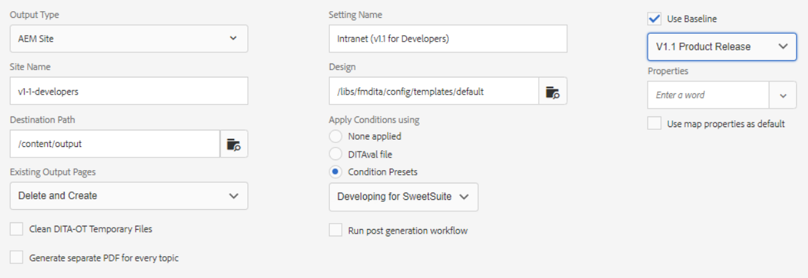

# Paramètres prédéfinis de sortie

Un paramètre prédéfini de sortie est un ensemble de propriétés de publication qui ont été affectées à un mappage. Ils peuvent être créés ou modifiés si nécessaire.

>[!VIDEO](https://video.tv.adobe.com/v/338989?quality=12&learn=on)

## Accès aux paramètres prédéfinis de sortie

Un paramètre prédéfini de sortie s’affiche lorsqu’un mappage dans l’éditeur XML est ouvert dans le tableau de bord des mappages. Les paramètres prédéfinis peuvent inclure des informations sur un type de sortie spécifique, un chemin de destination, des instructions sur la gestion des pages de sortie existantes et d’autres paramètres qui peuvent être appliqués à une carte pour générer une sortie.

## Création d’un paramètre prédéfini de sortie

>[!NOTE]
>
>REMARQUE : certaines des fonctionnalités utilisées par un paramètre prédéfini de sortie peuvent dépendre du développement initial d’une ligne de base ou d’un paramètre prédéfini de condition. S’ils sont nécessaires, vous devez les configurer à l’aide des onglets appropriés.

1. Sélectionnez un paramètre prédéfini de sortie de base. Par exemple, AEM ou PDF peut être sélectionné si le nouveau paramètre prédéfini à créer concerne un site ou pour fournir du contenu Adobe PDF.

1. Cliquez sur **Créer**.

1. Si nécessaire, sélectionnez un type de sortie.

1. Configurez ensuite les options en fonction du type de sortie.

1. Cliquez sur **Terminé**.

## Modification d’un paramètre prédéfini de sortie

Les paramètres prédéfinis de sortie sont prédéfinis, mais peuvent être personnalisés si nécessaire.

1. Ouvrez le tableau de bord des cartes.

1. Sélectionnez l’onglet **Paramètres prédéfinis de sortie**.

1. Sélectionnez un paramètre prédéfini de sortie.

1. Cliquez sur **Modifier**.

1. Modifiez les paramètres selon vos besoins.

   

1. Cliquez sur **Terminé**.
