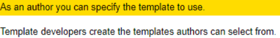

# Publication avec conditions

La publication conditionnelle permet d’écrire une source de contenu pour une ou plusieurs audiences, produits ou plateformes. Ces informations peuvent ensuite être publiées dynamiquement et uniquement le contenu spécifiquement requis inclus dans la sortie.

>[!VIDEO](https://video.tv.adobe.com/v/339041?quality=12&learn=on)

## Préparation de l’exercice

Vous pouvez télécharger des fichiers d’exemple pour l’exercice ici.

[Exercise-Download](assets/exercises/publishing-with-conditions.zip)

## Marquage du contenu avec des attributs conditionnels

1. Ouvrez la rubrique à modifier.

1. Saisissez le texte qui doit devenir conditionnel. Par exemple, un ou plusieurs paragraphes, un tableau entier, une figure ou un autre contenu.

   

1. Sélectionnez le contenu spécifique auquel attribuer un attribut conditionnel. Par exemple, un seul paragraphe dans la source.

   

1. Dans le rail de droite, assurez-vous que les propriétés s’affichent.

1. Ajoutez un attribut pour l’audience, le produit ou la plateforme.

1. Attribuez une valeur à l’attribut . Les mises à jour de l’affichage du contenu pour afficher les balises conditionnelles ont été appliquées.

   

## Prévisualiser du contenu conditionnel

1. Cliquez sur **Aperçu**. 

1. Sous **Filtres**, sélectionnez ou désélectionnez les conditions à afficher ou masquer.

1. Sélectionner ou désélectionner **Texte des conditions de mise en surbrillance**.

   

## Création d’un paramètre prédéfini de condition

Un paramètre prédéfini de condition est un ensemble de propriétés qui définissent ce qui doit être inclus ou exclu, ou autrement marqué, pendant la génération de la sortie.

1. Dans le tableau de bord des cartes, sélectionnez la variable **Paramètres prédéfinis de condition** .

1. Cliquez sur **Créer**.

1. Sélectionner **Ajouter** (ou **Tout ajouter**).

1. Attribuez un nom à la condition.

1. Sélectionnez une combinaison d’attributs, de libellés et d’actions.

   

1. Recommencez l’étape selon vos besoins.

1. Cliquez sur **Enregistrer**.

## Génération d’une sortie conditionnelle

Une fois les conditions appliquées au contenu, il peut être généré en tant que sortie. Cela peut utiliser un paramètre prédéfini de condition ou un fichier DITAval.

## Génération d’une sortie conditionnelle à l’aide d’un paramètre prédéfini de condition

1. Sélectionnez la **Paramètres prédéfinis de sortie** .

1. Sélectionnez un paramètre prédéfini de sortie.

1. Cliquez sur **Modifier**.

1. Sous **Appliquer la condition en utilisant** sélectionnez un paramètre prédéfini de condition.

   

1. Cliquez sur **Terminé**.

1. Générez le paramètre prédéfini de sortie et passez en revue le contenu.

## Génération d’une sortie conditionnelle à l’aide d’un fichier DITAval

Le fichier DITAval peut être utilisé pour publier du contenu conditionnel. Pour ce faire, un fichier doit être créé ou chargé, puis référencé lors de la publication.

1. Sélectionnez la **Paramètres prédéfinis de sortie** .

1. Sélectionnez un paramètre prédéfini de sortie.

1. Cliquez sur **Modifier**.

1. Sous Appliquer la condition à l’aide de , sélectionnez un fichier DITAval.

   

1. Cliquez sur **Terminé**.

1. Générez le paramètre prédéfini de sortie et passez en revue le contenu.
