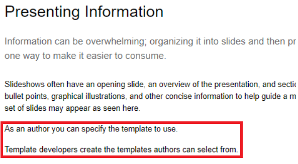
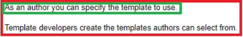
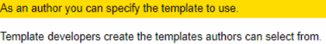
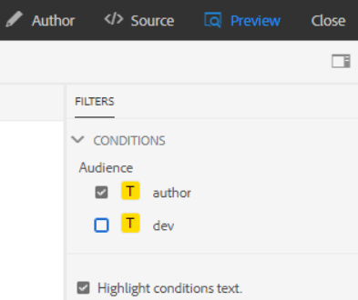
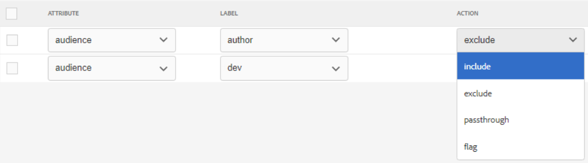
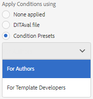
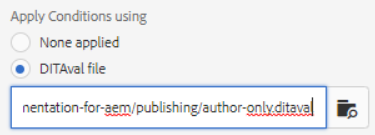

# Publication avec des conditions

La publication conditionnelle permet d’écrire une source de contenu pour une ou plusieurs audiences, un ou plusieurs produits ou plateformes. Ces informations peuvent ensuite être publiées dynamiquement et seul le contenu spécifiquement requis peut être inclus dans la sortie.

>[!VIDEO](https://video.tv.adobe.com/v/339041?quality=12&learn=on)

## Préparation de l’exercice

Vous pouvez télécharger des fichiers d’exemple pour l’exercice ici.

[Exercise-Download](assets/exercises/publishing-with-conditions.zip)

## Balisage de contenu avec des attributs conditionnels

1. Ouvrez la rubrique à modifier.

1. Saisissez le texte qui doit devenir conditionnel. Par exemple, un ou plusieurs paragraphes, un tableau entier, une image ou tout autre contenu.

   

1. Sélectionnez le contenu spécifique auquel affecter un attribut conditionnel. Par exemple, un seul paragraphe dans la source.

   

1. Dans le rail de droite, assurez-vous que les propriétés s’affichent.

1. Ajoutez un attribut pour l’audience, le produit ou la plateforme.

1. Attribuez une valeur à l’attribut . L’affichage du contenu est mis à jour pour afficher les balises conditionnelles appliquées.

   

## Prévisualiser du contenu conditionnel

1. Cliquez sur **Prévisualisation**.

1. Sous **Filtres**, sélectionnez ou désélectionnez les conditions à afficher ou masquer.

1. Sélectionnez ou désélectionnez **Texte des conditions de surbrillance**.

   

## Création d’un paramètre prédéfini de condition

Un paramètre prédéfini de condition est un ensemble de propriétés qui définissent ce qui doit être inclus ou exclu, ou autrement marqué, lors de la génération de la sortie.

1. Dans le tableau de bord des cartes, sélectionnez l’onglet **Paramètres prédéfinis de condition**.

1. Cliquez sur **Créer**.

1. Sélectionnez **Ajouter** (ou **Ajouter tout**).

1. Nommez la condition.

1. Sélectionnez une combinaison d’attributs, de libellés et d’actions.

   

1. Recommencez l’étape selon vos besoins.

1. Cliquez sur **Enregistrer**.

## Génération d’une sortie conditionnelle

Une fois que des conditions ont été appliquées au contenu, il peut être généré en tant que sortie. Vous pouvez utiliser un paramètre prédéfini de condition ou un fichier DITAval.

## Génération d’une sortie conditionnelle à l’aide d’un paramètre prédéfini de condition

1. Sélectionnez l’onglet **Paramètres prédéfinis de sortie**.

1. Sélectionnez un paramètre prédéfini de sortie.

1. Cliquez sur **Modifier**.

1. Sous **Appliquer une condition à l’aide de** sélectionnez un paramètre prédéfini de condition.

   

1. Cliquez sur **Terminé**.

1. Générez le paramètre prédéfini de sortie et vérifiez le contenu.

## Génération d&#39;une sortie conditionnelle à l&#39;aide d&#39;un fichier DITAval

Le fichier DITAval peut être utilisé pour publier du contenu conditionnel. Pour ce faire, un fichier doit être créé ou chargé, puis référencé lors de la publication.

1. Sélectionnez l’onglet **Paramètres prédéfinis de sortie**.

1. Sélectionnez un paramètre prédéfini de sortie.

1. Cliquez sur **Modifier**.

1. Sous Appliquer la condition à l&#39;aide de sélectionnez un fichier DITAval.

   

1. Cliquez sur **Terminé**.

1. Générez le paramètre prédéfini de sortie et vérifiez le contenu.
