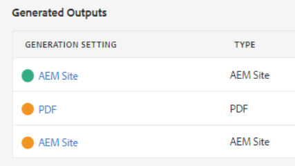
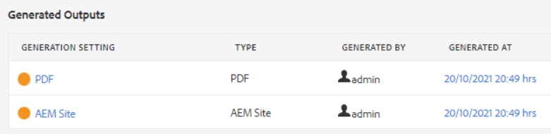
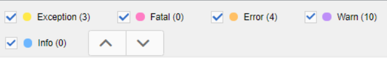

# Résolution des erreurs de publication

La publication d&#39;une carte est généralement simple. Ouvrez la carte, sélectionnez un paramètre prédéfini de sortie et générez une sortie. Cependant, si une carte ou ses rubriques contiennent des erreurs, la génération de sortie peut échouer. Dans ce cas, il est important de savoir comment résoudre les problèmes.

>[!VIDEO](https://video.tv.adobe.com/v/338990?quality=12&learn=on)

## Préparation de l’exercice

Vous pouvez télécharger des fichiers d’exemple pour l’exercice ici.

[Exercise-Download](assets/exercises/publishing-basic-to-advanced.zip)

## Causes courantes des erreurs de publication

Des erreurs peuvent s’introduire dans le contenu source. Par exemple :

* Référence de chemin de fichier incorrectement nommée

* Dossier nommé de manière incorrecte

* Graphique ou fichier manquant

* Référence de contenu configurée incorrectement

* Référence croisée rompue

* Erreurs dans les valeurs d’un attribut (par exemple, une chaîne plutôt qu’un nombre)

* Configuration incorrecte des composants utilisés par [!DNL AEM Guides]

## Impact des erreurs

Une erreur peut être mineure et entraîner une simple note vous informant qu’un fichier n’a pas été compressé correctement, ou suffisamment grave pour entraîner un échec complet de génération de la sortie. L’onglet Sorties affiche des icônes à code de couleur pour afficher les succès, les erreurs ou les échecs liés à la génération de la sortie.

## Ouverture et révision des journaux d’erreurs

Le fichier journal généré peut être ouvert pour révision.

1. Dans l’onglet **Sorties**, cliquez sur l’**date/heure sous Date et heure générées.**

   

1. Parcourez le journal des erreurs.

## Affichage et masquage des types d’erreur

Le journal des erreurs affiche chaque type d’erreur dans une couleur unique.

1. **Sélectionnez** ou **désélectionnez** tout type d’erreur pour afficher ou masquer la mise en surbrillance.

1. Parcourez les erreurs à l’aide des boutons **suivant** ou **précédent** (flèches).

## Résolution des erreurs

Selon le type d’erreur, la résolution peut être simple ou complexe. Il peut être complété par un auteur dans l’éditeur XML ou peut nécessiter l’intervention d’un administrateur pour [!DNL AEM Guides]. Les corrections spécifiques dépendent de l’erreur, de l’impact et des workflows de votre organisation.

* Référence de chemin de fichier incorrectement nommée

  Les auteurs peuvent mettre à jour la référence de chemin d’accès dans le document source.

* Dossier nommé de manière incorrecte

  Les auteurs peuvent mettre à jour le nom du dossier ou déplacer des fichiers selon les besoins.

* Graphique ou fichier manquant

  Les auteurs peuvent charger un graphique/fichier manquant, renommer un graphique/fichier ou déplacer un graphique/fichier

* Référence de contenu configurée incorrectement

  Les auteurs peuvent corriger l’emplacement du contenu référencé ou modifier le chemin d’accès vers la référence de contenu.

* Référence croisée rompue

  Les auteurs peuvent corriger l’emplacement vers lequel pointe la référence croisée ou modifier le nom ou les propriétés du fichier de destination

* Erreurs dans les valeurs d’un attribut (par exemple, une chaîne plutôt qu’un nombre)

  Les auteurs peuvent mettre à jour l’attribut avec une valeur correcte ou les administrateurs peuvent mettre à jour le système pour prendre en charge de nouvelles valeurs.

* Configuration incorrecte des composants utilisés par [!DNL AEM Guides]

  Les administrateurs peuvent mettre à jour l’installation du système, ses composants ou les autorisations.
