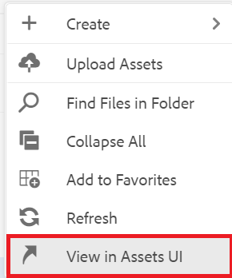

# Utilisation des rapports

L’onglet Rapports du tableau de bord des cartes permet d’identifier et de résoudre les liens rompus, le contenu référencé et réutilisé (attributs), les références croisées ou d’autres informations manquantes.

>[!VIDEO](https://video.tv.adobe.com/v/339039?quality=12&learn=on)

## Préparation de l’exercice

Vous pouvez télécharger des fichiers d’exemple pour l’exercice ici.

[Exercise-Download](assets/exercises/working-with-reports.zip)

## Chargement des ressources

1. En mode Référentiel, sélectionnez l’icône représentant des points de suspension sur votre dossier principal pour ouvrir le menu Options.

   

1. Sélectionner **[!UICONTROL Chargement de ressources]**.

   

1. Sélectionnez les fichiers que vous souhaitez charger dans le dossier, puis sélectionnez **Télécharger**.

Les fichiers DITA s’ouvrent et vous devez les examiner pour détecter des problèmes liés à un contenu manquant, à des références croisées ou des références croisées.

## Création d’une carte

1. Sélectionnez l’icône représentant des points de suspension sur votre dossier principal pour ouvrir le menu Options.

   

1. Sélectionner **Créer > Carte**.

   

   La boîte de dialogue Créer une carte s’affiche.

1. Dans le champ Modèle, sélectionnez **Bookmap** (ou **Carte** selon le type de contenu que vous créez) dans le menu déroulant et attribuez un titre à votre carte.

1. Sélectionnez **Créer**.

Votre carte est créée et le rail de gauche passe automatiquement de la vue Référentiel à la vue Carte.

## Insertion de composants de mappage

1. Sélectionnez l’icône en forme de crayon dans le rail de gauche.
Il s’agit de l’icône Modifier qui vous permet d’ouvrir la carte dans l’éditeur.

   

1. Revenez à la vue Repository en sélectionnant l’icône Repository .

   

1. Ajoutez une rubrique au mappage en la faisant glisser du référentiel vers le mappage de l’éditeur.
L’indicateur de ligne vous indique où sera placée votre rubrique.

1. Continuez à ajouter des rubriques selon vos besoins.

1. Lorsque vous avez terminé, sélectionnez **Enregistrer comme nouvelle version.**

   

1. Dans le *Commentaires sur la nouvelle version* , saisissez un commentaire descriptif.

1. Sélectionnez **Enregistrer**.

## Génération d’une sortie de site AEM

1. Dans le référentiel, sélectionnez l’icône représentant des points de suspension sur votre carte pour ouvrir le menu Options, puis **Ouvrez le tableau de bord de la carte.**

   

   Le tableau de bord des cartes s’ouvre dans un autre onglet.
1. Dans l’onglet Paramètres prédéfinis de sortie, sélectionnez **AEM site**.

   

1. Sélectionner **Générer**.

1. Accédez à la page Sorties pour afficher l’état des sorties générées.
En cas d’erreur, l’onglet Sorties peut afficher un cercle orange sous la colonne Paramètre de génération au lieu de vert, ce qui indique que la génération est terminée.

1. Sélectionnez le lien situé sous la colonne Paramètre de génération pour ouvrir la sortie générée.
Vérifiez que le contenu est manquant dans la sortie.

## Onglet Rapports

L’onglet Rapports affiche un résumé de rubrique et un tableau contenant les informations sur la rubrique et les problèmes de votre mappage.

Idéalement, après l’importation de contenu, vous devez toujours rechercher une carte dans les rapports.

La colonne Éléments manquants indique le nombre d’images manquantes et de références rompues. Vous pouvez sélectionner la variable **Crayon** pour ouvrir la rubrique dans l’éditeur.

## Résolution des images manquantes

Si des images sont manquantes dans vos fichiers, il est possible que le contenu ait été téléchargé, mais pas les images. Si tel est le cas, résolvez les problèmes d’image manquants en chargeant les images dans un dossier spécifique correspondant au chemin et aux noms de fichier attendus par les fichiers.

1. Dans *Repository View*, sélectionnez l’icône représentant des points de suspension dans votre dossier d’images pour ouvrir le menu Options.

   

1. Sélectionner **[!UICONTROL Chargement de ressources]**, puis sélectionnez les images manquantes.

1. Sélectionner **Télécharger**.

Les images manquantes ont été téléchargées. Désormais, une nouvelle sortie de site AEM affichera ces images et l’onglet Rapports n’affichera plus les erreurs d’image manquantes.

## Résolution des conrefs rompus

Si le contenu référencé ailleurs (une référence) est lié à pour un fichier dans un autre dossier (par exemple, un dossier nommé &quot;réutilisation&quot;). et que le contenu n’est pas téléchargé, une erreur doit être résolue. Par exemple, vous devez créer un sous-dossier nommé &quot;réutilisation&quot; et charger le fichier manquant dans &quot;réutilisation&quot;.

### Chargement d’une ressource avec le [!UICONTROL Ressources] Interface utilisateur

En plus de la variable [!UICONTROL Chargement de ressources] vous pouvez télécharger des ressources en les faisant glisser et en les déposant dans l’interface utilisateur d’Assets.

1. En mode Référentiel, sélectionnez l’icône représentant des points de suspension dans votre dossier de réutilisation pour ouvrir le menu Options.

   

1. Sélectionner **Affichage dans l’interface utilisateur d’Assets**.

   

1. Faites glisser et déposez le fichier dans le dossier .
Le fichier est téléchargé et l’erreur conref est résolue.

Toutes les erreurs ont maintenant été résolues. La page Rapports indique qu’il n’y a plus d’erreurs et la génération d’un site AEM entraîne une sortie complète sans composants manquants.
