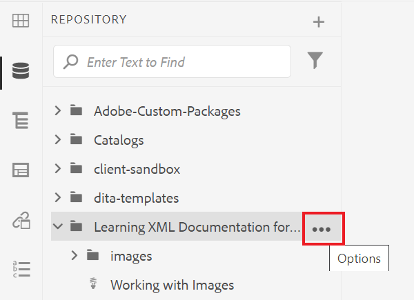
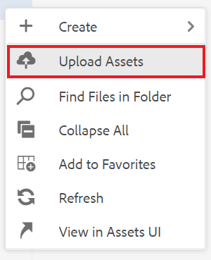
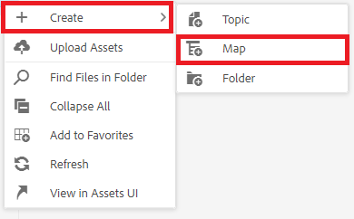
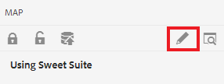
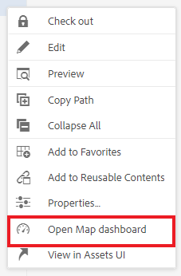
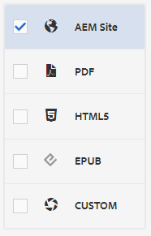
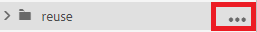
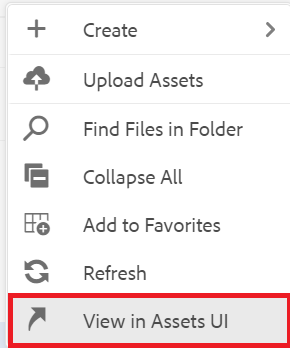

# Utilisation des rapports

L’onglet Rapports dans le tableau de bord Mapper vous permet d’identifier et de résoudre les liens rompus, le contenu référencé et réutilisé (conversions), les références croisées ou d’autres informations manquantes.

>[!VIDEO](https://video.tv.adobe.com/v/339039?quality=12&learn=on)

## Préparation de l’exercice

Vous pouvez télécharger des fichiers d’exemple pour l’exercice ici.

[Exercice-Téléchargement](assets/exercises/working-with-reports.zip)

## Chargement d’Assets

1. En mode Référentiel, sélectionnez l’icône représentant des points de suspension dans votre dossier principal pour ouvrir le menu Options.

   

1. Sélectionnez **[!UICONTROL Charger Assets]**.

   

1. Sélectionnez les fichiers à charger dans le dossier, puis sélectionnez **Charger**.

Les fichiers DITA s&#39;ouvrent et vous devez les examiner pour identifier les problèmes de contenu, de consignes ou de références croisées manquants.

## Création d’un mappage

1. Sélectionnez l’icône représentant des points de suspension dans votre dossier principal pour ouvrir le menu Options .

   

1. Sélectionnez **Créer > Mapper**.

   

   La boîte de dialogue Créer une carte s’affiche.

1. Dans le champ Modèle , sélectionnez **Bookmap** (ou **Map** en fonction du type de contenu que vous créez) dans le menu déroulant et donnez un titre à votre carte.

1. Sélectionnez **Créer**.

Votre carte est créée et le rail de gauche passe automatiquement de la vue Référentiel à la vue Carte .

## Insérer des composants de carte

1. Sélectionnez l’icône en forme de crayon dans le rail de gauche.
Il s’agit de l’icône Modifier qui vous permet d’ouvrir la carte dans l’éditeur.

   

1. Revenez à la vue Référentiel en sélectionnant l’icône Référentiel .

   

1. Ajoutez une rubrique à la carte en la faisant glisser du Référentiel vers la carte dans l’éditeur.
L’indicateur linéaire vous indique où sera placée la rubrique.

1. Continuez à ajouter des rubriques selon vos besoins.

1. Lorsque vous avez terminé, sélectionnez **Enregistrer comme nouvelle version.**

   

1. Dans le champ *Commentaires pour la nouvelle version*, saisissez un commentaire descriptif.

1. Sélectionnez **Enregistrer**.

## Générer une sortie de site AEM

1. Dans le référentiel, sélectionnez l’icône représentant des points de suspension sur votre carte pour ouvrir le menu Options, puis **Ouvrir le tableau de bord de la carte**.

   

   Le tableau de bord des cartes s’ouvre dans un autre onglet.
1. Dans l’onglet Paramètres prédéfinis de sortie , sélectionnez **Site**.

   

1. Sélectionnez **Générer**.

1. Accédez à la page Sorties pour afficher le statut des sorties générées.
En cas d’erreur, l’onglet Sorties peut afficher un cercle orange sous la colonne Paramètre de génération au lieu du vert, indiquant que la génération est terminée.

1. Sélectionnez le lien sous la colonne Paramètre de génération pour ouvrir la sortie générée.
Vérifiez votre sortie pour détecter le contenu manquant.

## Onglet Rapports

L’onglet Rapports affiche un résumé de rubrique et un tableau contenant des informations sur la rubrique et les problèmes de votre carte.

Idéalement, vous devez toujours rechercher une carte dans les rapports après avoir importé du contenu.

La colonne Éléments manquants indique le nombre d’images manquantes et de conversions rompues. Vous pouvez sélectionner l’icône **Crayon** pour ouvrir la rubrique dans l’éditeur.

## Résolution des images manquantes

Si des images sont absentes de vos fichiers, une cause courante peut être que le contenu a été chargé, mais pas les images. Si tel est le cas, résolvez les problèmes d’image manquants en chargeant les images dans un dossier spécifique correspondant au chemin d’accès et aux noms de fichier attendus par les fichiers.

1. Dans *Vue du référentiel*, sélectionnez l’icône représentant des points de suspension dans le dossier des images pour ouvrir le menu Options.

   

1. Sélectionnez **[!UICONTROL Charger Assets]**, puis sélectionnez les images manquantes.

1. Sélectionnez **Charger**.

Les images manquantes ont été chargées. Désormais, une nouvelle sortie de site AEM générée affichera ces images, et l’onglet Rapports n’affichera plus les erreurs d’image manquantes.

## Résoudre des conversions rompues

Si le contenu référencé ailleurs (une conref) renvoie vers pour un fichier dans un autre dossier (par exemple, un dossier nommé « réutiliser »). et que le contenu n’est pas chargé, une erreur doit être résolue. Par exemple, vous devez créer un sous-dossier nommé « réutiliser » et charger le fichier manquant dans « réutiliser ».

### Chargement d’une ressource avec l’interface utilisateur 

Outre l’option [!UICONTROL Télécharger Assets], vous pouvez charger des ressources en les faisant glisser vers l’interface utilisateur d’Assets.

1. En mode Référentiel, sélectionnez l’icône représentant des points de suspension dans votre dossier de réutilisation pour ouvrir le menu Options.

   

1. Sélectionnez **Afficher dans l’interface utilisateur d’Assets**.

   

1. Faites glisser le fichier dans le dossier.
Le fichier est chargé et l’erreur conref est résolue.

Toutes les erreurs ont maintenant été résolues. La page Rapports indique qu’il n’y a plus d’erreurs. La génération d’un site AEM génère une sortie complète sans composants manquants.
