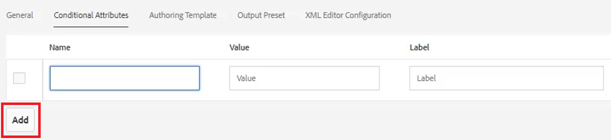
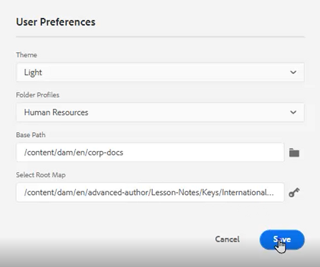

# Conditions

Dans DITA, les conditions sont souvent pilotées par des attributs tels que Produit, Plateforme et Audience. Des valeurs spécifiques peuvent également leur être affectées. Les utilisateurs peuvent contrôler tout cela via les profils de dossier.

Des exemples de fichiers que vous pouvez choisir d’utiliser pour cette leçon sont fournis dans le fichier . [conditions.zip](assets/conditions.zip).

>[!VIDEO](https://video.tv.adobe.com/v/342755?quality=12&learn=on)

## Affectation de conditions à un profil de dossier

1. Sélectionnez la **Profils de dossier** mosaïque.

2. Cliquez sur [!UICONTROL **Attributs conditionnels**].

3. Cliquez sur [!UICONTROL **Modifier**] dans le coin supérieur gauche du profil.

4. Cliquez sur [!UICONTROL **Ajouter**].

   

5. Renseignez les champs requis.

   - Le Nom doit correspondre à un attribut utilisé pour le profilage.

   - La valeur est l’entrée exacte qui sera utilisée dans la source de code DITA.

   - Le libellé est le mot qui sera affiché par l’utilisateur qui saisit des attributs.

6. Cliquez sur [!UICONTROL **Enregistrer**].

>[!NOTE]
>
>REMARQUE : la configuration d’un profil global peut être un moyen rapide et efficace de contrôler l’utilisation des attributs et des valeurs afin de suivre un guide de style cohérent.

## Attribution d’attributs aux éléments

Si aucun profil de dossier personnalisé n’a été affecté à un concept, vous pouvez attribuer des attributs à des éléments spécifiques, tels que des paragraphes.

1. Dans la **Repository View**, cliquez sur l’élément que vous souhaitez utiliser pour le sélectionner.

2. Dans le **Propriétés du contenu** , cliquez sur l’icône [!UICONTROL **Attribut**] menu déroulant.

3. Sélectionnez l’attribut que vous souhaitez attribuer.

4. Ajouter un **Valeur**.

L’association d’attributs et de valeurs est désormais affectée à l’élément sélectionné.

## Attribuer des paires d’attributs et de valeurs à l’aide de conditions

Le panneau Conditions permet une affectation contrôlée des paires Attribut/Valeur.

1. Modifiez le **Préférences utilisateur**.

   a. Cliquez sur l’icône Préférences utilisateur .

   

   b. Renseignez les champs obligatoires de la section **Préférences utilisateur** boîte de dialogue. Par exemple :

   

   c. Cliquez sur [!UICONTROL **Enregistrer**].

2. Dans le panneau des conditions, développez les listes déroulantes pour Audience et Platform. Notez que les conditions disponibles sont spécifiques à Folder Profile.

3. Faites glisser et déposez une condition sur l’élément souhaité pour l’affecter.

## Attribution d’un schéma d’objet

Les mappages de schéma d’objet sont une forme spécialisée de mappage aléatoire et sont référencés par une carte. Les schémas d’objet sont utilisés pour définir des taxonomies. Elles permettent de contrôler les valeurs disponibles.

1. Accédez au **Repository View**.

2. Sélectionnez une carte qui référence le schéma d’objet ditamap. Cet exemple utilise la carte appelée _Conception et mise en page_.

   

3. Configurez les préférences utilisateur.

   a. Cliquez sur le bouton [!UICONTROL **Préférences utilisateur**] icône .

   

   b. Renseignez les champs du **Préférences utilisateur** boîte de dialogue.

   c. Cliquez sur le symbole du dossier en regard du champ Chemin d’accès de base pour choisir le chemin d’accès au fichier souhaité.

   d. Cliquez sur [!UICONTROL **Sélectionner**].

   e. Cliquez sur le symbole de la touche en regard de la propriété **Root Map** pour saisir un chemin.

   >[!IMPORTANT]
   >
   >Important : la carte racine sélectionnée doit être la carte qui contient le schéma d’objet.

   

   f. Limitez les ressources affichées en sélectionnant le ou les dossiers que vous souhaitez utiliser.

   g. Cliquez sur [!UICONTROL **Sélectionner**].

   h. Cliquez sur [!UICONTROL **Enregistrer**].

Le schéma d’objet a maintenant été attribué.

## Affichage du schéma d’objet à partir du panneau Conditions

1. Accédez à **Paramètres de l’éditeur**.

2. Sélectionnez la **Conditions** .

3. Cochez la case **Afficher le modèle d’objet dans le panneau Conditions**
