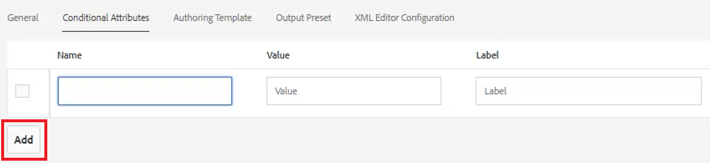
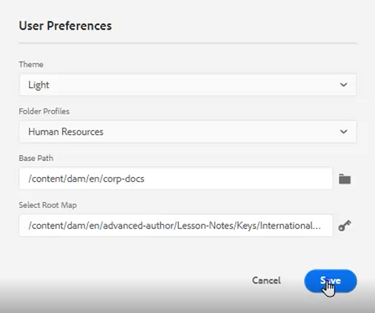
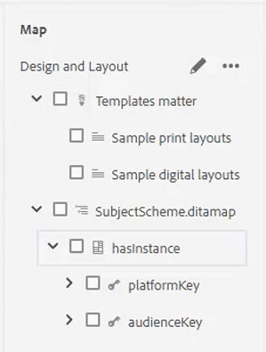
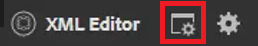
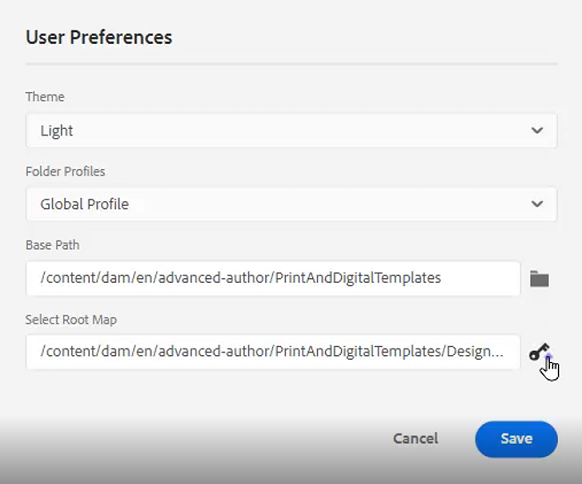

# Conditions

Dans DITA, les conditions sont souvent pilotées par des attributs tels que Product, Platform et Audience. Des valeurs spécifiques peuvent également leur être attribuées. Les utilisateurs peuvent contrôler tout cela via des profils de dossier.

Des exemples de fichiers que vous pouvez choisir d’utiliser pour cette leçon sont fournis dans le fichier [conditions.zip](assets/conditions.zip).

>[!VIDEO](https://video.tv.adobe.com/v/342755?quality=12&learn=on)

## Attribution de conditions à un profil de dossier

1. Sélectionnez la mosaïque **Profils de dossier**.

1. Cliquez sur [!UICONTROL **Attributs conditionnels**].

1. Cliquez sur [!UICONTROL **Modifier**] dans le coin supérieur gauche du profil.

1. Cliquez sur [!UICONTROL **Ajouter**].

   

1. Renseignez les champs obligatoires.

   - Le nom doit correspondre à un attribut utilisé pour le profilage.

   - La valeur est l&#39;entrée exacte qui sera utilisée dans la source de code DITA.

   - Le libellé est le mot qui sera vu par l’utilisateur qui saisit des attributs.

1. Cliquez sur [!UICONTROL **Enregistrer**].

>[!NOTE]
>
REMARQUE : la configuration d’un profil global peut être un moyen précoce et efficace de contrôler l’utilisation des attributs et des valeurs afin de suivre un guide de style cohérent.

## Attribution d’attributs aux éléments

Si aucun profil de dossier personnalisé n’a été attribué à un concept, vous pouvez attribuer des attributs à des éléments spécifiques, tels que des paragraphes.

1. Dans la **Vue du référentiel**, cliquez sur l’élément avec lequel vous souhaitez travailler pour le sélectionner.

1. Dans le panneau **Propriétés du contenu**, cliquez sur le menu déroulant [!UICONTROL **Attribut**].

1. Sélectionnez l’attribut que vous souhaitez affecter.

1. Ajoutez une **Valeur**.

L’association d’attributs et de valeurs est désormais affectée à l’élément sélectionné.

## Attribuer des paires attribut/valeur à l’aide de conditions

Le panneau Conditions permet l’affectation contrôlée des paires Attribut et Valeur.

1. Modifiez le **Préférences utilisateur**.

   a. Cliquez sur l’icône Préférences utilisateur .

   

   b. Renseignez les champs requis de la boîte de dialogue **Préférences utilisateur**. Par exemple :

   

   c. Cliquez sur [!UICONTROL **Enregistrer**].

1. Dans le panneau Conditions , développez les listes déroulantes pour Audience et Platform. Notez que les conditions disponibles sont spécifiques au profil de dossier.

1. Faites glisser et déposez une condition sur l’élément souhaité pour l’affecter.

## Attribuer un schéma d&#39;objet

Les cartes de schéma d&#39;objet sont une forme spécialisée de ditamap et sont référencées par une carte. Les schémas d&#39;objet sont utilisés pour définir des taxonomies. Ils permettent de contrôler les valeurs disponibles.

1. Accédez à la **Vue du référentiel**.

1. Sélectionnez un mappage qui fait référence au ditamap du schéma d&#39;objet. Cet exemple utilise la carte _Conception et mise en page_.

   

1. Configurez Les Préférences Utilisateur.

   a. Cliquez sur l’icône [!UICONTROL **Préférences utilisateur**].

   

   b. Renseignez les champs de la boîte de dialogue **Préférences utilisateur**.

   c. Cliquez sur le symbole de dossier en regard du champ Chemin d’accès de base pour choisir le chemin d’accès au fichier souhaité.

   d. Cliquez sur [!UICONTROL **Sélectionner**].

   e. Cliquez sur le symbole de touche en regard du champ **Carte racine** pour saisir un chemin d’accès.

   >[!IMPORTANT]
   >
   Important : la carte racine sélectionnée doit être celle qui contient le schéma d&#39;objet.

   

   f. Restreignez les ressources affichées en sélectionnant le ou les dossiers que vous souhaitez utiliser.

   g. Cliquez sur [!UICONTROL **Sélectionner**].

   h. Cliquez sur [!UICONTROL **Enregistrer**].

Le schéma d&#39;objet a maintenant été attribué.

## Affichage du schéma d&#39;objet à partir du panneau Conditions

1. Accédez à **Paramètres de l’éditeur**.

1. Sélectionnez l’onglet **Conditions**.

1. Cochez la case **Afficher le schéma d&#39;objet dans le panneau Conditions**
