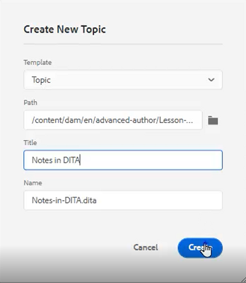
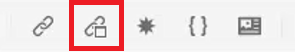
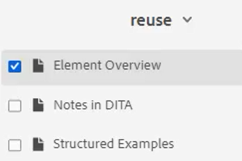
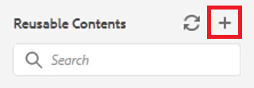

# Réutilisation du contenu

L’une des principales fonctionnalités de DITA est la possibilité de réutiliser du contenu. Il permet de réutiliser du contenu de petites phrases jusqu’à des rubriques ou des cartes entières.  Toutefois, pour que le contenu soit réutilisé efficacement, il doit être bien géré. Assurez-vous de disposer d’une stratégie de contenu efficace lorsque vous utilisez des informations réutilisables.

>[!VIDEO](https://video.tv.adobe.com/v/342757?quality=12&learn=on)

## Créer une rubrique réutilisable

Lorsqu’une modification est apportée à une rubrique source réutilisable, les informations sont mises à jour partout où le contenu est utilisé.

1. Accédez au **référentiel**.

1. Cliquez sur le **menu contextuel** en regard du dossier de réutilisation.

1. Choisissez **Créer > Rubrique Dita**.

1. Renseignez les champs de la boîte de dialogue Créer une rubrique . Par exemple :

   

1. Cliquez sur [!UICONTROL **Créer**].

1. Ajoutez du contenu à la rubrique selon vos besoins.

## Ajouter un nouvel élément réutilisable à une rubrique

Il existe plusieurs méthodes pour ajouter des éléments réutilisables. Ici, le premier workflow est préférable lors de l’ajout d’un seul composant. Le deuxième workflow est préférable pour ajouter plusieurs composants réutilisables.

### Workflow 1

1. Cliquez dans la rubrique à un emplacement valide.

1. Sélectionnez l’icône **Insérer du contenu réutilisable** dans la barre d’outils supérieure.

   

1. Dans la boîte de dialogue Réutiliser le contenu , cliquez sur l’icône [!UICONTROL **Dossier**].

1. Accédez au dossier requis.

1. Choisissez une rubrique avec des composants réutilisables.
Par exemple :

   

1. Cliquez sur [!UICONTROL **Sélectionner**].

1. Sélectionnez un composant spécifique à réutiliser.

1. Cliquez sur [!UICONTROL **Sélectionner**].

L’élément réutilisable a maintenant été inséré dans la rubrique.

### Workflow 2

1. Accédez à **Contenu réutilisable** dans le panneau de gauche.

1. Cliquez sur l’icône [!UICONTROL **Ajouter**] dans le panneau Contenu réutilisable .

   

1. Accédez à un dossier.

1. Sélectionnez une ou plusieurs rubriques spécifiques.

1. Cliquez sur [!UICONTROL **Ajouter**].

1. Dans le panneau Contenu réutilisable , développez **Présentation des éléments**.

1. Effectuez un glisser-déposer d’un élément dans la rubrique à un emplacement valide.

L’élément réutilisable a maintenant été inséré dans la rubrique.

## Attribution d’un identifiant et d’une valeur à un élément

La liste que vous venez de créer est un élément réutilisable. Par conséquent, il nécessite un identifiant et une valeur .

1. Cliquez à l’intérieur de la silhouette.

1. Dans le panneau Propriétés du contenu , cliquez sur la liste déroulante sous Attribut.

1. Sélectionnez **ID**.

1. Saisissez un nom logique pour la valeur.

1. Enregistrez ou modifiez la rubrique pour que la modification soit répercutée dans le référentiel.

L’ID et la valeur ont été affectés à l’élément.
