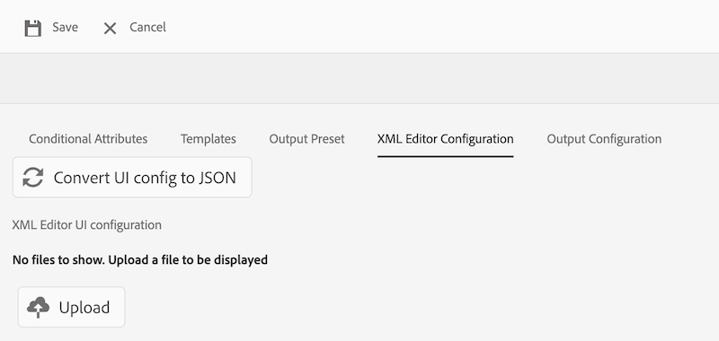

# Vue d’ensemble

Lors de la migration de l’ancienne interface utilisateur vers la nouvelle interface utilisateur d’AEM Guides, les mises à jour de **ui_config** doivent être converties en configurations d’interface utilisateur plus flexibles et modulaires. Ce framework permet d’adopter facilement des modifications dans **editor_toolbar** et [autres barres d’outils](/help/courses/course-3/conver-ui-config.md#editing-json-for-different-screens). Le processus prend également en charge la modification d’autres vues et widgets dans l’application.


## Modification de JSON pour différents écrans

Les fichiers JSON peuvent être ajoutés à la section Configuration de l’interface utilisateur de l’éditeur XML pour divers écrans et widgets. Vous trouverez ci-dessous une liste des widgets couramment utilisés et de leurs identifiants :

1. [editor_toolbar](assets/toolbars/editor_toolbar.json) : barre d’outils de l’éditeur web composée d’actions sur les fichiers et le contenu.
1. [editor_tab_bar](assets/toolbars/editor_tab_bar.json) : la vue à onglets des fichiers ouverts dans webeditor contient des actions que vous pouvez exécuter sur les fichiers ouverts.
1. [file_mode_switcher](assets/toolbars/file_mode_switcher.json) : permet de basculer entre les différents modes disponibles (auteur, source, prévisualisation) pour les fichiers ouverts dans l’éditeur web.

   

1. [map_console_navigation_bar](assets/toolbars/map_console_navigation_bar.json) : il s’agit de la barre d’informations de la carte ouverte dans la console de carte. Il permet de modifier la carte et donne accès aux paramètres.
1. [map_console_action_bar](assets/toolbars/map_console_action_bar.json) : il s’agit de la barre d’actions des éléments de la console de mappage, tels que le paramètre prédéfini de sortie, la ligne de base, la traduction et les rapports, qui fournit des informations pertinentes ainsi que leurs boutons d’action respectifs.

   

1. [home_navigation_bar](assets/toolbars/home_navigation_bar.json) : barre d’en-tête de la page d’accueil des guides dans laquelle le message de bienvenue s’affiche avec le profil de dossier sélectionné.

   

<br>

## Structure générale de chaque fichier JSON

Chaque fichier JSON suit une structure cohérente :

1. **id** : indique le widget dans lequel le composant est personnalisé.
1. **targetEditor** : définit quand afficher ou masquer un bouton à l’aide de l’éditeur et des propriétés de mode :

   Actuellement, nous avons ces **éditeur** et **mode** dans notre système.

   **editor** : ditamap, bookmap, subjectScheme, xml, css, traduction, préréglage, pdf_preset

   **mode** : auteur, source, aperçu, table des matières, partage

   (Remarque : le mode table des matières s&#39;applique au mode Mise en page.)

1. **target** : indique l’emplacement où le nouveau composant sera ajouté. Cette méthode utilise des paires clé-valeur ou des index pour une identification unique. Les états d’affichage incluent :

   * **append** : ajoutez à la fin.

   * **prepend** : ajoutez au début.

   * **replace** : permet de remplacer un composant existant.

Exemple de structure JSON :

```json
{
  "id" : "editor_toolbar",
  "view": {
    "items": [
      {
        ...,
        "targetEditor": {
          "mode": [
            "preview"
          ],
          "editor": [
            "xml"
          ]
        },
        "target": {
          "key": "label",
          "value": "Table",
          "viewState": "prepend"
        },
        ...
      },
    ]
  }
}
```

<br>

## Exemples

Vous trouverez ci-dessous un exemple d’ajout, de suppression ou de remplacement d’un bouton dans la barre d’outils de l’éditeur.

### Ajout d’un bouton

Ajout d&#39;un nouveau bouton **Insérer un tableau personnalisé** dans **editor_toolbar** pour ajouter un tableau simple visible uniquement en mode aperçu.

```json
{
  "id": "editor_toolbar",
  "view": {
    "items": [
      {
        "icon": "table",
        "title": "Insert Custom Table",
        "on-click": {
          "name": "$$AUTHOR_INSERT_ELEMENT",
          "args": [
            "simpletable",
            "table",
            "choicetable"
          ]
        },
        "key": "$$AUTHOR_INSERT_ELEMENT",
        "targetEditor": {
          "mode": [
            "preview"
          ],
        },
        "target": {
          "key": "label",
          "value": "Table",
          "viewState": "prepend"
        }
      }
    ]
  }
}
```


### Suppression d’un bouton

Suppression d’un bouton de la barre d’outils. Ici, nous supprimons le bouton Ajouter une image de la barre d’outils de l’éditeur.

```json
{
  "id": "editor_toolbar",
  "view": {
    "items": [
      {
        "hide": true,
        "target": {
          "key": "label",
          "value": "Image",
          "viewState": "replace"
        }
      }
    ]
  }
}
```

### Remplacement d’un bouton

Remplacement du bouton **Multimédia** de la barre d’outils par le bouton d’insertion de lien **Youtube** visible uniquement en mode création.

```json
{
  "id": "editor_toolbar",
  "view": {
    "items": [
      {
        "icon": "s2youtube",
        "title": "Youtube",
        "on-click": {
          "name": "$$AUTHOR_INSERT_ELEMENT",
          "args": "<object data='http://youtube.com'></object>"
        },
        "targetEditor": {
          "mode": [
            "author"
          ]
        },
        "target": {
          "key": "elementId",
          "value": "toolbar-multimedia",
          "viewState": "replace"
        }
      }
    ]
  }
}
```


<br>

## Comment charger des fichiers JSON personnalisés

1. Dans **Configuration de l’éditeur XML** cliquez sur **Modifier** dans la barre supérieure.
1. Désormais, dans la sous-section **Configuration de l’interface utilisateur de l’éditeur XML** vous pourrez voir un bouton **charger**.

   {width="400" height="150"}

1. Vous pouvez cliquer sur et charger le fichier json modifié. (Le fichier json à charger doit porter le même nom que l’identifiant du widget personnalisé).
1. Une fois le chargement effectué, appuyez sur **Enregistrer** dans la barre supérieure.

   Pour chaque fichier chargé, vous pouvez également **supprimer** le fichier json pour supprimer sa personnalisation de l’interface utilisateur ou **télécharger** pour l’afficher ou le modifier à nouveau.

   {width="400" height="150"}

<br>


## Comment charger un fichier CSS personnalisé

Vous pouvez également ajouter un CSS pour personnaliser l’aspect des boutons personnalisés ajoutés ou des widgets ou boutons existants dans l’interface utilisateur.

Pour un bouton personnalisé nouvellement ajouté, ajoutez un **extraclass** au bouton ou au composant personnalisé dans le fichier JSON.
Pour une ancienne classe, vous pouvez inspecter l’élément et modifier également les classes existantes.

```json
{
  "icon": "table",
  "title": "Insert Custom Table",
  "extraclass": "custom-css",
  "key": "$$AUTHOR_INSERT_ELEMENT",
  "targetEditor": {
    "mode": [
      "preview"
    ],
  },
  "target": {
    "key": "label",
    "value": "Table",
    "viewState": "prepend"
  }
}
```

1. Dans **Configuration de l’éditeur XML** cliquez sur **Modifier** dans la barre supérieure.
1. Désormais, dans la sous-section **Éditeur XML** mise en page de la page, un bouton **charger** s’affiche.

   {width="400" height="150"}

1. Vous pouvez cliquer sur et charger le fichier CSS modifié. (Seuls les fichiers CSS sont pris en charge)
1. Une fois le chargement effectué, appuyez sur **Enregistrer** dans la barre supérieure.

   Pour chaque fichier chargé, vous pouvez également **supprimer** le fichier css pour supprimer sa personnalisation de l’interface utilisateur ou **télécharger** pour l’afficher ou le modifier à nouveau.

   {width="400" height="150"}


<br>

### Exemple de personnalisation du css du bouton

Nous ajoutons ici un nouveau bouton **Insérer un tableau personnalisé** dans **editor_toolbar** pour ajouter un tableau simple visible uniquement en mode aperçu et y appliquer un CSS personnalisé.
Ce css modifie l’arrière-plan du bouton et la taille de police de son titre.


```css
#editor_toolbar {
  .custom-css {
    background-color: burlywood;
    font-size: 2rem;  
  }
}
```

```json
{
  "id": "editor_toolbar",
  "view": {
    "items": [
      {
        "icon": "table",
        "title": "Insert Custom Table",
        "extraclass": "custom-css",
        ...
      }
    ]
  }
}
```

<br>

## Étapes de conversion de la configuration de l’interface utilisateur en Json modulaires

1. Dans l’écran de navigation, cliquez sur l’icône [!UICONTROL **Outils**].

   

1. Sélectionnez **Guides** dans le panneau de gauche.

1. Cliquez sur la mosaïque [!UICONTROL **Profils de dossier**].

   

1. Sélectionnez un profil de dossier.

1. Cliquez sur l’onglet [!UICONTROL **Configuration de l’éditeur XML**].

1. Vous pouvez cliquer sur le bouton **Convertir la configuration de l’interface utilisateur en JSON**. Cela génère le fichier json **editor_toolbar** et **map_console_action_bar** qui contient les modifications effectuées dans **ui_config**.

   

1. Vous pouvez extraire les exemples de fichiers json générés pour [barre d’outils de l’éditeur](assets/editor_toolbar.json) et [barre d’actions de la console Carte](assets/map_console_action_bar.json)


>[!NOTE]
>
>Les modifications apportées aux sections **toolbar** et **topbar** sont ajoutées dans le fichier json **editor_toolbar** visible sur la page de l’éditeur. Les modifications apportées aux boutons liés aux paramètres prédéfinis ou à la traduction dans **ui_config** sont ajoutées au fichier json **map_console_action_bar** visible sur la page de la console de mappages.
