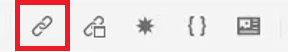
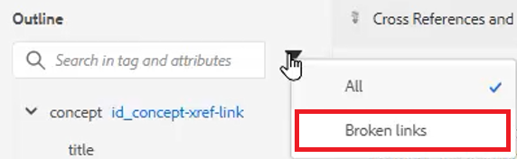

# Renvois et liens

XML Editor et DITA offrent un moyen puissant de relier les rubriques. Il est important de gérer efficacement vos références de contenu, ce qui inclut l’utilisation de valeurs d’identifiant uniques.

Des exemples de fichiers que vous pouvez utiliser pour cette leçon sont fournis dans le fichier .
[crossreferencesandlinks.zip](assets/crossreferencesandlinks.zip)

>[!VIDEO](https://video.tv.adobe.com/v/342764?quality=12&learn=on)

## Créer une référence croisée à une rubrique externe

Il est possible de créer une référence croisée externe en faisant glisser une rubrique du référentiel vers un fichier ouvert. Toutefois, pour éviter les références croisées rompues, un identifiant doit d’abord être défini sur une valeur liée à l’élément parent. Il s’agit d’un moyen facile de créer une référence croisée tout en s’assurant que les identifiants sont correctement attribués.

1. Ouvrez un fichier dans lequel insérer une référence croisée externe.

1. Attribuez un identifiant à l’élément à référencer.

   a. Cliquez à l’intérieur de l’élément.

   b. Dans le panneau Propriétés du contenu , choisissez **ID** dans la liste déroulante Attribut .

   c. Saisissez un nom logique dans le champ Valeur .

   d. Affichez l’élément et sa valeur dans **mode Plan** si vous le souhaitez.

1. **Enregistrez** la rubrique pour vous assurer que le référentiel dispose de l’identifiant mis à jour.

1. Cliquez sur l’icône [!UICONTROL **Référence**] dans la barre d’outils supérieure.

   

1. Dans l’onglet **Référence de contenu**, sélectionnez l’association d’identifiants et d’éléments à insérer comme référence croisée.

1. Cliquez sur [!UICONTROL **Sélectionner**].

La référence croisée a été ajoutée à la rubrique.

## Lien vers un site web

Vous pouvez insérer un lien vers un site web dans n’importe quelle rubrique. Reportez-vous à la vidéo Cours 1 d’AEM Guides sur la liaison à des sites web pour plus d’informations.

## Afficher les liens rompus

Certaines modifications peuvent entraîner des renvois rompus. Il peut s&#39;agir de la suppression d&#39;une rubrique, de la réorganisation d&#39;une section contenant une référence croisée ou de la modification d&#39;un ID après l&#39;insertion de la référence croisée. Notez qu’un exemple de rubrique _crossreferencesandlinks.zip_ est fourni avec cette leçon. Cela rompra plusieurs des références croisées à puces vers le contenu interne.

1. Accédez au **mode Plan** dans le panneau de gauche.

1. Cliquez sur l’icône [!UICONTROL **Filtrer**].

1. Sélectionnez **Liens rompus**.

   

Les liens rompus s’affichent sous la forme d’objets cliquables. Vous pouvez les identifier en texte rouge dans la rubrique.
