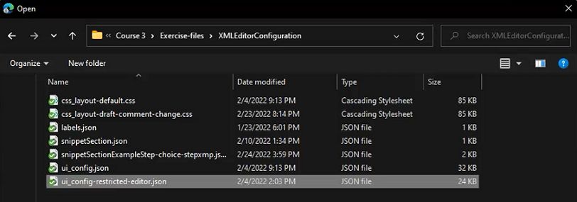

# Configuration de l’éditeur XML

Si vous travaillez dans un environnement restrictif, vous pouvez choisir les fonctionnalités que vos auteurs peuvent voir en personnalisant la configuration de l’éditeur dans un profil de dossier spécifique. L’application de ce profil de dossier peut modifier l’aspect de l’éditeur lui-même, des modèles CSS, des fragments de code disponibles et des libellés de version de contenu.

Des exemples de fichiers que vous pouvez choisir d’utiliser pour cette leçon sont fournis dans le fichier [xmleditorconfiguration.zip](assets/xmleditorconfiguration.zip).

>[!VIDEO](https://video.tv.adobe.com/v/342762?quality=12&learn=on)

## Personnaliser la configuration par défaut de l’interface utilisateur de l’éditeur

Vous pouvez toujours télécharger la configuration par défaut de l’interface utilisateur sur votre système local, y apporter des modifications dans l’éditeur de texte de votre choix, puis la charger à nouveau.

1. Dans l’écran de navigation, cliquez sur l’icône [!UICONTROL **Outils**].

   

1. Sélectionnez **Guides** dans le panneau de gauche.

1. Cliquez sur la mosaïque [!UICONTROL **Profils de dossier**].

   

1. Sélectionnez un profil de dossier.

1. Cliquez sur l’onglet [!UICONTROL **Configuration de l’éditeur XML**].

1. Cliquez sur [!UICONTROL **Télécharger**] par défaut.

   

Vous pouvez désormais ouvrir et modifier le contenu dans un éditeur de texte. Le Guide d’installation et de configuration d’AEM Guides __ contient des exemples de suppression, de personnalisation ou d’ajout de fonctions à la configuration de l’interface utilisateur.

## Charger la configuration modifiée de l’éditeur XML

Après avoir personnalisé la configuration de l’interface utilisateur, vous pouvez la charger. Notez qu’un exemple de fichier de configuration _ui-config-limited-editor.json_ est fourni avec l’ensemble des rubriques annexes de cette leçon.

1. Dans le profil du dossier, cliquez sur l’onglet [!UICONTROL **Configuration de l’éditeur XML**].

1. Sous Configuration de l’éditeur XML, cliquez sur [!UICONTROL **Télécharger**].

   

1. Double-cliquez sur le fichier pour la configuration de l’interface utilisateur modifiée ou, comme illustré ici, sur le fichier d’exemple fourni.

   

1. Cliquez sur [!UICONTROL **Enregistrer**] dans le coin supérieur gauche de l’écran.

Vous avez chargé la configuration d’interface utilisateur modifiée.

## Personnaliser la disposition du modèle CSS

Comme pour la configuration de l’interface utilisateur, vous pouvez télécharger la mise en page du modèle CSS. Vous pouvez l’ouvrir dans un éditeur de texte et apporter des modifications pour personnaliser l’aspect de votre rubrique avant le chargement.

1. Dans l’écran de navigation, cliquez sur l’icône [!UICONTROL **Outils**].

   

1. Sélectionnez **Guides** dans le panneau de gauche.

1. Cliquez sur la mosaïque [!UICONTROL **Profils de dossier**].

   

1. Sélectionnez un profil de dossier.

1. Cliquez sur l’onglet [!UICONTROL **Configuration de l’éditeur XML**].

1. Sous Disposition du modèle CSS, cliquez sur [!UICONTROL **Télécharger**].

   

Vous pouvez désormais modifier et enregistrer le contenu CSS dans un éditeur de texte.

## Charger la mise en page du modèle CSS modifié

Après avoir personnalisé la mise en page du modèle CSS, vous pouvez la charger. Notez qu’un exemple de fichier _css-layout-ONLY-draft-comment-change.css_ est fourni avec l’ensemble des rubriques annexes de cette leçon. Ce fichier contient uniquement le brouillon de modification de commentaire, tandis que _css-layout-draft-comment-change.css_ est le fichier entier, disponible à des fins de test ou de révision uniquement.

1. Dans le profil du dossier, cliquez sur l’onglet [!UICONTROL **Configuration de l’éditeur XML**].

1. Sous Disposition du modèle CSS, cliquez sur [!UICONTROL **Télécharger**].

   

1. Double-cliquez sur le fichier pour obtenir votre propre disposition CSS personnalisée ou l’exemple de fichier fourni illustré ici.

   

1. Cliquez sur [!UICONTROL **Enregistrer**] dans le coin supérieur gauche de l’écran.
Vous avez chargé la disposition Modèle CSS personnalisé.

## Modifier des fragments de code de l’éditeur XML

Les fragments de code sont des éléments de contenu réutilisables qui peuvent être spécifiques à un produit ou à un groupe. Notez que les exemples de fragments de code sont fournis avec les fichiers de prise en charge de cette leçon.

1. Dans l’écran de navigation, cliquez sur l’icône [!UICONTROL **Outils**].

   

1. Sélectionnez **Guides** dans le panneau de gauche.

1. Cliquez sur la mosaïque [!UICONTROL **Profils de dossier**].

   

1. Sélectionnez un profil de dossier.

1. Cliquez sur l’onglet [!UICONTROL **Configuration de l’éditeur XML**].

1. Sous Fragments de code de l’éditeur XML, cliquez sur **Télécharger**.

   

1. Choisissez vos propres fragments de code ou utilisez les exemples fournis.

   

1. Cliquez sur [!UICONTROL **Enregistrer**] dans le coin supérieur gauche de l’écran.

Vous avez correctement ajouté de nouveaux fragments de code à l’éditeur.

## Personnaliser les libellés de version du contenu XML

Par défaut, les auteurs sont autorisés à créer les libellés de leur choix et à les associer à des fichiers de rubrique. Cela peut entraîner différentes variations sur la même étiquette. Pour éviter les libellés incohérents, vous pouvez également choisir parmi des listes de libellés prédéfinis.

1. Dans l’écran de navigation, cliquez sur l’icône [!UICONTROL **Outils**].

   

1. Sélectionnez **Guides** dans le panneau de gauche.

1. Cliquez sur la mosaïque [!UICONTROL **Profils de dossier**].

   

1. Sélectionnez un profil de dossier.

1. Cliquez sur l’onglet [!UICONTROL **Configuration de l’éditeur XML**].

1. Sous Étiquettes de version du contenu XML, cliquez sur [!UICONTROL **Télécharger**].

   

Vous êtes maintenant prêt à personnaliser les libellés selon vos besoins.

## Charger les libellés de version du contenu XML

Une fois que vous avez téléchargé et modifié les libellés, vous pouvez charger la rubrique Libellé de la version du contenu XML . Vous pouvez choisir d’utiliser l’exemple de fichier _labels.json_, fourni avec l’ensemble des rubriques annexes de cette leçon.

1. Dans le profil du dossier, cliquez sur l’onglet [!UICONTROL **Configuration de l’éditeur XML**].

1. Sous Étiquettes de version du contenu XML, cliquez sur [!UICONTROL **Télécharger**].

   

1. Double-cliquez sur le fichier pour obtenir vos propres libellés personnalisés ou l’exemple de fichier fourni illustré ici.

   

1. Cliquez sur [!UICONTROL **Enregistrer**] dans le coin supérieur gauche de l’écran.

Vous avez chargé les libellés de version du contenu XML personnalisé.
