# Profils de dossier

AEM fournit un accès rapide aux outils de configuration. En personnalisant les profils de dossier, différents services ou produits peuvent avoir des modèles uniques, des environnements de création, des profils d’attributs conditionnels, des fragments de code ou même des configurations d’éditeur web.

Des exemples de fichiers que vous pouvez choisir d’utiliser pour cette leçon sont fournis dans le fichier [folderprofiles.zip](assets/folderprofiles.zip).

>[!VIDEO](https://video.tv.adobe.com/v/342758?quality=12&learn=on)

## Accéder aux profils de dossier

Les configurations sont gérées à l’aide de l’icône Profils de dossier .

1. Dans l’écran de navigation, cliquez sur l’icône [!UICONTROL **Outils**].

   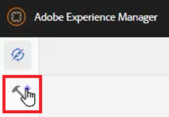

1. Sélectionnez **Guides** dans le panneau de gauche.

1. Cliquez sur la mosaïque [!UICONTROL **Profils de dossier**].

   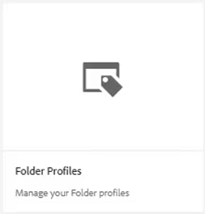

1. Sélectionnez le profil souhaité. Par exemple, choisissez **Profil global**, qui est le profil par défaut.

   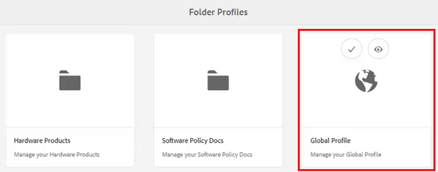

## Modification des attributs conditionnels dans le profil global

Une fois que vous avez accédé au profil global, vous pouvez modifier sa configuration. Sauf indication contraire, les paramètres du profil global s’appliquent à tous les utilisateurs.

1. Dans le profil global, sélectionnez l’onglet **Attributs conditionnels**.

1. Cliquez sur [!UICONTROL **Modifier**] dans le coin supérieur gauche de l’écran.

   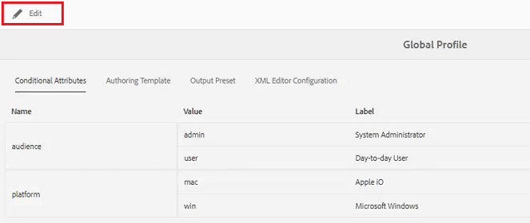

1. Cliquez sur [!UICONTROL **Ajouter**].

1. Renseignez les champs **Nom**, **Valeur** et **Libellé** pour la nouvelle condition.

   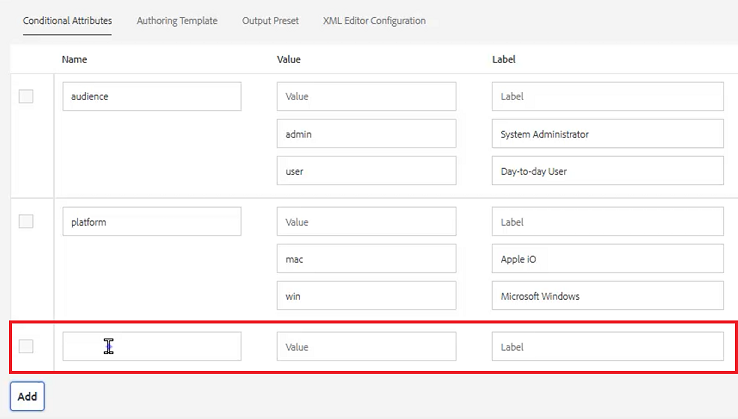

1. Cliquez sur [!UICONTROL **Enregistrer**] dans le coin supérieur gauche de l’écran.
Le nouveau statut est désormais disponible pour tous les utilisateurs et utilisatrices. Vous pouvez la sélectionner dans le panneau Propriétés du contenu et l’appliquer au contenu selon vos besoins.

## Créer un nouveau profil de dossier

Outre le profil global par défaut, vous pouvez créer vos propres profils personnalisés.

1. Dans l’écran de navigation, cliquez sur l’icône [!UICONTROL **Outils**].

   

1. Sélectionnez **Guides** dans le panneau de gauche.

1. Cliquez sur la mosaïque [!UICONTROL **Profils de dossier**].

   

1. Cliquez sur [!UICONTROL **Créer**].

1. Dans la boîte de dialogue Créer un profil de dossier .

   a. Nommez le profil.

   b. Spécifiez un chemin d’accès.

   c. Cliquez sur [!UICONTROL **Créer**].

   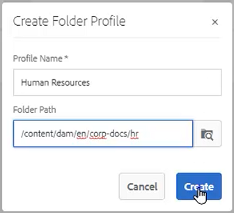

Une mosaïque portant le nouveau nom de profil s’affiche sur la page Profils de dossier.

## Ajout d’utilisateurs administratifs à partir de l’onglet Général

Les utilisateurs administrateurs ont les droits de mettre à jour les attributs conditionnels, le modèle de création et les paramètres prédéfinis de sortie pour le profil de dossier.

1. Cliquez sur la mosaïque pour ouvrir le profil de dossier souhaité.

   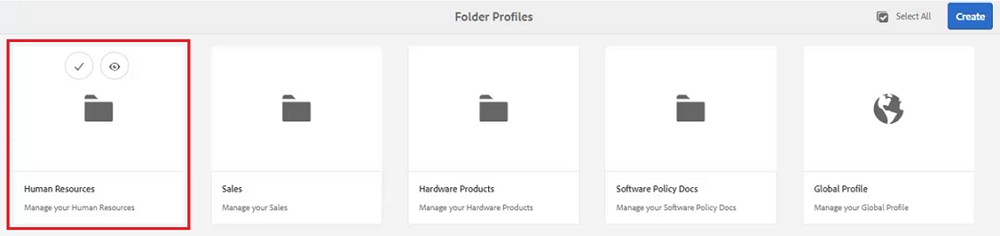

1. Sélectionnez l’onglet **Général**.

1. Cliquez sur [!UICONTROL **Modifier**] en haut à gauche de l’écran.

1. Sous Utilisateurs administrateurs, sélectionnez un utilisateur dans la liste déroulante ou saisissez son nom.

1. Cliquez sur [!UICONTROL **Ajouter**].

   Vous pouvez ajouter plusieurs utilisateurs administrateurs si nécessaire.

   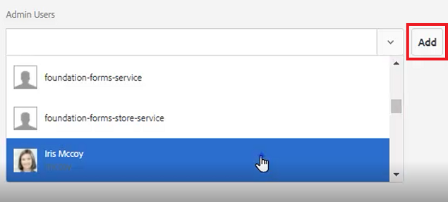

1. Cliquez sur [!UICONTROL **Enregistrer**] dans le coin supérieur droit de l’écran lorsque tous les utilisateurs ont été ajoutés.

Les utilisateurs administratifs sont désormais affectés à ce profil.

## Ajoutez une nouvelle audience à partir de l’onglet Attributs conditionnels .

Une fois que vous avez accédé au profil global, vous pouvez modifier sa configuration. Sauf indication contraire, les paramètres du profil global s’appliquent à tous les utilisateurs.

1. Dans le profil de dossier souhaité, sélectionnez l’onglet **Attributs conditionnels**.

1. Cliquez sur [!UICONTROL **Modifier**] dans le coin supérieur gauche de l’écran.

   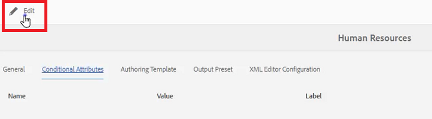

1. Cliquez sur [!UICONTROL **Ajouter**].

1. Renseignez les champs **Nom**, **Valeur** et **Libellé** pour la nouvelle condition.

   Cliquez sur le signe [!UICONTROL **Plus**] pour ajouter des paires Valeur et Libellé supplémentaires pour l’attribut nommé.

   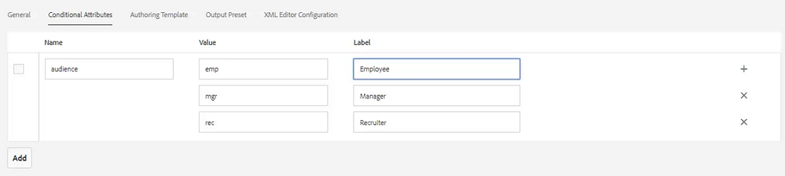

1. Cliquez sur [!UICONTROL **Enregistrer**] dans le coin supérieur gauche de l’écran.

Les nouveaux attributs conditionnels ont été ajoutés à ce profil.

## Choisissez un modèle et un mappage dans l’onglet Modèles de création .

AEM Guides est fourni avec des modèles et des mappages de création prêts à l’emploi. Vous pouvez les limiter à des auteurs spécifiques. Par défaut, les modèles sont stockés à l&#39;emplacement d&#39;Assets dans un dossier de modèles DITA.

1. Dans le profil de dossier souhaité, sélectionnez l’onglet Modèles de création .

1. Cliquez sur Modifier dans le coin supérieur gauche de l’écran.

1. Ajoutez un modèle de mappage.

   a. Dans le menu déroulant **Modèles de carte**, sélectionnez une option parmi les cartes disponibles.

   b. Cliquez sur [!UICONTROL **Ajouter**].

   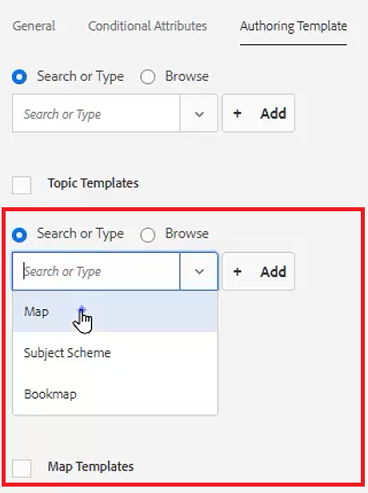

1. Ajoutez un modèle de rubrique.

   a. Dans le menu déroulant **Modèles de rubrique**, sélectionnez une option parmi les modèles disponibles.

   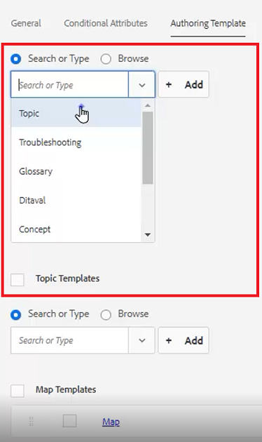

1. Cliquez sur [!UICONTROL **Ajouter**].

1. Ajoutez d&#39;autres modèles de rubriques, au besoin.

1. Lorsque vous avez terminé, cliquez sur [!UICONTROL **Enregistrer**] en haut à gauche de l’écran.

Les nouveaux modèles de création ont été ajoutés à ce profil.

## Suppression de paramètres prédéfinis non essentiels de l’onglet Paramètres prédéfinis de sortie

Vous pouvez configurer chaque paramètre prédéfini de sortie en fonction du profil de dossier. Les paramètres de sortie prédéfinis qui ne sont pas nécessaires doivent être supprimés.

1. Dans le profil de dossier souhaité, sélectionnez l’onglet **Paramètres prédéfinis de sortie**.

1. Dans le panneau de gauche, cochez les cases des paramètres prédéfinis qui ne sont pas obligatoires.

   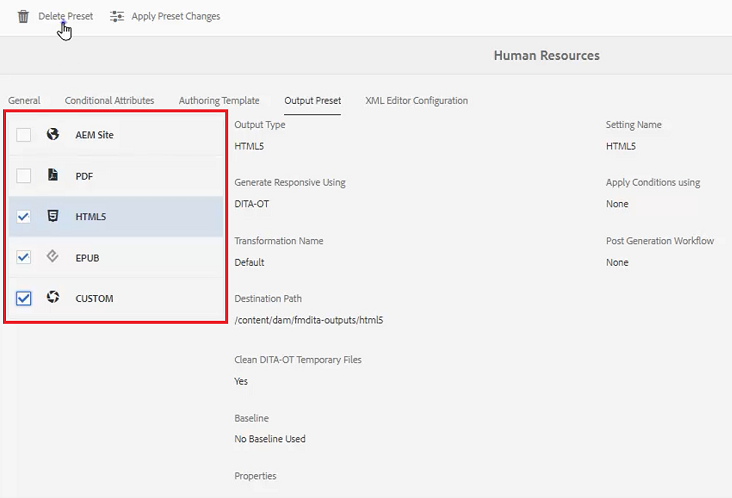

1. Cliquez sur [!UICONTROL **Supprimer le paramètre prédéfini**] dans le coin supérieur gauche de l’écran.

1. Dans la boîte de dialogue Supprimer le paramètre prédéfini , cliquez sur [!UICONTROL **Supprimer**].

   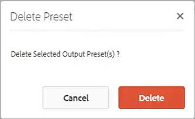

Désormais, les seuls paramètres prédéfinis de sortie qui s’affichent sont ceux qui seront utilisés.

## Téléchargez un fragment de code depuis l’onglet Configuration de l’éditeur XML .

1. Dans le profil de dossier souhaité, sélectionnez l’onglet **Configuration de l’éditeur XML**.

1. Sous Fragments de code de l’éditeur XML, cliquez sur [!UICONTROL **Télécharger**].

   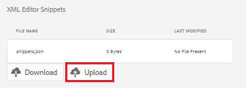

1. Accédez à un fragment de code créé précédemment.

1. Cliquez sur [!UICONTROL **Ouvrir**].

1. Cliquez sur [!UICONTROL **Enregistrer**] en haut à gauche de l’écran.

Vous avez correctement modifié la configuration de l’éditeur pour inclure des fragments de code.

## Spécifier le profil de dossier dans le référentiel

Dans l’éditeur, vous pouvez voir les résultats des modifications que vous avez apportées aux profils de dossier.

1. Accédez à **Vue Référentiel**.

1. Cliquez sur le dossier correspondant au contenu que vous souhaitez utiliser.

1. Cliquez sur l’icône [!UICONTROL **Préférences utilisateur**] dans la barre d’outils supérieure.

   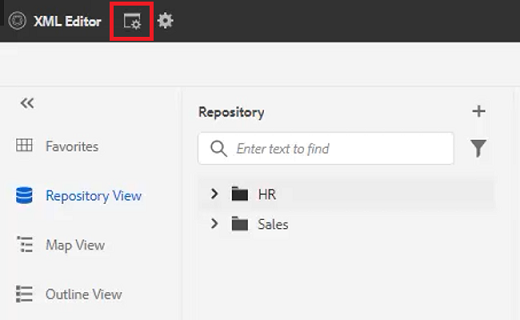

1. Dans la boîte de dialogue Préférences utilisateur , sélectionnez le profil de dossier souhaité dans la liste déroulante.

   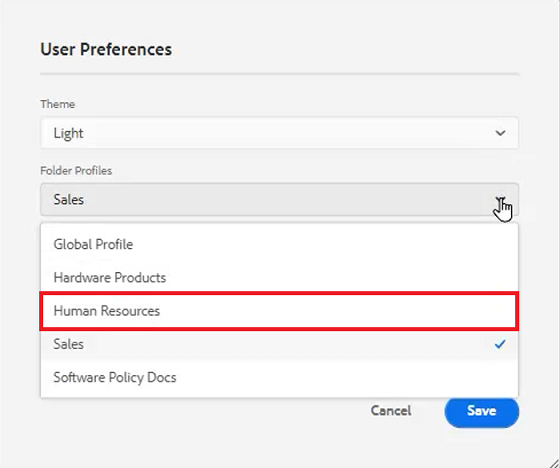

1. Cliquez sur [!UICONTROL **Enregistrer**].

Vous avez appliqué le profil de dossier à votre contenu. Désormais, lorsque vous créez une rubrique DITA, une liste restreinte de types de rubriques basée sur le profil de dossier s&#39;affiche. La condition d’audience contient les paramètres globaux ainsi que ceux spécifiques au profil de dossier. Le fichier de fragments de code que vous avez chargé a créé un ensemble de fragments de code par défaut parmi lesquels choisir. Le tableau de bord des cartes affiche les paramètres prédéfinis de sortie restreints.
