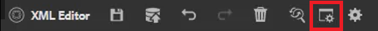
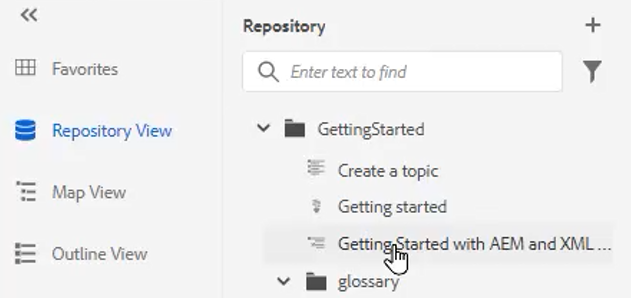
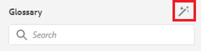

# Glossaire

Le panneau Glossaire permet d’analyser une carte. Vous pouvez créer un fichier de rubrique Glossaire et l&#39;inclure dans une carte Glossaire commune. Cette carte peut ensuite être ajoutée à d’autres cartes. L’utilisation du glossaire facilite la formulation cohérente de l’information et apporte une meilleure clarté au lecteur.

Des exemples de fichiers que vous pouvez choisir d’utiliser pour cette leçon sont fournis dans le fichier [glossary.zip](assets/glossary.zip).

>[!VIDEO](https://video.tv.adobe.com/v/342765?quality=12&learn=on)

## Ajout d’une entrée de glossaire à une rubrique

1. Accédez au panneau **Glossaire**.

1. Effectuez un glisser-déposer de l&#39;entrée du panneau **Glossaire** à l&#39;emplacement souhaité dans votre rubrique.

Si la carte contient des entrées de glossaire et est correctement configurée, les rubriques peuvent être automatiquement mises à jour pour contenir une forme abrégée.

## Spécifier une carte racine

La carte racine appropriée doit être sélectionnée pour fonctionner correctement avec un glossaire. Lorsqu&#39;une carte racine trouve des entrées de glossaire, elles s&#39;affichent dans le panneau Glossaire.

1. Lorsqu’une rubrique est ouverte, sélectionnez **Glossaire** dans le panneau de gauche.

1. Cliquez sur l’icône [!UICONTROL **Préférences utilisateur**] dans la barre d’outils supérieure.

   

1. Cliquez sur l’icône clé pour spécifier la carte racine appropriée pour l’utilisation du glossaire.

1. Cliquez sur [!UICONTROL **Sélectionner**].

1. Cliquez sur [!UICONTROL **Enregistrer**].

Le panneau Glossaire est automatiquement mis à jour.

## Utiliser le glossaire

1. Accédez à la **Vue du référentiel**.

1. Sélectionnez le mappage qui a été préconfiguré pour fonctionner avec le glossaire.

   

1. Choisissez la [!UICONTROL **vue Carte**].

1. Vérifiez que la vue Carte affiche les rubriques requises.

## Prévisualiser une entrée Glossentry

Comme il est possible d’effectuer des modifications en bloc, il peut être important de prévisualiser une entrée glossentry.

1. Sélectionnez **Glossaire** dans le panneau de gauche.

1. Cliquez sur le menu contextuel en regard d’une entrée de glossaire et sélectionnez [!UICONTROL **Aperçu**].

Le formulaire abrégé et la définition du glossaire s’affichent tous deux.

## Vérifier les paramètres de l’outil de zone réactive

Utilisez l’outil Zone réactive pour créer une collection complète d’entrées de glossaire à partir d’une seule carte. Vous pouvez même rechercher et convertir des termes de texte spécifiques en abréviations de glossaire liées.

1. Dans le panneau Glossaire, sélectionnez l’icône [!UICONTROL **Zone réactive**].

   

1. Cliquez sur le menu déroulant [!UICONTROL **Clés du glossaire**] et sélectionnez uniquement les clés que vous souhaitez appliquer.

1. Cliquez sur la liste déroulante [!UICONTROL **Rubriques**] pour sélectionner le contenu qui doit être affecté.

1. Cliquez sur le menu déroulant [!UICONTROL **Filtrer les rubriques par statut**] pour consulter les options configurées.

1. Configurez les paramètres restants selon vos besoins.

1. Lorsque vous avez terminé, cliquez sur [!UICONTROL **Convertir**].

Le panneau Glossaire affiche désormais toutes les rubriques mises à jour, ainsi que les rubriques comportant des erreurs.
