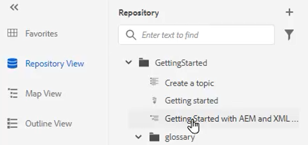

# Glossaire

Le panneau Glossaire permet d’analyser une carte. Vous pouvez créer un fichier de rubrique Glossaire et l’inclure dans une carte de glossaire commune. Cette carte peut ensuite être ajoutée à d’autres cartes. L’utilisation du glossaire facilite l’utilisation d’expressions cohérentes et permet une meilleure clarté pour le lecteur.

Des exemples de fichiers que vous pouvez choisir d’utiliser pour cette leçon sont fournis dans le fichier . [glossaire.zip](assets/glossary.zip).

>[!VIDEO](https://video.tv.adobe.com/v/342765?quality=12&learn=on)

## Ajout d’une entrée de glossaire à une rubrique

1. Accédez au **Glossaire** du panneau.

2. Faites glisser et déposez l’entrée depuis le **Glossaire** à l’emplacement souhaité dans votre rubrique.

Si la carte contient des entrées de glossaire et est correctement configurée, les rubriques peuvent être automatiquement mises à jour pour contenir un formulaire abrégé.

## Définition d’une carte racine

La bonne carte racine doit être sélectionnée pour fonctionner correctement avec un glossaire. Lorsqu’une carte racine trouve des entrées de glossaire, elles s’affichent dans le panneau Glossaire.

1. Une fois la rubrique ouverte, sélectionnez **Glossaire** dans le panneau de gauche.

2. Cliquez sur le bouton [!UICONTROL **Préférences utilisateur**] dans la barre d’outils supérieure.

   

3. Cliquez sur l’icône de clé pour spécifier la carte racine appropriée pour l’utilisation du glossaire.

4. Cliquez sur [!UICONTROL **Sélectionner**].

5. Cliquez sur [!UICONTROL **Enregistrer**].

Le panneau Glossaire est automatiquement mis à jour.

## Utilisation du glossaire

1. Accédez au **Repository View**.

2. Sélectionnez la carte qui a été préconfigurée pour fonctionner avec le glossaire.

   

3. Choisissez la [!UICONTROL **Vue Carte**].

4. Vérifiez que la vue Carte affiche les rubriques requises.

## Aperçu d’un Glossentry

Puisqu’il est possible d’effectuer des modifications en bloc, il peut être important de prévisualiser une entrée de sortie.

1. Choisir **Glossaire** dans le panneau de gauche.

2. Cliquez sur le menu contextuel en regard d’une entrée et sélectionnez [!UICONTROL **Aperçu**].

Le formulaire abrégé et la définition du glossaire s’affichent tous deux.

## Vérification des paramètres de l’outil de zone réactive

Utilisez l’outil Zone réactive pour créer une collection complète d’entrées de glossaire à partir d’une seule carte. Vous pouvez même rechercher et convertir des termes de texte spécifiques en abréviations du glossaire liées.

1. Dans le panneau Glossaire, sélectionnez la variable [!UICONTROL **Icône Zone réactive**].

   

2. Cliquez sur le bouton [!UICONTROL **Clés du glossaire**] et sélectionnez uniquement les Clés à appliquer.

3. Cliquez sur le bouton [!UICONTROL **Sujets**] pour sélectionner le contenu qui doit être affecté.

4. Cliquez sur le bouton [!UICONTROL **Filtrage des rubriques par état**] pour consulter les options configurées.

5. Configurez les paramètres restants suivant vos besoins.

6. Lorsque vous avez terminé, cliquez sur [!UICONTROL **Convertir**].

Le panneau Glossaire affiche désormais toutes les rubriques mises à jour, ainsi que celles qui comportent des erreurs.
