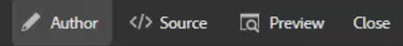
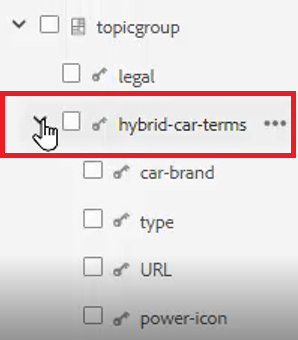
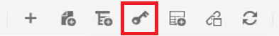
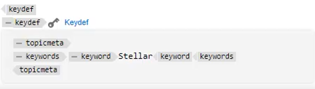

# Clés

Différents ensembles de matériaux peuvent contenir des informations similaires qui doivent être personnalisées à certains endroits. Les clés vous permettent d&#39;inclure des informations de variable dans lors de l&#39;utilisation de DITA.

Des exemples de fichiers que vous pouvez utiliser pour cette leçon sont fournis dans le fichier [keys.zip](assets/keys.zip).

>[!VIDEO](https://video.tv.adobe.com/v/342756?quality=12&learn=on)

## Activer les clés

1. Chargez l’ensemble des fichiers d’exemple fournis.

   a. Chargez le fichier zip.

   b. Actualisez l’environnement AEM.

   c. Sélectionnez le fichier à extraire.

   

   d. Cliquez sur [!UICONTROL **Extraire l’archive**] dans la barre d’outils supérieure.

   

   e. Dans la boîte de dialogue, choisissez l’emplacement spécifique des fichiers à extraire, par exemple un dossier appelé Clés.

   f. Cliquez sur [!UICONTROL **Suivant**].

   g. Ignorez les conflits, car ils n’existent pas pour le contenu qui n’a jamais été chargé auparavant.

   h. Sélectionnez [!UICONTROL **Extraire**] en haut à droite de l’écran.

1. Une fois l’extraction terminée, cliquez sur [!UICONTROL **Accéder au dossier cible**].

   

## Résoudre les clés en valeurs référencées

Pour utiliser correctement les clés, les préférences utilisateur doivent référencer une carte spécifique comme carte racine. À l&#39;intérieur de cette carte se trouve une collection de clés, regroupées dans un groupe de sujets. L’ouverture de la carte et des rubriques résout les clés sur les valeurs référencées par cette carte.

1. Spécifiez une carte racine.

   a. Dans l&#39;écran Clés, ouvrez une carte.

   b. Configurez Les Préférences Utilisateur.

   c. Cliquez sur l’icône [!UICONTROL **Préférences utilisateur**] dans la barre d’outils supérieure.

   

   d. Cliquez sur l’icône de clé pour spécifier une **carte racine** qui sera utilisée pour résoudre les clés.

   e. Cochez les cases correspondant à l’Assets souhaitée.

   

   f. Cliquez sur [!UICONTROL **Sélectionner**].

   g. **Enregistrer** les préférences utilisateur.

1. Accédez à la **Vue Carte**.

1. Ouvrir le mappage spécifié.

Les clés sont résolues.

## Ajouter un nouveau jeu de clés manuellement

1. Ouvrez un mappage avec un mappage racine spécifié.

1. Sélectionnez une clé.

   

1. Insérez une nouvelle clé.

   a. Cliquez dans un emplacement valide de la carte.

   b. Sélectionnez l’icône **Keydef** dans la barre d’outils supérieure.

   

   c. Dans la boîte de dialogue Insérer une clé , saisissez une valeur unique pour les clés correspondant à la définition que vous êtes en train de créer.

   d. Cliquez sur [!UICONTROL **Insérer**].

1. Ajoutez topicmeta dans le keydef.

   a. Cliquez sur l&#39;icône [!UICONTROL **Insérer un élément**] dans la barre d&#39;outils supérieure.

   

   b. Dans la boîte de dialogue Insérer un élément, recherchez et sélectionnez « topicmeta ».

1. Ajoutez des mots-clés dans la méta de rubrique.

   a. Cliquez sur l&#39;icône [!UICONTROL **Insérer un élément**] dans la barre d&#39;outils supérieure.

   

   b. Dans la boîte de dialogue Insérer un élément, recherchez et sélectionnez « mots-clés ».

1. Ajoutez un mot-clé dans le champ meta.

   a. Cliquez sur l&#39;icône [!UICONTROL **Insérer un élément**] dans la barre d&#39;outils supérieure.

   

   b. Dans la boîte de dialogue **Insérer un élément**, recherchez et sélectionnez « mot-clé »

1. Saisissez la valeur de keydef dans le mot-clé .

Sur la carte, votre keydef doit maintenant ressembler à ceci :

## Configuration d’un keydef en tant que fragment de code

Les fragments de code sont de petits fragments de contenu qui peuvent être réutilisés dans différentes rubriques de votre projet de documentation. Au lieu de générer manuellement chaque keydef, vous pouvez configurer un seul keydef sous la forme d’un fragment de code.

1. Sélectionnez un élément keydef dans le mappage.

1. Dans le menu contextuel, cliquez sur [!UICONTROL **Créer un fragment de code**].

1. Dans la boîte de dialogue Nouveau fragment de code, ajoutez un titre et une description.
Vous pouvez également supprimer des clés existantes ou des définitions de mots-clés du contenu.

1. Cliquez sur [!UICONTROL **Créer**].

1. Dans le panneau de gauche, sélectionnez **Fragments de code**.

1. Faites glisser et déposez le fragment de code que vous venez de créer du panneau Fragments de code vers la carte.

1. Mettez à jour le jeu de clés selon les besoins à l’aide des propriétés de contenu.
Une fois enregistré et actualisé, cet ensemble de clés sera disponible pour tout utilisateur ayant défini un mappage contenant le même mappage racine.
