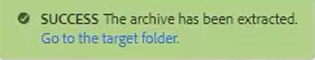
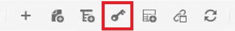

# Clés

Différents ensembles de matériaux peuvent contenir des informations similaires qui doivent être personnalisées dans des endroits choisis. Les clés vous permettent d’inclure des informations sur les variables lors de l’utilisation de DITA.

Des exemples de fichiers que vous pouvez choisir d’utiliser pour cette leçon sont fournis dans le fichier [keys.zip](assets/keys.zip).

>[!VIDEO](https://video.tv.adobe.com/v/342756?quality=12&learn=on)

## Activer les clés

1. Chargez l’ensemble des fichiers d’exemple fournis.

   a. Chargez le fichier zip.

   b. Actualisez l’environnement AEM.

   c. Sélectionnez le fichier à extraire.

   

   d. Cliquez sur [!UICONTROL **Extract Archive**] dans la barre d’outils supérieure.

   

   e. Dans la boîte de dialogue, choisissez l’emplacement spécifique des fichiers à extraire, par exemple un dossier appelé Clés.

   f. Cliquez sur [!UICONTROL **Suivant**].

   g. Ignorez les conflits, car ils n’existeront pas pour le contenu qui n’a jamais été transféré auparavant.

   h. Sélectionnez [!UICONTROL **Extract**] en haut à droite de l’écran.

1. Une fois l’extraction terminée, cliquez sur [!UICONTROL **Aller au dossier cible**].

   

## Résoudre les clés des valeurs référencées

Pour utiliser correctement les clés, les préférences utilisateur doivent référencer une carte spécifique comme carte racine. A l&#39;intérieur de cette carte se trouve un ensemble de clés, regroupées au sein d&#39;un groupe de sujets. L’ouverture du mappage et des rubriques résout les clés sur les valeurs auxquelles ce mappage fait référence.

1. Spécifiez une carte racine.

   a. Dans l’écran Clés , ouvrez une carte.

   b. Configurez les préférences utilisateur.

   c. Cliquez sur l’icône [!UICONTROL **Préférences utilisateur**] dans la barre d’outils supérieure.

   

   d. Cliquez sur l’icône de clé pour spécifier une **carte racine** qui sera utilisée pour résoudre les clés.

   e. Cochez les cases correspondant à une Assets souhaitée.

   

   f. Cliquez sur [!UICONTROL **Sélectionner**].

   g. **Enregistrez** les préférences utilisateur.

1. Accédez à la **vue Carte**.

1. Ouvrez la carte spécifiée.

Les clés sont résolues.

## Ajouter manuellement une nouvelle clé

1. Ouvrez une carte avec une carte racine spécifiée.

1. Sélectionnez une clé.

   

1. Insérez une nouvelle clé.

   a. Cliquez sur un emplacement valide dans la carte.

   b. Sélectionnez l’icône **Keydef** sur la barre d’outils supérieure.

   

   c. Dans la boîte de dialogue Insérer une clé, saisissez une valeur unique pour les clés qui correspond à la définition que vous créez.

   d. Cliquez sur [!UICONTROL **Insérer**].

1. Ajoutez topicmeta dans le fichier keydef.

   a. Cliquez sur l’icône [!UICONTROL **Insérer l’élément**] de la barre d’outils supérieure.

   

   b. Dans la boîte de dialogue Insérer un élément, recherchez et sélectionnez &quot;topicmeta&quot;.

1. Ajoutez des mots-clés dans la topicmeta.

   a. Cliquez sur l’icône [!UICONTROL **Insérer l’élément**] de la barre d’outils supérieure.

   

   b. Dans la boîte de dialogue Insérer un élément, recherchez et sélectionnez &quot;mots-clés&quot;.

1. Ajoutez un mot-clé dans la rubrique .

   a. Cliquez sur l’icône [!UICONTROL **Insérer l’élément**] de la barre d’outils supérieure.

   

   b. Dans la boîte de dialogue **Insérer l’élément**, recherchez et sélectionnez &quot;mot-clé&quot;

1. Saisissez la valeur de keydef dans le mot-clé.

Sur la carte, votre clé de sécurité devrait maintenant ressembler à ceci :

## Configuration d’une clé comme fragment de code

Les fragments de code sont de petits fragments de contenu qui peuvent être réutilisés dans diverses rubriques de votre projet de documentation. Au lieu de générer manuellement chaque clé, vous pouvez configurer une seule clé comme extrait de code.

1. Sélectionnez un élément keydef dans le mappage.

1. Dans le menu contextuel, cliquez sur [!UICONTROL **Créer un fragment de code**].

1. Dans la boîte de dialogue Nouveau fragment de code, ajoutez un titre et une description.
Vous pouvez également supprimer des clés ou des définitions de mots-clés existantes du contenu.

1. Cliquez sur [!UICONTROL **Créer**].

1. Dans le panneau de gauche, sélectionnez **Fragments de code**.

1. Faites glisser le fragment que vous venez de créer du panneau Fragments de code vers la carte.

1. Mettez à jour la clé keydef selon les besoins à l’aide des propriétés du contenu.
Une fois enregistré et actualisé, cet ensemble de clés est disponible pour tous les utilisateurs qui ont défini une carte contenant la même carte racine.
