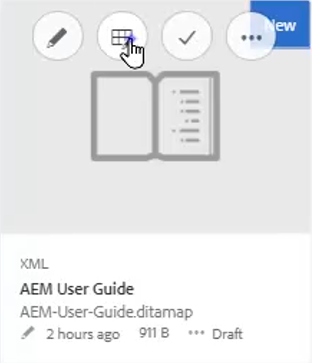
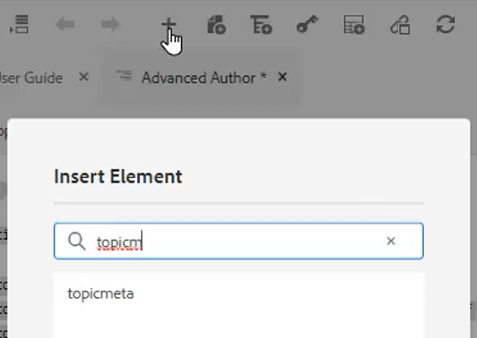
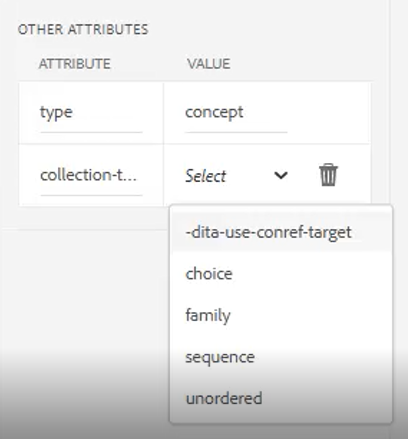

# Cartes et signets

L’éditeur de carte d’Adobe Experience Manager Guides vous permet de créer et de modifier des fichiers de carte. L&#39;éditeur de carte vous permet de modifier deux types de fichiers : DITA map et bookmap. Pour nos besoins, considérez qu’il s’agit de concepts largement interchangeables.
L’éditeur de carte se présente sous deux modes : l’éditeur de carte de base et l’éditeur de carte avancé.

>[!VIDEO](https://video.tv.adobe.com/v/342766?quality=12&learn=on)

## Créer un mappage

AEM Guides fournit deux modèles de mappage prêts à l’emploi : un mappage DITA et un mappage bookmap. Vous pouvez également créer vos propres modèles de carte et les partager avec vos auteurs pour créer des fichiers de carte.

Pour créer un fichier de mappage, procédez comme suit.

1. Dans l’interface utilisateur d’Assets, accédez à l’emplacement où vous souhaitez créer le fichier de mappage.

1. Cliquez sur [!UICONTROL **Créer > Plan DITA**].

1. Sur la page Plan directeur, sélectionnez le type de modèle de carte à utiliser, puis cliquez sur [!UICONTROL **Suivant**].

1. Sur la page Propriétés , saisissez un **Titre** et un **Nom** pour la carte.

1. Cliquez sur [!UICONTROL **Créer**].

## Ouverture d’une carte à l’aide de l’éditeur de cartes avancé

1. Dans l’**interface utilisateur d’**, sélectionnez le mappage à modifier.

1. Cliquez sur [!UICONTROL **Modifier les rubriques**].

   

Ou

1. Pointez la souris sur l’icône de carte.

1. Sélectionnez **Modifier les rubriques** dans le menu **Action**.

## Ajout de contenu à une carte ou un bookmap

1. Accédez à la **Vue du référentiel**.

1. Effectuez un glisser-déposer du contenu de la Vue du référentiel vers des emplacements valides dans la carte ou la libellule.

Ou

1. Cliquez à un emplacement valide dans la carte ou la libellule.

1. Cliquez sur l’[!UICONTROL **icône de barre d’outils**] appropriée pour ajouter des chapitres, des rubriques ou des références de rubrique.

   

1. Choisissez un ou plusieurs Assets à ajouter.

1. Cliquez sur [!UICONTROL **Sélectionner**].

### Promouvoir ou rétrograder des éléments dans un mappage

Utilisez **les flèches de la barre d’outils** pour convertir ou rétrograder des chapitres et des éléments contextuels dans une carte ou un bookmap.

1. Sélectionnez un élément dans le mappage.

1. Cliquez sur la [!UICONTROL **Flèche gauche**] pour convertir un objet topicref en chapitre, ou sur la [!UICONTROL **Flèche droite**] pour rétrograder un chapitre en objet topicref.

   

1. Enregistrez et gérez la version du mappage si nécessaire.

Ou

1. Faites glisser et déposez des éléments pour les réorganiser.

## Ajout de métadonnées à une carte

1. Dans la **barre d’outils Carte**, insérez un groupe de rubriques.

   

1. Cliquez sur l’icône [!UICONTROL **Plus**] pour insérer des éléments.

1. Choisissez les éléments à insérer.

   

1. Cliquez sur [!UICONTROL **Fermer**].

## Ajout d’un objet fiable à un mappage

Un objet fiable peut être ajouté après la structure d’un mappage.

1. Cliquez sur le mappage dans lequel vous souhaitez insérer le dossier fiable.

1. Utilisez l’icône **Icône de la barre d’outils** pour ajouter le fiable à la carte.

   

1. Configurez la boîte de dialogue.

1. Cliquez sur [!UICONTROL **Insérer**].

1. Effectuez un glisser-déposer des rubriques requises du **Référentiel** dans le référentiel.

1. Copiez et collez les éléments requis du mappage dans le fichier à relier à l’aide des raccourcis clavier standard.

## Attribuer des attributs aux objets contextuels dans un mappage

1. Mettez en surbrillance une rubrique ou une collection imbriquée de rubriques dans la carte.

1. Sous Autres attributs dans le panneau Propriétés du contenu, choisissez un **Attribut** et sa **Valeur.**

   
