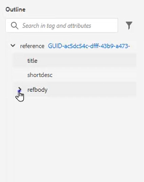
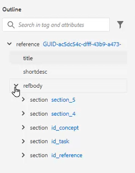
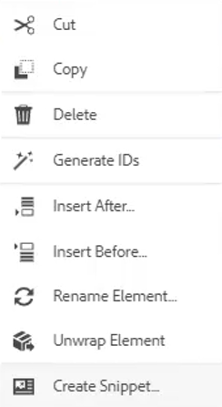
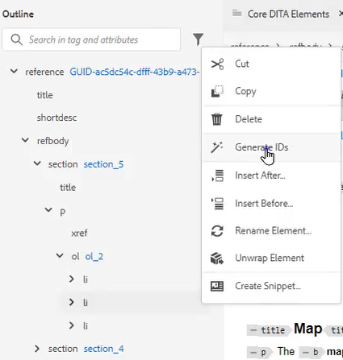
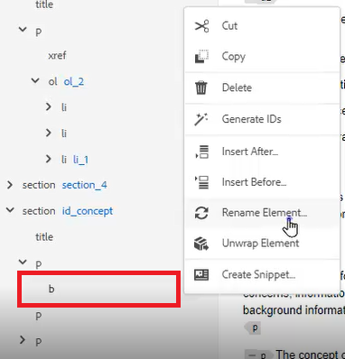
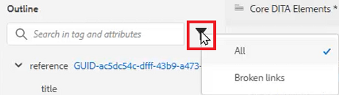
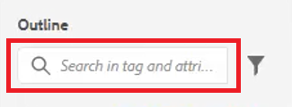

# Mode Plan

Le mode Plan offre une large gamme de prise en charge lorsque vous travaillez avec un document structuré. Développez et réduisez l’affichage, parcourez la structure, utilisez les attributs (par exemple pour créer un nouvel identifiant), puis réorganisez, dépliez et restructurez les éléments d’un simple clic sur un bouton.

>[!VIDEO](https://video.tv.adobe.com/v/342767?quality=12&learn=on)

## Développer et réduire le mode Plan

Les éléments peuvent être développés pour afficher les éléments enfants ou réduits selon les besoins.

1. Cliquez sur l’icône appropriée pour développer ou réduire le mode Plan.

   

   

Le mode Plan passe du mode développé au mode réduit.

## Naviguer en mode Plan

1. Cliquez sur un élément pour accéder à cet emplacement.

1. Cliquez sur le [!UICONTROL **Points de suspension**] en regard d’un élément pour accéder aux options de raccourci.

   

## Attribuer un ID à l’aide du mode Plan

Un nouvel identifiant peut être généré automatiquement en fonction de la configuration du système. À l’aide des propriétés de contenu, l’identifiant et sa valeur peuvent également être mis à jour si nécessaire.

1. Cliquez sur le bouton [!UICONTROL **Points de suspension**] en regard d’un élément.

1. Choisissez **Générer des identifiants**.

   

L’ID est attribué. Les mises à jour des propriétés du contenu et les informations sur les éléments et les attributs s’affichent.

## Réorganisation des éléments par glisser-déposer

Les éléments peuvent être réorganisés dans la vue globale.

1. Cliquez sur un élément et faites-le glisser vers un autre emplacement dans la vue Plan.

1. Déposez l’élément au-dessus d’un autre élément pour le remplacer. Cette action est indiquée par un carré autour de l&#39;élément à remplacer.

   Ou

   Déposez l’élément entre deux autres éléments pour modifier son emplacement. Cette action est indiquée par une ligne entre les éléments où le nouvel élément sera déposé.

## Renommer un élément

1. Sélectionnez l’élément.

1. Cliquez sur le bouton [!UICONTROL **Points de suspension**].

1. Sélectionnez **Renommer l’élément**.

   

1. Double-cliquez sur un nouveau nom d’élément.

L’élément a été renommé.

## Déplier un élément

1. Sélectionnez l’élément à déplier.

1. Cliquez sur le bouton [!UICONTROL **Points de suspension**].

1. Sélectionnez [!UICONTROL **Déplier l’élément**].

Le contenu reste, mais la structure a été supprimée.

## Filtrer le contenu à l’aide de la vue d’ensemble

1. Cliquez sur l’icône [!UICONTROL **Filtre**] en regard de la barre de recherche en mode Plan.

   

1. Choisissez **Tous** pour afficher tous les éléments ou **Liens rompus** pour rechercher et corriger les références rompues.

## Rechercher en mode Plan

Une recherche peut être restreinte et renvoyer des résultats en fonction d’un élément, d’un attribut ou d’une valeur.

1. Saisissez le nom de l’élément à rechercher dans la barre de recherche.

   

1. Choisissez le résultat qui correspond le mieux à vos besoins.
