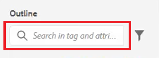

# Mode plan

La vue Plan offre un large éventail de fonctions pour l’utilisation d’un document structuré. Développez et réduisez la vue, naviguez dans la structure, utilisez les attributs (par exemple pour créer un ID), puis réorganisez, actualisez et restructurez les éléments en cliquant sur un bouton.

>[!VIDEO](https://video.tv.adobe.com/v/342767?quality=12&learn=on)

## Développer et réduire la vue Contour

Les éléments peuvent être développés pour afficher les éléments enfants ou réduits selon les besoins.

1. Cliquez sur l’icône appropriée pour développer ou réduire la vue Plan.

   

   

La vue de contour bascule de développée à réduite.

## Navigation à l’aide de la vue Plan

1. Cliquez sur un élément pour accéder à cet emplacement.

1. Cliquez sur l’icône [!UICONTROL **Ellipse**] en regard d’un élément pour accéder aux options de raccourci.

   

## Attribution d’un identifiant à l’aide de la vue Plan

Un nouvel ID peut être généré automatiquement en fonction de la configuration du système. À l’aide des propriétés du contenu, l’identifiant et sa valeur peuvent également être mis à jour si nécessaire.

1. Cliquez sur les [!UICONTROL **points de suspension**] en regard de n’importe quel élément.

1. Sélectionnez **Générer les identifiants**.

   

L’ID est attribué. Les mises à jour des propriétés de contenu et les informations sur les éléments et les attributs s’affichent.

## Réorganiser les éléments à l’aide du glisser-déposer

Les éléments peuvent être réorganisés dans la vue Ligne.

1. Cliquez sur un élément et faites-le glisser vers un autre emplacement de la vue Ligne.

1. Déposez l’élément au-dessus d’un autre élément pour le remplacer. Cette action est indiquée par un carré autour de l’élément à remplacer.

   Ou

   Déposez l’élément entre deux autres éléments pour en modifier l’emplacement. Cette action est indiquée par une ligne entre les éléments où le nouvel élément sera déposé.

## Renommer un élément

1. Sélectionnez l’élément .

1. Cliquez sur le bouton [!UICONTROL **Ellipsis**].

1. Sélectionnez **Renommer l’élément**.

   

1. Double-cliquez sur le nom d’un nouvel élément.

L’élément a maintenant été renommé.

## Extraire un élément

1. Sélectionnez l’élément que vous souhaitez renvoyer à la ligne.

1. Cliquez sur le bouton [!UICONTROL **Ellipsis**].

1. Sélectionnez [!UICONTROL **Unwrap element**].

Le contenu reste mais la structure a été supprimée.

## Filtrage du contenu à l’aide de la vue Plan

1. Cliquez sur l’icône [!UICONTROL **Filtre**] en regard de la barre de recherche dans la vue Plan.

   

1. Choisissez **Tous** pour afficher tous les éléments ou **Liens rompus** pour rechercher et corriger les références rompues.

## Recherche avec la vue Plan

Une recherche peut être limitée et renvoyer des résultats en fonction d’un élément, d’un attribut ou d’une valeur.

1. Saisissez le nom de l’élément que vous souhaitez trouver dans la barre de recherche.

   

1. Choisissez le résultat qui correspond le mieux à vos besoins.
