# Panneaux

L’éditeur web d’AEM Guides est divisé en plusieurs sections, notamment une barre d’outils principale, une barre d’outils secondaire, un panneau de gauche, une zone d’édition de contenu et un panneau de droite.

>[!VIDEO](https://video.tv.adobe.com/v/342760?quality=12&learn=on)

## Redimensionnement du panneau de gauche

Les panneaux persistants tels que le panneau de gauche sont de taille réglable.

1. Positionnez le curseur sur la bordure du panneau.

1. Lorsque la double flèche s’affiche, cliquez et faites glisser vers l’intérieur ou l’extérieur selon vos besoins.

## Développer ou réduire la barre latérale du panneau de gauche

La vue développée affiche les noms et les icônes qui apparaissent sous la forme d’info-bulles dans la vue réduite.

1. Cliquez sur l’icône [!UICONTROL **Barre latérale**] pour développer le panneau.

   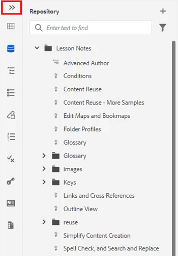

1. Cliquez à nouveau sur l’icône [!UICONTROL **Barre latérale**] pour réduire le panneau.

   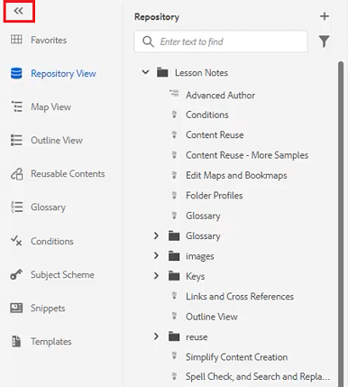

## Création d’une collection de favoris

Dans le panneau de gauche, les Favoris vous permettent de créer une liste de documents spécifiques et de l’ajouter au fil du temps. Vous pouvez créer et gérer une large collection de favoris.

1. Sélectionnez **Favoris** dans le panneau de gauche.

1. Cliquez sur l’icône [!UICONTROL **Plus**].

   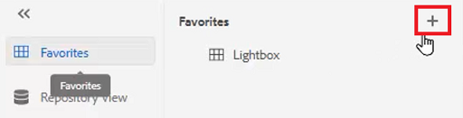

1. Dans la boîte de dialogue Nouvelle collection , saisissez un **Titre** et un **Description**.

   Notez que si vous sélectionnez Public , d’autres utilisateurs pourront voir ce favori.

1. Cliquez sur [!UICONTROL **Créer**].

Vous avez maintenant créé une collection Favoris.

## Ajouter un fichier à une collection Favoris à partir du référentiel

Après avoir créé une collection, vous pouvez commencer à y ajouter des Favoris.

1. Sélectionnez **Vue du référentiel** dans le panneau de gauche.

1. Cliquez sur les [!UICONTROL **points de suspension**] situés à côté d’une rubrique pour accéder aux options contextuelles.

1. Sélectionnez **Ajouter à** > **Favoris**.

1. Dans la boîte de dialogue Ajouter aux favoris, choisissez **Nouvelle collection** ou **Collection existante**.

   Ici, nous choisissons d’ajouter à une collection existante.

   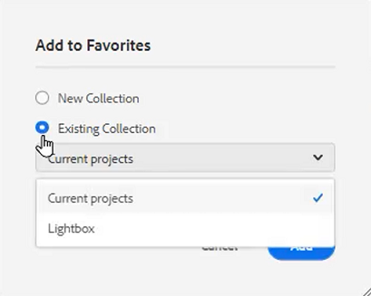

1. Si nécessaire, sélectionnez une collection dans la liste déroulante.

1. Cliquez sur [!UICONTROL **Ajouter**].

La rubrique est ajoutée à la collection Favoris de votre choix. Vous pouvez l’afficher dans le menu Favoris .

## Ajouter un fichier à une collection Favoris à partir de l’éditeur

Vous pouvez également ajouter une rubrique à vos Favoris à partir d’une rubrique ouverte dans l’éditeur.

1. Accédez à la **Vue du référentiel**.

1. Double-cliquez sur une rubrique pour l’ouvrir.

1. Cliquez avec le bouton droit de la souris sur l’onglet **Titre** du fichier dans l’éditeur pour accéder aux options contextuelles.

1. Choisissez **Ajouter à** > **Favoris**.

   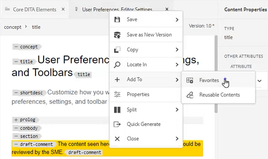

1. Dans la boîte de dialogue Ajouter aux favoris, choisissez **Nouvelle collection** ou **Collection existante**.

   Ici, nous choisirons d’ajouter à une nouvelle collection.

1. Dans la boîte de dialogue Nouvelle collection , saisissez un **Titre** et un **Description**.

   Notez que si vous sélectionnez **Public**, d’autres utilisateurs pourront voir ce favori.

1. Cliquez sur [!UICONTROL **Créer**].

Le nouveau favori a été créé et regroupé. Vous pouvez l’afficher dans le menu Favoris .

## Afficher et gérer vos favoris

Il est facile de voir les sujets que vous avez déjà ajoutés à vos collections Favoris.

1. Sélectionnez [!UICONTROL **Favoris**] dans le panneau de gauche.

1. Sous Favoris, cliquez sur l’icône [!UICONTROL **Flèche**] en regard d’une collection pour afficher son contenu.

   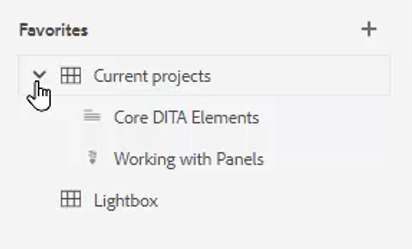

1. Cliquez sur le [!UICONTROL **Points de suspension**] en regard d’une rubrique pour afficher des options contextuelles, y compris la possibilité de la supprimer de la liste Favoris.

## Filtrer une recherche dans la vue Référentiel

Le filtre amélioré du référentiel vous permet de rechercher du texte avec un large éventail de restrictions.

1. Accédez à **Vue Référentiel**.

1. Cliquez sur l’icône [!UICONTROL **Filtrer la recherche**].

   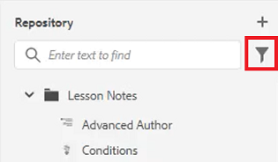

1. Saisissez du texte dans le chemin d’accès sélectionné ou choisissez un nouveau chemin d’accès, le cas échéant.

   La liste des fichiers est mise à jour au fur et à mesure que vous saisissez du texte dans le filtre.

1. Cliquez sur l’icône de flèche en regard d’une catégorie de recherche pour affiner davantage la recherche si nécessaire.

   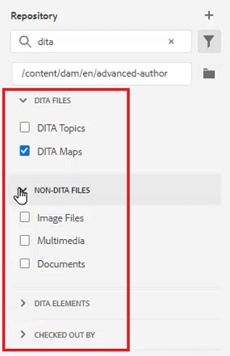

Les recherches peuvent être limitées aux rubriques ou aux plans DITA. Vous pouvez rechercher des fichiers image non DITA, des fichiers multimédias ou d&#39;autres documents dans le chemin d&#39;accès sélectionné. Vous pouvez même restreindre la recherche aux éléments DITA ou filtrer par extraction de fichier.

## Explorer la vue Carte

Plusieurs fonctionnalités utiles sont disponibles dans la vue Carte, notamment la possibilité d’extraire et de verrouiller des fichiers, de prévisualiser le fichier de carte, d’ouvrir le tableau de bord de la carte et d’afficher la carte dans l’interface utilisateur d’Assets.

Reportez-vous à la leçon intitulée [Cartes et signets](./maps-and-bookmaps.md) de ce cours pour plus d&#39;informations sur la vue Carte et ses fonctionnalités.

## Explorer le mode Plan

Le mode Plan fournit une vue hiérarchique du document actif dans le mode Plan. Vous pouvez développer le mode Plan pour afficher plusieurs éléments, ainsi que tous les identifiants attribués.

Reportez-vous à la leçon intitulée [Mode Plan](./outline-view.md) de ce cours pour plus d&#39;informations sur le mode Plan et ses fonctionnalités.

## Utiliser des contenus réutilisables

La principale fonctionnalité de DITA est la possibilité de réutiliser du contenu, de petites phrases à des rubriques ou des cartes entières. L’éditeur fournit une interface glisser-déposer pour la réutilisation du contenu.

Reportez-vous à la leçon intitulée [Réutilisation du contenu](./content-reuse.md) de ce cours pour plus d’informations
informations sur le contenu réutilisable et sur la manière de le gérer efficacement.

## Utiliser des glossaires

L’utilisation du glossaire facilite la formulation cohérente de l’information et apporte une meilleure clarté au lecteur. L’éditeur fournit une interface glisser-déposer permettant d’insérer des termes de glossaire dans une rubrique.

Reportez-vous à la leçon intitulée [Glossaire](./glossary.md) de ce cours pour plus d’informations sur la configuration et l’utilisation de glossaires.

## Utiliser les conditions

Dans DITA, les conditions sont souvent pilotées par l&#39;utilisation d&#39;attributs tels que Product, Platform et Audience, auxquels des valeurs spécifiques peuvent être attribuées. Les conditions sont gérées à l’aide des profils de dossier.

Reportez-vous à la leçon intitulée [Conditions](./conditions.md) de ce cours pour plus d’informations sur la configuration et l’utilisation d’attributs conditionnels.

## Création d’un fragment de code

Les fragments de code sont de petits fragments de contenu qui peuvent être réutilisés comme point de départ pour le contenu ou la structure. L’utilisation de fragments de code permet de réduire le temps nécessaire à la création de contenu et d’améliorer la qualité structurelle et la cohérence des matériaux.

1. Ouvrez une rubrique dans l’éditeur.

1. Sélectionnez un élément dans la rubrique.

1. Cliquez sur le bouton secondaire de la souris dans l’élément .

1. Dans le menu qui s’affiche, sélectionnez Créer [!UICONTROL **fragment de code**].

   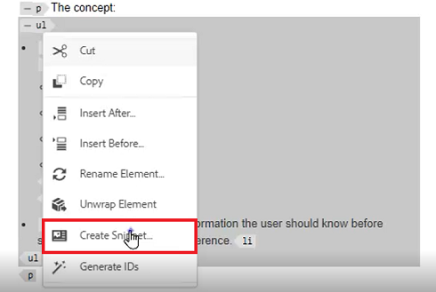

1. Dans la boîte de dialogue Nouveau fragment de code, ajoutez un **Titre** et un **Description**.

1. Modifiez le fragment de code selon vos besoins.

   Notez qu’une vérification contextuelle vous avertit visuellement si vous introduisez une erreur dans le contenu.

1. Cliquez sur [!UICONTROL **Créer**].

Le fragment de code est ajouté à la liste des fragments de code disponibles. Vous pouvez la faire glisser et la déposer à un emplacement valide de la rubrique.

## Utilisation de modèles

Grâce au panneau Modèles , les administrateurs peuvent facilement créer et gérer des modèles à l’intention des auteurs. Par défaut, les modèles sont classés en tant que types Carte et Rubrique.

Pour plus d’informations sur la configuration et l’application de modèles[&#128279;](./folder-profiles.md) reportez-vous aux leçons intitulées Profils de dossier et [Workflows de création de contenu simple](simple-content-creation-workflows.md) de ce cours.

## Rechercher des fichiers avec Rechercher et remplacer

Deux options de recherche et de remplacement sont disponibles dans l’éditeur. Le premier permet d’exécuter des fonctions Rechercher et Remplacer dans une rubrique ouverte spécifique, à l’instar d’un traitement de texte traditionnel. La seconde est un panneau Rechercher et remplacer qui recherche du texte dans plusieurs fichiers du référentiel.

Reportez-vous à la leçon intitulée [Vérification orthographique et recherche et remplacement](./spell-check.md) de ce cours pour plus d’informations sur la fonction Rechercher et remplacer.

## Mettre à jour les propriétés du contenu

Les propriétés du contenu dans le panneau de droite incluent des informations spécifiques sur l’élément actuellement sélectionné, par exemple l’identifiant d’attribut et la valeur.

1. Ouvrez une rubrique dans **XML Editor**.

1. Sélectionnez un **élément**.

   Propriétés du contenu affiche le type et les attributs actuels de l’élément.

1. Saisissez une nouvelle **Valeur** pour l’élément.

   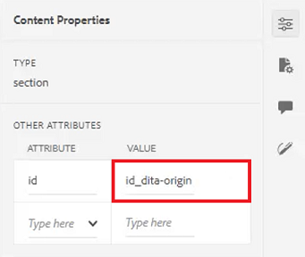

Les propriétés du contenu sont mises à jour de manière dynamique au fur et à mesure que vous modifiez des éléments.

## Ajout d’une rubrique à une carte à l’aide des Propriétés du fichier

Propriétés du fichier affiche des informations supplémentaires sur l’ensemble de la rubrique ouverte. Certaines de ces informations sont contrôlées par les propriétés de la rubrique. Les modifications apportées à d’autres éléments, tels que l’état du document, peuvent dépendre d’autorisations.

1. Ouvrez une rubrique dans l’éditeur.

1. Cliquez sur l’icône [!UICONTROL &#x200B; **Propriétés du fichier**] dans le panneau de droite.

   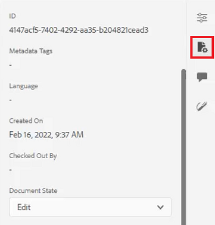

1. Définissez **État du document** sur **Modifier**. Notez que la liste Références est actuellement vide.

   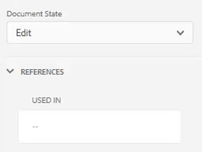

1. Fermez la rubrique.

1. Sélectionnez [!UICONTROL **Vue du référentiel**] dans le panneau de gauche.

1. Ouvrez un mappage.

   La vue devient Vue Carte.

1. Cliquez sur l’icône [!UICONTROL **Modifier**].

   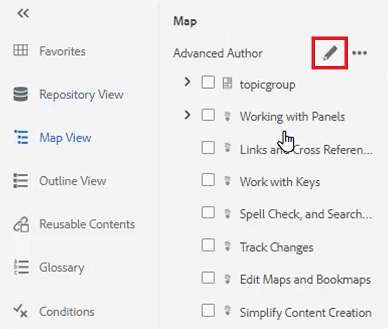

1. Une fois que la carte est ouverte pour modification, revenez à **Vue du référentiel**.

1. Effectuez un glisser-déposer de la rubrique que vous utilisez dans la carte.

1. Cliquez sur l’icône [!UICONTROL **Enregistrer**] dans la barre d’outils supérieure.

La rubrique est ajoutée à la carte. Maintenant, lorsque vous ouvrez la rubrique et vérifiez les Propriétés du fichier, vous pouvez voir que les références sont mises à jour pour refléter le fait que la rubrique est utilisée dans la carte spécifiée.

## Création d’une tâche de révision

Le panneau de droite contient un raccourci pour lancer un workflow de révision.

1. Cliquez sur l’icône [!UICONTROL **Vérifier**] dans le panneau de droite.

   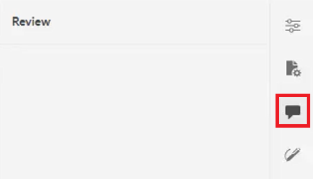

1. Cliquez sur [!UICONTROL **Créer une révision**].

   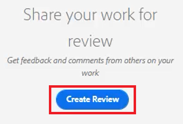

1. Dans la boîte de dialogue Créer une tâche de révision , renseignez les champs selon vos besoins.

1. Cliquez sur [!UICONTROL **Suivant**].

La tâche de révision est créée.

## Suivi des modifications

La possibilité de suivre les modifications vous donne un grand contrôle sur les modifications conservées dans une version d’une rubrique à la suivante. Vous pouvez utiliser le panneau de droite pour gérer les modifications suivies.

Reportez-vous à la leçon intitulée [Suivi des modifications](./track-changes.md) de ce cours pour plus d’informations sur la fonctionnalité de suivi des modifications.
