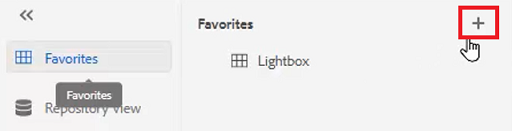
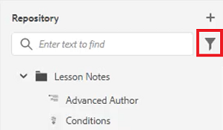
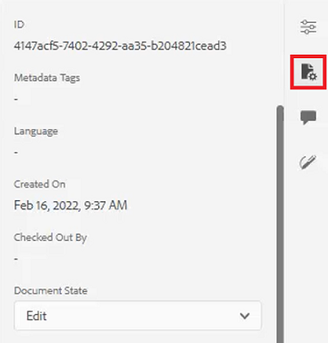

# Panneaux

L’éditeur web de guides d’AEM est divisé en plusieurs sections, notamment une barre d’outils principale, une barre d’outils secondaire, un panneau de gauche, une zone d’édition de contenu et un panneau de droite.

>[!VIDEO](https://video.tv.adobe.com/v/342760?quality=12&learn=on)

## Redimensionner le panneau de gauche

Les panneaux persistants, tels que le panneau de gauche, peuvent être ajustés en taille.

1. Placez le curseur sur la bordure du panneau.

2. Lorsque la flèche bidirectionnelle apparaît, cliquez et faites glisser vers l’intérieur ou vers l’extérieur selon les besoins.

## Développer ou réduire la barre latérale du panneau de gauche

La vue développée affiche les noms et les icônes qui apparaissent sous forme d’info-bulles dans la vue réduite.

1. Cliquez sur le bouton [!UICONTROL **Barre latérale**] pour développer le panneau.

   

2. Cliquez sur le bouton [!UICONTROL **Barre latérale**] pour réduire le panneau.

   

## Création d’une collection de favoris

Dans le panneau de gauche, les Favoris vous permettent de créer une liste de documents spécifiques et de les ajouter au fil du temps. Vous pouvez créer et gérer une vaste collection de Favoris.

1. Sélectionner **Favoris** dans le panneau de gauche.

2. Cliquez sur le bouton [!UICONTROL **Plus**] icône .

   

3. Dans la boîte de dialogue Nouvelle collection, saisissez une **Titre** et un **Description**.

   Notez que sélectionner Public signifie que d’autres utilisateurs peuvent voir ce Favori.

4. Cliquez sur [!UICONTROL **Créer**].

Vous avez maintenant créé une collection Favoris.

## Ajout d’un fichier à une collection Favoris à partir du référentiel

Après avoir créé une collection, vous pouvez commencer à y ajouter des Favoris.

1. Sélectionner **Repository View** dans le panneau de gauche.

2. Cliquez sur le bouton [!UICONTROL **Ellipse**] situé en regard d’une rubrique pour accéder aux options contextuelles.

3. Sélectionner **Ajouter à** > **Favoris**.

4. Dans la boîte de dialogue Ajouter aux favoris , choisissez **Nouvelle collection** ou **Collection existante**.

   Nous choisirons ici d’ajouter à une collection existante.

   

5. Si nécessaire, sélectionnez une collection dans la liste déroulante.

6. Cliquez sur [!UICONTROL **Ajouter**].

La rubrique est ajoutée à la collection Favoris que vous avez choisie. Vous pouvez l’afficher dans le menu Favoris .

## Ajout d’un fichier à une collection Favoris à partir de l’éditeur

Vous pouvez également ajouter une rubrique à vos Favoris à partir d’une rubrique ouverte dans l’éditeur.

1. Accédez au **Repository View**.

2. Double-cliquez sur une rubrique pour l’ouvrir.

3. Cliquez avec le bouton droit sur le **Onglet Titre** dans l’éditeur pour accéder aux options contextuelles.

4. Choisir **Ajouter à** > **Favoris**.

   

5. Dans la boîte de dialogue Ajouter aux favoris , choisissez **Nouvelle collection** ou **Collection existante**.

   Nous choisirons ici d’ajouter à une nouvelle collection.

6. Dans la boîte de dialogue Nouvelle collection, saisissez une **Titre** et un **Description**.

   Notez que la sélection de **Public** signifie que d’autres utilisateurs peuvent voir ce Favori.

7. Cliquez sur [!UICONTROL **Créer**].

Le nouveau favori a été créé et regroupé. Vous pouvez l’afficher dans le menu Favoris .

## Afficher et gérer vos favoris

Il est facile d’afficher les rubriques que vous avez déjà ajoutées à vos collections favorites.

1. Sélectionner [!UICONTROL **Favoris**] dans le panneau de gauche.

2. Sous Favoris, cliquez sur le [!UICONTROL **Flèche**] en regard d’une collection pour en afficher le contenu.

   

3. Cliquez sur le bouton [!UICONTROL **Ellipse**] en regard d’une rubrique pour afficher les options contextuelles, y compris la possibilité de la supprimer de la liste Favoris.

## Filtrage d’une recherche en mode Référentiel

Le filtre amélioré du référentiel vous permet de rechercher du texte avec de nombreuses restrictions.

1. Accédez à **Repository View**.

2. Cliquez sur le bouton [!UICONTROL **Recherche de filtre**] icône .

   

3. Saisissez du texte dans le chemin sélectionné ou choisissez un nouveau chemin si nécessaire.

   La liste des fichiers est mise à jour lorsque vous entrez du texte dans le filtre.

4. Cliquez sur l’icône de flèche en regard d’une catégorie de recherche pour affiner davantage la recherche, le cas échéant.

   

Les recherches peuvent être limitées aux rubriques DITA ou aux mappages DITA. Vous pouvez rechercher des fichiers image non DITA, des fichiers multimédias ou d’autres documents dans le chemin d’accès sélectionné. Vous pouvez même restreindre la recherche aux éléments DITA ou filtrer par extraction de fichier.

## Exploration de la vue Carte

Plusieurs fonctions utiles sont disponibles dans la vue Carte, notamment la possibilité d’extraire et de verrouiller des fichiers, de prévisualiser le fichier de carte, d’ouvrir le tableau de bord de carte et d’afficher la carte dans l’interface utilisateur d’Assets.

Reportez-vous à la leçon intitulée [Cartes et cartes-livres](./maps-and-bookmaps.md) dans ce cours pour plus d’informations sur la vue Carte et ses fonctionnalités.

## Exploration de la vue Ligne

La vue Plan fournit une vue hiérarchique du document actif dans le plan. Vous pouvez développer la vue Ligne pour afficher plusieurs éléments ainsi que les identifiants attribués.

Reportez-vous à la leçon intitulée [Mode plan](./outline-view.md) dans ce cours pour plus d’informations sur la vue Plan et ses fonctionnalités.

## Utilisation de contenus réutilisables

La fonction principale de DITA est la possibilité de réutiliser du contenu, des petites expressions aux rubriques ou mappages entiers. L’éditeur fournit une interface par glisser-déposer pour la réutilisation du contenu.

Reportez-vous à la leçon intitulée [Réutilisation de contenu](./content-reuse.md) dans ce cours pour plus d’informations sur le contenu réutilisable et la manière de le gérer efficacement.

## Utilisation de glossaires

L’utilisation du glossaire facilite l’utilisation d’expressions cohérentes et permet une meilleure clarté pour le lecteur. L’éditeur fournit une interface par glisser-déposer permettant d’insérer des termes de glossaire dans une rubrique.

Reportez-vous à la leçon intitulée [Glossaire](./glossary.md) dans ce cours pour plus d’informations sur la configuration et l’utilisation de glossaires.

## Travail avec les conditions

Dans DITA, les conditions sont souvent motivées par l’utilisation d’attributs tels que Produit, Plateforme et Audience, auxquels des valeurs spécifiques peuvent être affectées. Les conditions sont gérées via les profils de dossier.

Reportez-vous à la leçon intitulée [Conditions](./conditions.md) dans ce cours pour plus d’informations sur la configuration et l’utilisation des attributs conditionnels.

## Création d’un fragment de code

Les fragments de code sont de petits fragments de contenu qui peuvent être réutilisés comme point de départ pour le contenu ou la structure. L’utilisation de fragments réduit le temps nécessaire à la création du contenu et améliore la qualité structurelle et la cohérence des matériaux.

1. Ouvrez une rubrique dans l’éditeur.

2. Sélectionnez un élément dans la rubrique.

3. Cliquez sur le bouton de la souris secondaire dans l’élément .

4. Dans le menu qui s’affiche, sélectionnez Créer . [!UICONTROL **Fragment de code**].

   

5. Dans la boîte de dialogue Nouveau fragment de code, ajoutez une **Titre** et un **Description**.

6. Modifiez le fragment de code selon vos besoins.

   Notez qu’une vérification contextuelle vous avertit visuellement si vous introduisez une erreur dans le contenu.

7. Cliquez sur [!UICONTROL **Créer**].

Le fragment de code est ajouté à la liste des fragments de code disponibles. Il est prêt à être glissé et déposé dans un emplacement valide dans la rubrique.

## Utilisation des modèles

À l’aide du panneau Modèles , les administrateurs peuvent facilement créer et gérer des modèles à utiliser par les auteurs. Par défaut, les modèles sont classés comme de type Carte et Rubrique.

Reportez-vous aux leçons intitulées [Profils de dossier](./folder-profiles.md) et [Processus simples de création de contenu](simple-content-creation-workflows.md) dans ce cours pour plus d&#39;informations sur le paramétrage et l&#39;application des modèles.

## Recherche de fichiers avec Rechercher et remplacer

Deux options Chercher et Remplacer sont disponibles dans l’éditeur. Le premier permet d’utiliser des fonctions Chercher et Remplacer dans une rubrique ouverte spécifique, tout comme un traitement de texte traditionnel. Le second est un panneau Chercher et Remplacer qui recherche du texte dans plusieurs fichiers du référentiel.

Reportez-vous à la leçon intitulée [Vérifier et remplacer l’orthographe](./spell-check.md)  dans ce cours pour plus d’informations sur la fonctionnalité Rechercher et remplacer .

## Mettre à jour les propriétés de contenu

Les propriétés du contenu sur le panneau de droite incluent des informations spécifiques sur l’élément actuellement sélectionné, par exemple l’identifiant d’attribut et la valeur.

1. Ouvrir une rubrique dans **Éditeur XML**.

2. Sélectionnez une **element**.

   Propriétés du contenu affiche le type et les attributs actuels de l’élément.

3. Saisissez un nouveau **Valeur** pour l’élément .

   

Les propriétés du contenu sont mises à jour dynamiquement lorsque vous apportez des modifications aux éléments.

## Ajout d’une rubrique à un mappage à l’aide des propriétés du fichier

Propriétés du fichier affiche des informations supplémentaires sur l’ensemble de la rubrique ouverte. Certaines de ces informations sont contrôlées par les propriétés de rubrique. Les modifications apportées à d’autres documents, tels que l’état du document, peuvent dépendre d’autorisations.

1. Ouvrez une rubrique dans l’éditeur.

2. Cliquez sur le bouton [!UICONTROL  **Propriétés du fichier**] dans le panneau de droite.

   

3. Définissez la variable **État du document** to **Modifier**. Notez que la liste Références est actuellement vide.

   

4. Fermez la rubrique.

5. Sélectionner [!UICONTROL **Repository View**] dans le panneau de gauche.

6. Ouvrez une carte.

   La vue passe en mode Carte.

7. Cliquez sur l’icône [!UICONTROL **Modifier**].

   

8. Une fois que la carte est ouverte pour modification, revenez à **Repository View**.

9. Faites glisser et déposez la rubrique que vous utilisez dans la carte.

10. Cliquez sur le bouton [!UICONTROL **Enregistrer**] dans la barre d’outils supérieure.

La rubrique est ajoutée à la carte. Désormais, lorsque vous ouvrez la rubrique et que vous cochez les Propriétés du fichier, vous pouvez voir que les Références sont mises à jour pour indiquer que la rubrique est utilisée dans la carte spécifiée.

## Création d’une tâche de révision

Le panneau de droite contient un raccourci pour lancer un processus de révision.

1. Cliquez sur le bouton [!UICONTROL **Réviser**] dans le panneau de droite.

   

2. Cliquez sur [!UICONTROL **Créer une révision**].

   

3. Dans la boîte de dialogue Créer une tâche de révision, renseignez les champs selon les besoins.

4. Cliquez sur [!UICONTROL **Suivant**].

La tâche de révision est créée.

## Suivi des modifications

La possibilité d’effectuer le suivi des modifications vous permet de contrôler considérablement les modifications conservées dans une version d’une rubrique par rapport à la version suivante. Vous pouvez utiliser le panneau de droite pour gérer les modifications suivies.

Reportez-vous à la leçon intitulée [Suivi des modifications](./track-changes.md) dans ce cours pour plus d’informations sur la fonctionnalité de suivi des modifications.
