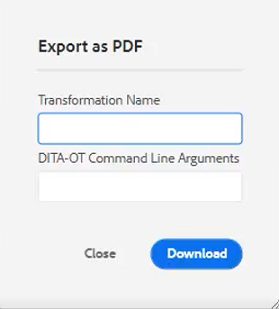
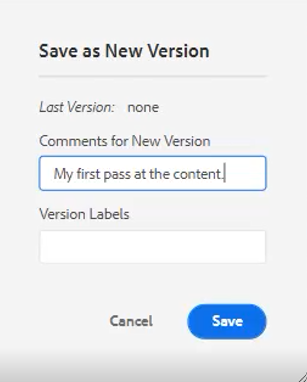
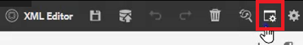

# Processus simples de création de contenu

L’éditeur de guides d’AEM comporte plusieurs raccourcis qui simplifient le processus de création de contenu. Ces raccourcis permettent aux utilisateurs d’ajouter et de modifier rapidement des images, de travailler simultanément sur plusieurs rubriques, de corriger les erreurs, de télécharger des PDF de rubrique et d’utiliser des versions et des étiquettes.

>[!VIDEO](https://video.tv.adobe.com/v/342770)

## Ajouter une image

Des images peuvent être ajoutées directement à partir d&#39;un disque local.

1. Faites glisser l’image directement dans la rubrique. Le **Chargement de ressources** s’affiche.

   

2. Modifiez le chemin du dossier à l’emplacement de l’image de votre choix.

3. Donnez au nom de l’image un nom représentatif de son objectif.

4. Cliquez sur [!UICONTROL **Charger**].

## Modification d’une image

1. Redimensionnez une image en faisant glisser un coin.

2. Déplacez une image vers un autre emplacement de la rubrique en la faisant glisser et en la déposant.

3. Utilisation **Propriétés du contenu** dans le panneau de droite pour modifier le

   ・ échelle

   • position

   ・ alignement, ou

   ・ d&#39;autres attributs.

   

## Utilisation de plusieurs rubriques

La vue fractionnée s’avère utile lors de la comparaison de rubriques, de la copie et du collage entre des rubriques ou du glissement et du dépôt de contenu d’une rubrique vers une autre.

1. Ouvrez plusieurs rubriques connexes.

2. Cliquez sur l’onglet Titre d’un fichier pour ouvrir le menu contextuel.

3. Sélectionner [!UICONTROL **Partage**].

4. Choisir **Right**.

   

## Correction des erreurs typographiques

1. Localisez le mot ou l’expression contenant l’erreur.

2. Appuyez et maintenez la pression [!UICONTROL **Ctrl**].

3. Cliquez sur le bouton secondaire de la souris sur l’erreur.

4. Sélectionnez l’orthographe correcte.

L’erreur a été corrigée dans le texte de la rubrique.

## Téléchargement d’un PDF de rubrique

Les utilisateurs peuvent télécharger un PDF de la rubrique actuelle à marquer ou à partager avec d’autres personnes.

1. Cliquez sur [!UICONTROL **Aperçu**] en haut à droite de l’écran.

2. Cliquez sur le bouton [!UICONTROL **Icône PDF**] au-dessus de la rubrique . Une boîte de dialogue s’affiche.

   

3. Renseignez les informations de l’une ou de l’autre **Nom de la transformation** ou **Arguments de ligne de commande DITA-OT** si nécessaire. Notez qu’un PDF est toujours généré si tous les champs sont laissés vides.

4. Cliquez sur [!UICONTROL **Télécharger**]. Le PDF est généré.

5. Utilisez les icônes disponibles pour configurer, télécharger ou partager la rubrique du PDF.

## Recherche d’une rubrique dans le référentiel ou la carte

1. Ouvrez la rubrique.

2. Cliquez sur le bouton de la souris secondaire dans l’onglet Titre.

3. Sélectionner **Localisez la page**.

4. Choisissez l’une **Référentiel** ou **Carte** pour accéder à l’emplacement souhaité de la rubrique.

## Version d’une rubrique

1. Apportez une modification à une rubrique.

2. Enregistrez la rubrique.

3. Cliquez sur le bouton **Référentiel** dans le menu supérieur gauche.

   

4. Dans la boîte de dialogue, ajoutez **Commentaires pour la nouvelle version**.

   

5. Cliquez sur [!UICONTROL **Enregistrer**].

Le numéro de version est mis à jour.

## Chargement des libellés de version

Tenter de suivre l’état d’une rubrique en fonction du numéro de version peut s’avérer difficile. Les libellés facilitent l’identification de l’état exact d’un sujet qui a subi plusieurs révisions.

1. Sélectionnez une **Profil de dossier**.

2. Dans le profil du dossier, configurez l’éditeur XML.

   a. Sélectionnez Modifier en haut à gauche de l’écran.

   b. Sous Étiquettes de version de contenu XML, ajoutez une nouvelle rubrique ou utilisez une rubrique existante.

   

3. Sélectionnez [!UICONTROL **Télécharger**].

4. Choisissez un fichier tel que ReviewLabels.json ou un fichier similaire. Les détails de la création d’un tel fichier sont présentés dans une autre vidéo.

5. Cliquez sur [!UICONTROL **Ouvrir**].

6. Cliquez sur [!UICONTROL **Enregistrer**] en haut à gauche de l’écran Profil de dossier .

7. Cliquez sur [!UICONTROL **Fermer**] en haut à droite.

Les libellés de version sont désormais chargés.

## Attribution de libellés de version

1. Chargement des libellés de version.

2. Cliquez sur le bouton [!UICONTROL **Préférences utilisateur**] en haut à gauche de la rubrique active.

   

3. Sélectionnez le même profil de dossier où les libellés de version ont été précédemment chargés.

4. Dans la boîte de dialogue Préférences utilisateur, assurez-vous que le chemin d’accès de base référence les mêmes informations que celles auxquelles le profil de dossier a été appliqué.

   

5. Cliquez sur [!UICONTROL **Enregistrer**].

6. Version de la rubrique.

7. Ajoutez un commentaire et sélectionnez un libellé de version dans la liste déroulante.

   

8. Cliquez sur [!UICONTROL **Enregistrer**].

Le numéro de version est mis à jour.

## Affichage de l’historique des versions et des libellés

1. Dans le panneau de gauche, recherchez le titre de la rubrique active.

2. Cliquez sur le titre pour ouvrir le menu contextuel.

3. Sélectionner [!UICONTROL **Affichage dans l’interface utilisateur d’Assets**].

   

   - L’historique des versions avec les libellés s’affiche à gauche.

   

4. Cliquez sur une version pour accéder à des options telles que **Revenir à cette version** et **Aperçu de la version**.

## Créer un modèle

Il existe des modèles pour les rubriques et les mappages. Les administrateurs peuvent accéder aux modèles dans le panneau de gauche.

1. Cliquez sur [!UICONTROL **Modèles**] dans le panneau de gauche.

2. Sélectionnez Carte ou Rubrique pour ouvrir le menu contextuel associé.

3. Cliquez sur pour ajouter le nouveau modèle.

   

4. Renseignez les champs de la boîte de dialogue qui s’affiche.

Le modèle shell s’affiche, contenant un exemple de contenu et une structure d’exemple.
