# Workflows de création de contenu simple

L’éditeur AEM Guides dispose de plusieurs raccourcis qui simplifient le workflow de création de contenu. Ces raccourcis permettent aux utilisateurs d’ajouter et de modifier rapidement des images, d’utiliser plusieurs rubriques à la fois, de corriger des erreurs, de télécharger des PDF de rubrique et d’utiliser des versions et des libellés.

>[!VIDEO](https://video.tv.adobe.com/v/342770?quality=12&learn=on)

## Ajouter une image

Les images peuvent être ajoutées directement à partir d&#39;un lecteur local.

1. Glissez-déposez l’image directement dans la rubrique. La boîte de dialogue **Télécharger Assets** s’affiche.

   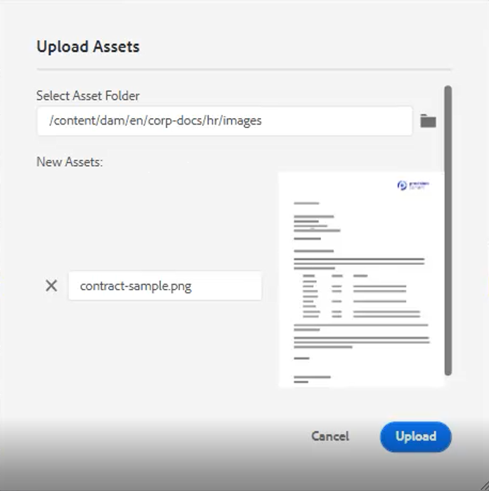

1. Modifiez le chemin du dossier à l’emplacement d’image souhaité.

1. Remplacez le nom de l’image par quelque chose de représentatif de son objectif.

1. Cliquez sur [!UICONTROL **Charger**].

## Modifier une image

1. Redimensionnez une image en faisant glisser et en déposant un coin.

1. Déplacez une image vers un autre emplacement du sujet en la faisant glisser et en la déposant.

1. Utilisez **Propriétés du contenu** dans le panneau latéral droit pour modifier la

   - mettre à l&#39;échelle

   - position

   - alignement, ou

   - autres attributs.

   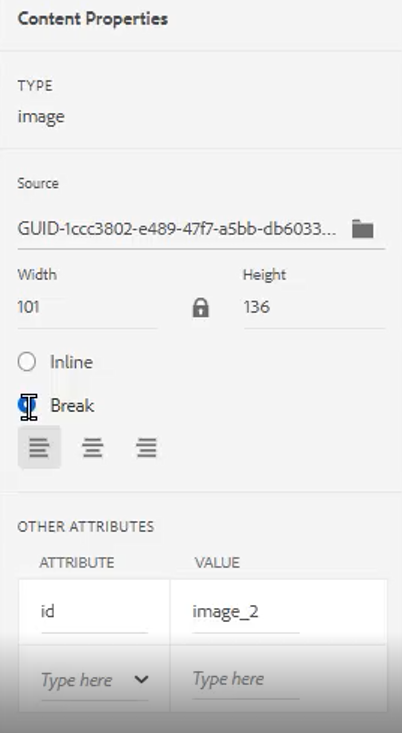

## Utiliser plusieurs rubriques

Le mode partagé est utile pour comparer des rubriques, copier et coller entre des rubriques ou faire glisser et déposer du contenu d’une rubrique à une autre.

1. Ouvrez deux rubriques connexes ou plus.

1. Cliquez sur l’onglet Titre d’un fichier pour ouvrir le menu contextuel.

1. Sélectionnez [!UICONTROL **Partager**].

1. Choisissez **Droite**.

   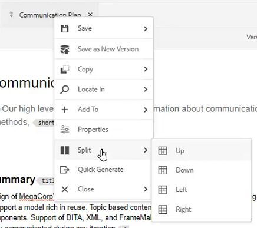

## Corriger les erreurs typographiques

1. Recherchez le mot ou l’expression contenant l’erreur.

1. Maintenez la touche enfoncée [!UICONTROL **Ctrl**].

1. Cliquez sur le bouton secondaire de la souris sur l’erreur.

1. Sélectionnez l’orthographe correcte.

L&#39;erreur a été corrigée dans le texte de la rubrique.

## Télécharger une rubrique PDF

Les utilisateurs peuvent vouloir télécharger un PDF de la rubrique actuelle pour le marquer ou le partager avec d’autres personnes.

1. Cliquez sur [!UICONTROL **Aperçu**] en haut à droite de l’écran.

1. Cliquez sur l&#39;icône [!UICONTROL **&#x200B;**] au-dessus de la rubrique. Une boîte de dialogue s’affiche.

   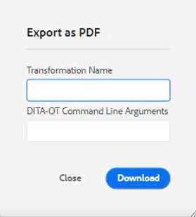

1. Renseignez les informations relatives aux arguments de ligne de commande **Nom de la transformation** ou **DITA-OT** si nécessaire. Notez qu’un PDF est toujours généré si tous les champs ne sont pas renseignés.

1. Cliquez sur [!UICONTROL **Télécharger**]. Le PDF génère.

1. Utilisez les icônes disponibles pour configurer, télécharger ou partager la rubrique PDF.

## Localiser une rubrique dans le référentiel ou le mappage

1. Ouvrez la rubrique.

1. Cliquez sur le bouton secondaire de la souris sur l&#39;onglet Titre.

1. Sélectionnez **Localiser dans**.

1. Choisissez **Référentiel** ou **Mappage** pour accéder à l’emplacement de rubrique souhaité.

## Version d’une rubrique

1. Apportez une modification à une rubrique.

1. Enregistrez la rubrique.

1. Cliquez sur l’icône **Référentiel** dans le menu supérieur gauche.

   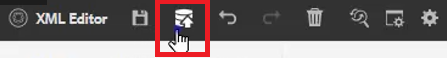

1. Dans la boîte de dialogue, ajoutez **Commentaires pour la nouvelle version**.

   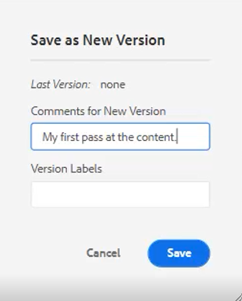

1. Cliquez sur [!UICONTROL **Enregistrer**].

Le numéro de version est mis à jour.

## Charger les libellés de version

Il peut s’avérer difficile d’effectuer le suivi de l’état d’une rubrique en fonction du numéro de version uniquement. Les libellés permettent d’identifier plus facilement l’état exact d’une rubrique qui a fait l’objet de plusieurs révisions.

1. Sélectionnez un **Profil de dossier**.

1. Dans le profil du dossier, configurez l’éditeur XML.

   a. Sélectionnez Modifier en haut à gauche de l’écran.

   b. Sous Étiquettes de version du contenu XML, ajoutez une nouvelle rubrique ou utilisez une rubrique existante.

   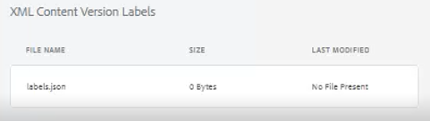

1. Sélectionnez [!UICONTROL **Charger**].

1. Sélectionnez un fichier tel que ReviewLabels.json ou un fichier similaire. Les détails sur la création d’un tel fichier sont abordés dans une autre vidéo.

1. Cliquez sur [!UICONTROL **Ouvrir**].

1. Cliquez sur [!UICONTROL **Enregistrer**] en haut à gauche de l’écran Profil de dossier.

1. Cliquez sur [!UICONTROL **Fermer**] en haut à droite.

Les libellés de version sont maintenant chargés.

## Attribuer des libellés de version

1. Charger les libellés de version.

1. Cliquez sur l’icône [!UICONTROL **Préférences utilisateur**] en haut à gauche de la rubrique active.

   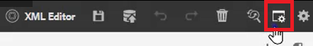

1. Sélectionnez le même profil de dossier que celui dans lequel les libellés de version ont été précédemment chargés.

1. Dans la boîte de dialogue Préférences utilisateur, assurez-vous que le chemin d’accès de base référence les mêmes informations auxquelles le profil de dossier a été appliqué.

   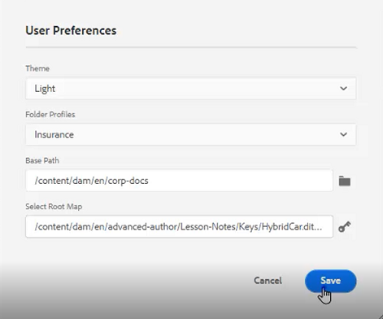

1. Cliquez sur [!UICONTROL **Enregistrer**].

1. Créez une version de la rubrique.

1. Ajoutez un commentaire et sélectionnez un libellé de version dans la liste déroulante.

   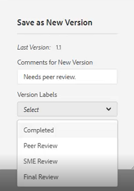

1. Cliquez sur [!UICONTROL **Enregistrer**].

Le numéro de version est mis à jour.

## Afficher l’historique des versions et les libellés

1. Dans le panneau de gauche, recherchez le titre actuel de la rubrique.

1. Cliquez sur le titre pour ouvrir le menu contextuel.

1. Sélectionnez [!UICONTROL **Afficher dans l’interface utilisateur d’Assets**].

   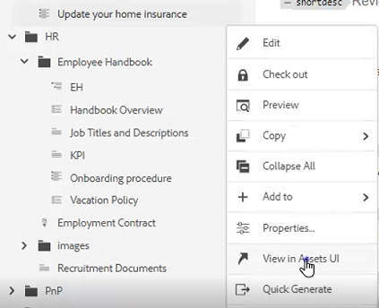

   - L’historique des versions avec les libellés s’affiche à gauche.

   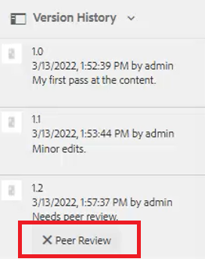

1. Cliquez sur une version pour accéder à des options telles que **Revenir à cette version** et **Prévisualiser la version**.

## Création d’un modèle

Il existe des modèles pour les rubriques et les cartes. Les administrateurs peuvent accéder aux modèles dans le panneau de gauche.

1. Cliquez sur [!UICONTROL **Modèles**] dans le panneau de gauche.

1. Sélectionnez Carte ou Rubrique pour ouvrir le menu contextuel associé.

1. Cliquez sur pour ajouter le nouveau modèle.

   

1. Renseignez les champs dans la boîte de dialogue qui s’affiche.

Le modèle de shell apparaît, contenant un exemple de contenu et un exemple de structure.
