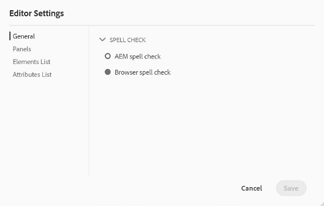
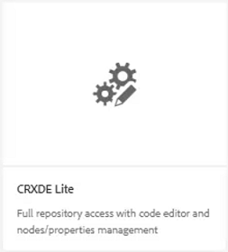
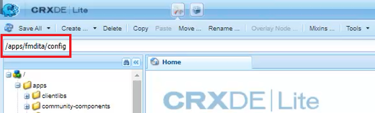
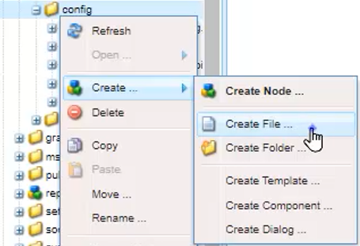
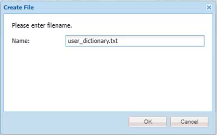
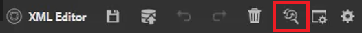
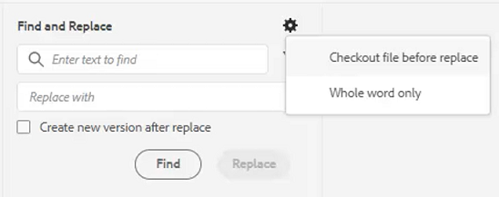
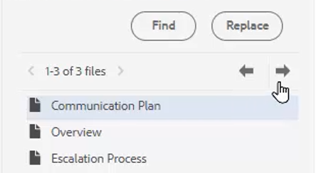

# Vérification orthographique et rechercher/remplacer

L’éditeur AEM Guides dispose de puissantes fonctionnalités de vérification orthographique et de recherche et remplacement.

>[!VIDEO](https://video.tv.adobe.com/v/342768?quality=12&learn=on)

Correction d’une faute d’orthographe

1. Recherchez une erreur dans une rubrique ouverte, soulignée en rouge.

1. Maintenez la touche Ctrl enfoncée tout en cliquant sur le bouton de souris secondaire à l’intérieur du mot.

1. Choisissez la bonne orthographe parmi les suggestions.

Si l’orthographe correcte n’est pas suggérée, vous pouvez toujours modifier manuellement le mot.

## Basculer vers la vérification orthographique AEM

Vous pouvez utiliser un outil de vérification orthographique autre que le dictionnaire par défaut du navigateur.

1. Accédez à **Paramètres de l’éditeur**.

1. Sélectionnez l’onglet Paramètres **généraux**.

   

1. Il existe deux options :

   - **Vérification orthographique du navigateur** : paramètre par défaut dans lequel la vérification orthographique utilise le dictionnaire intégré du navigateur.

   - **Vérification orthographique AEM** — utilisez-la pour créer une liste de mots personnalisée à l&#39;aide du dictionnaire personnalisé AEM.

1. Choisissez **Vérification Orthographique**.

1. Cliquez sur [!UICONTROL **Enregistrer**].

Configuration d’un dictionnaire personnalisé

L’administrateur peut modifier les paramètres afin que le dictionnaire AEM reconnaisse les mots personnalisés tels que les noms de société.

1. Accédez au volet **Outils**.

1. Connectez-vous à ****.

   

1. Accédez au nœud **_/apps/fmdita/config_**.

   

1. Créez un fichier .

   a. Cliquez avec le bouton droit sur le dossier de configuration.

   b. Choisissez **Créer > Créer un fichier**.

   

   c. Nommez le fichier _**user_dictionary.txt**_.

   

   d. Cliquez sur [!UICONTROL **OK**].

1. Ouvrez le fichier .

1. Ajoutez une liste de mots à inclure dans votre dictionnaire personnalisé.

1. Cliquez sur [!UICONTROL **Enregistrer tout**].

1. Fermez le fichier .

Il se peut que les auteurs doivent redémarrer leur session d’éditeur web pour obtenir la liste de mots personnalisés mise à jour dans le dictionnaire AEM.

## Rechercher et remplacer dans un seul fichier

1. Cliquez sur l’icône Rechercher et remplacer dans la barre d’outils supérieure.

   

1. Dans la barre d’outils inférieure, saisissez un mot ou une expression.

1. Cliquez sur [!UICONTROL **Rechercher**].

1. Si nécessaire, saisissez un mot pour remplacer le mot trouvé.

1. Cliquez sur [!UICONTROL **Remplacer**].

## Rechercher et remplacer dans le référentiel

1. Accédez au **référentiel**.

1. Cliquez sur l’icône [!UICONTROL **Rechercher et remplacer**] en bas à gauche de l’écran.

1. Cliquez sur l’icône [!UICONTROL **Afficher les paramètres**].

1. Choisissez l’une des options suivantes :

   - **Extraction du fichier avant remplacement** — si un administrateur l&#39;active, le fichier sera extrait automatiquement avant de remplacer les termes de recherche.

   - **Mot entier uniquement** — limite la recherche pour renvoyer uniquement le mot ou l&#39;expression exact saisi.

   

1. Cliquez sur l’icône [!UICONTROL **Appliquer le filtre**] pour sélectionner le chemin d’accès dans le référentiel où vous souhaitez effectuer la recherche.

1. Saisissez les termes à rechercher et à remplacer.

1. Si nécessaire, sélectionnez **Créer une version après le remplacement**.

1. Cliquez sur [!UICONTROL **Rechercher**].

1. Ouvrez le fichier souhaité et utilisez les flèches pour passer d’un résultat trouvé au suivant.

   
