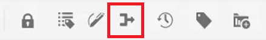

# Suivi des modifications

Vous pouvez effectuer le suivi de toutes les mises à jour effectuées sur un document en activant le mode de suivi des modifications . Ce mode vous permet, ainsi qu’à votre équipe, de capturer toutes les insertions et les suppressions survenues pendant le processus de révision des documents.

>[!VIDEO](https://video.tv.adobe.com/v/342763?quality=12&learn=on)

## Utilisation de la fonction de suivi des modifications

1. Active/désactive l’icône de la barre d’outils **Track Changes** pour activer (ou désactiver) la fonctionnalité.

   

1. Effectuez une modification dans la rubrique.

   Le contenu ajouté s’affiche désormais en vert avec une barre de modification. Le contenu supprimé s’affiche en rouge avec une barré.

1. Sélectionnez l’icône **Modifications suivies** à droite pour accéder au panneau Modifications suivies.

   

1. Cliquez sur [!UICONTROL **Enregistrer**].

   

1. Fermez la rubrique.

D’autres utilisateurs peuvent désormais ouvrir la rubrique et afficher les modifications suivies existantes. Ils peuvent accepter ou refuser les modifications et ajouter les leurs.

## Rechercher les modifications suivies

La fonction de recherche s’avère utile lorsque de nombreuses modifications font l’objet d’un suivi, car le défilement de ces modifications peut prendre du temps.

1. Sélectionnez l’icône **Modifications suivies** à droite pour accéder au panneau Modifications suivies.

1. Saisissez un mot ou une expression dans le champ Rechercher .
La recherche renvoie toutes les modifications qui correspondent aux mots recherchés.

## Filtrer les modifications suivies

Plusieurs modifications suivies peuvent également être filtrées par insertion, suppression ou réviseur.

1. Cliquez sur l’icône [!UICONTROL **Filtre**] au bas du panneau Modifications suivies.

1. Cochez les cases correspondant aux filtres souhaités.

   

1. Cliquez sur [!UICONTROL **Appliquer**].

## Accepter ou rejeter les modifications suivies

Les réviseurs et les experts en la matière peuvent accepter ou refuser les modifications d’autres utilisateurs, individuellement ou tous en même temps.

1. Cliquez sur l’icône [!UICONTROL **Modifications suivies**] à droite pour accéder au panneau Modifications suivies.

1. Sélectionnez une modification spécifique.

1. Cliquez sur l’icône [!UICONTROL **Thumbs Up**] ou [!UICONTROL **Thumbs Down**] associée à la modification pour l’accepter ou la rejeter.

   

   Ou

   Cliquez sur l’icône [!UICONTROL **Thumbs Up**] ou [!UICONTROL **Thumbs Down**] au-dessus de la barre de recherche pour accepter ou rejeter toutes les modifications.

   

1. [!UICONTROL **Enregistrez**] la rubrique.

## Utilisation de la fonction de fusion

Lorsque vous travaillez dans un environnement de plusieurs auteurs, il peut être difficile de suivre les modifications apportées par d’autres auteurs dans une rubrique ou une carte. La fonction Fusion vous permet de mieux contrôler non seulement l’affichage des modifications, mais également les modifications conservées dans la dernière version du document.

1. Ouvrez une rubrique dans l’éditeur web.

1. Cliquez sur l’icône [!UICONTROL **Fusionner**] dans la barre d’outils.

   

1. Dans la boîte de dialogue Fusionner , sélectionnez une version du fichier avec laquelle comparer la version actuelle du fichier.

1. Dans les Options, choisissez :

   - **Suivi des modifications à partir de la version sélectionnée** : cette option affiche toutes les mises à jour de contenu sous la forme de modifications suivies. Vous pouvez ensuite choisir d’accepter ou de rejeter les modifications du document une par une ou toutes à la fois.

   - **Revenir à la version sélectionnée** : cette option rétablit la version actuelle du document sur la version sélectionnée. Il ne vous donne aucun contrôle sur le contenu accepté ou rejeté.

1. Cliquez sur [!UICONTROL **Terminé**].

Si vous avez sélectionné l’option **Track Changes From Selected Version**, toutes les modifications de la version sélectionnée s’affichent dans l’onglet Changes du panneau de droite.
