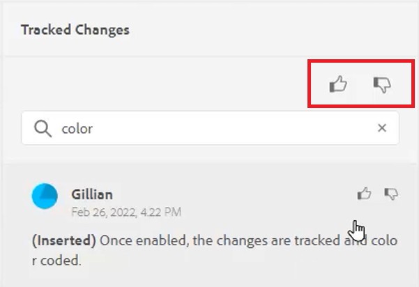
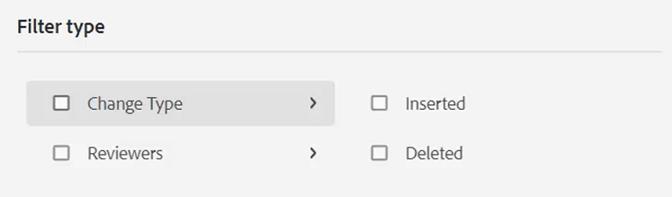
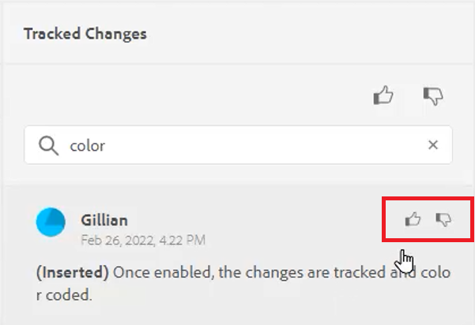

# Suivi des modifications

Vous pouvez suivre toutes les mises à jour apportées à un document en activant le mode Suivi des modifications. Ce mode vous permet, à vous et à votre équipe, de capturer toutes les insertions et suppressions pendant le processus de révision du document.

>[!VIDEO](https://video.tv.adobe.com/v/342763?quality=12&learn=on)

## Utilisation de la fonction de suivi des modifications

1. Activez/désactivez l’icône de la barre d’outils **Suivi des modifications** pour activer (ou désactiver) la fonction.

   

1. Apportez une modification à la rubrique.

   Le contenu ajouté s’affiche désormais en vert avec une barre de modification. Le contenu supprimé s’affiche en rouge et est barré.

1. Sélectionnez l’icône **Modifications suivies** à droite pour accéder au panneau Modifications suivies.

   

1. Cliquez sur [!UICONTROL **Enregistrer**].

   

1. Fermez la rubrique.

D’autres utilisateurs peuvent désormais ouvrir la rubrique et afficher les modifications suivies existantes. Ils peuvent accepter ou refuser les modifications et ajouter les leurs.

## Rechercher les modifications suivies

La fonction de recherche est utile lorsqu’il existe de nombreuses modifications suivies, car faire défiler ces modifications peut prendre du temps.

1. Sélectionnez l’icône **Modifications suivies** à droite pour accéder au panneau Modifications suivies.

1. Saisissez un mot ou une expression dans le champ Rechercher .
La recherche renvoie toutes les modifications qui correspondent aux mots recherchés.

## Filtrage des modifications suivies

Plusieurs modifications suivies peuvent également être filtrées par insertion, suppression ou réviseur.

1. Cliquez sur l’icône [!UICONTROL **Filtrer**] au bas du panneau Modifications suivies.

1. Cochez les cases correspondant aux filtres souhaités.

   

1. Cliquez sur [!UICONTROL **Appliquer**].

## Acceptation ou rejet des modifications suivies

Les réviseurs et les experts peuvent accepter ou refuser les modifications apportées par les autres utilisateurs, individuellement ou en une seule fois.

1. Cliquez sur l’icône [!UICONTROL **Modifications suivies**] à droite pour accéder au panneau Modifications suivies.

1. Sélectionnez une modification spécifique.

1. Cliquez sur l’icône [!UICONTROL **Pouces vers le haut**] ou [!UICONTROL **Pouces vers le bas**] associée à la modification pour l’accepter ou la rejeter.

   

   Ou

   Cliquez sur l’icône [!UICONTROL **Pouces vers le haut**] ou [!UICONTROL **Pouces vers le bas**] au-dessus de la barre de recherche pour accepter ou rejeter toutes les modifications.

   

1. [!UICONTROL **Enregistrer**] la rubrique.

## Utiliser la fonction de fusion

Lorsque vous travaillez dans un environnement multi-auteurs, il peut être difficile de suivre les modifications que d’autres auteurs ont apportées à une rubrique ou à un mappage. La fonction de fusion vous permet de mieux contrôler non seulement l’affichage des modifications, mais également les modifications conservées dans la dernière version du document.

1. Ouvrez une rubrique dans l’éditeur web.

1. Cliquez sur l’icône [!UICONTROL **Fusionner**] dans la barre d’outils.

   

1. Dans la boîte de dialogue Fusionner, sélectionnez la version du fichier avec laquelle vous souhaitez comparer la version actuelle du fichier.

1. Dans la liste Options, choisissez :

   - **Suivi des modifications à partir de la version sélectionnée** : cette option affiche toutes les mises à jour de contenu sous la forme de modifications suivies. Vous pouvez ensuite choisir d&#39;accepter ou de rejeter les modifications apportées au document une par une ou toutes en même temps.

   - **Rétablir la version sélectionnée** : cette option rétablit la version actuelle du document à la version sélectionnée. Il ne vous permet pas de contrôler le contenu accepté ou rejeté.

1. Cliquez sur [!UICONTROL **Terminé**].

Si vous avez sélectionné l’option **Suivi des modifications à partir de la version sélectionnée**, toutes les modifications de la version sélectionnée apparaissent dans l’onglet Modifications du panneau de droite.
