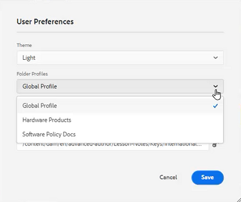

# Préférences utilisateur, paramètres de l’éditeur et barres d’outils de l’éditeur

L’éditeur dispose d’une interface hautement configurable. La combinaison des préférences utilisateur, des paramètres d’éditeur et des profils de dossier vous permet de personnaliser presque tous les aspects de votre environnement de travail spécifique.

>[!VIDEO](https://video.tv.adobe.com/v/342769)

## Afficher ou masquer les balises d’élément

Les balises sont des repères visuels indiquant les limites d’un élément. Une limite d’élément marque le début et la fin d’un élément. Vous pouvez ensuite utiliser ces bordures comme indice visuel pour placer le point d’insertion ou sélectionner le texte à l’intérieur d’une limite.

1. Cliquez sur le bouton [!UICONTROL **Activer/désactiver la vue Balises**] dans la barre d’outils secondaire.

   

   Les balises s’affichent dans la rubrique. Avec la vue Balises, vous pouvez :

   ・ Sélectionnez le contenu d’un élément en cliquant sur la balise d’ouverture ou de fermeture.

   ・ Développez ou réduisez les balises en cliquant sur le signe + ou - dans la balise .

   ・ Utilisez le menu contextuel pour couper, copier ou dépasser l’élément sélectionné.

   ・ Effectuez un glisser-déposer d’éléments en sélectionnant la balise et en déposant l’élément à un emplacement valide.

2. Cliquez sur le bouton [!UICONTROL **Activer/désactiver la vue Balises**] pour masquer à nouveau les balises.

Les balises disparaissent pour vous permettre de vous concentrer sur le texte.

## Verrouillage de ressources en cas d’utilisation

Le verrouillage (ou l’extraction) d’un fichier donne à l’utilisateur un accès exclusif en écriture sur le fichier. Lorsque le fichier est Déverrouillé (ou archivé), les modifications sont enregistrées dans la version actuelle du fichier.

1. Cliquez sur le bouton [!UICONTROL **Verrouiller**] dans la barre d’outils secondaire.

   

   Le fichier a été extrait et une icône représentant un cadenas s’affiche en regard du nom du fichier dans le référentiel.

2. Cliquez sur le bouton [!UICONTROL **Déverrouiller**] icône .

   

Le référentiel se met à jour pour indiquer que le fichier a été archivé.

## Insertion de caractères spéciaux

1. Cliquez sur le bouton [!UICONTROL **Insertion de caractères spéciaux**] dans la barre d’outils secondaire.

   

2. Dans la boîte de dialogue Insérer un caractère spécial, saisissez le nom du caractère dans la barre de recherche.

   Vous pouvez également utiliser la liste déroulante Sélectionner une catégorie pour afficher tous les caractères d’une catégorie spécifique.

3. Sélectionnez le caractère de votre choix.

4. Cliquez sur [!UICONTROL **Insérer**].

Le caractère spécial est inséré dans le texte.

## Basculement entre les modes Auteur, Source et Aperçu

La barre d’outils située en haut à droite de l’écran vous permet de basculer entre les vues.

・ Sélectionner **Auteur** pour afficher la structure et le contenu au fur et à mesure que vous travaillez avec une rubrique.

・ Sélectionner **Source** pour afficher le code XML sous-jacent qui constitue la rubrique.

・ Sélectionner **Aperçu** pour afficher comment une rubrique s’affiche lorsqu’elle est affichée par un utilisateur dans son navigateur.

## Modification du thème avec les préférences utilisateur

Vous pouvez choisir parmi des thèmes clairs ou sombres pour l’éditeur. À l’aide du thème Lumière, les barres d’outils et les panneaux utilisent un arrière-plan gris clair. À l’aide du thème sombre, les barres d’outils et les panneaux utilisent un arrière-plan noir. Dans les deux thèmes, la zone d’édition du contenu s’affiche avec un arrière-plan blanc.

1. Cliquez sur le bouton [!UICONTROL **Préférences utilisateur**] dans la barre d’outils supérieure.

   

2. Dans la boîte de dialogue Préférences utilisateur, cliquez sur le [!UICONTROL **Thème**] menu déroulant.

3. Choisissez l’une des options disponibles.

   

4. Cliquez sur [!UICONTROL **Enregistrer**].

L’éditeur est mis à jour afin d’afficher le thème de votre choix.

## Mise à jour du chemin de base avec les préférences utilisateur

Vous pouvez mettre à jour le chemin d’accès de base afin que la vue Repository vous montre le contenu d’un emplacement spécifique dès que vous lancez l’éditeur. Cela réduit le temps d’accès aux fichiers de travail.

1. Cliquez sur le bouton [!UICONTROL **Préférences utilisateur**] dans la barre d’outils supérieure.

   

2. Dans la boîte de dialogue Préférences utilisateur, cliquez sur le [!UICONTROL **Dossier**] en regard du chemin d’accès de base.

   

3. Dans la boîte de dialogue Sélectionner le chemin, cochez la case en regard d’un dossier spécifique.

4. Cliquez sur [!UICONTROL **Sélectionner**].

La prochaine fois que vous lancez l’éditeur, le référentiel affiche les fichiers qui ont été spécifiés dans le chemin d’accès de base.

## Attribution d’un nouveau profil de dossier

Le profil global est une valeur par défaut du système. Les administrateurs peuvent créer d’autres profils de dossier parmi lesquels effectuer un choix.

1. Cliquez sur le bouton [!UICONTROL **Préférences utilisateur**] dans la barre d’outils supérieure.

   

2. Dans la boîte de dialogue Préférences utilisateur, cliquez sur le [!UICONTROL **Profils de dossier**] menu déroulant.

   

3. Choisissez un profil parmi les options disponibles.

4. Cliquez sur [!UICONTROL **Enregistrer**].

Le nouveau profil de dossier est désormais attribué. Elle a modifié les options de la barre d’outils, les modes d’affichage et les conditions et les fragments de code dans le panneau de gauche. Il peut également modifier l’aspect visuel du contenu dans l’éditeur.

## Modification du dictionnaire à l’aide des paramètres de l’éditeur

Les paramètres de l’éditeur sont disponibles pour les administrateurs. Ces préférences vous permettent de configurer un éventail de paramètres, dont l’un est le dictionnaire utilisé par l’éditeur pour la vérification orthographique.

1. Cliquez sur le bouton [!UICONTROL **Paramètres de l’éditeur**] dans la barre d’outils supérieure.

   

2. Dans la boîte de dialogue Paramètres de l’éditeur, cliquez sur [!UICONTROL **Général**] .

3. Sélectionnez le dictionnaire que vous souhaitez utiliser.

4. Cliquez sur [!UICONTROL **Enregistrer**].

Le dictionnaire se met à jour. Notez que le passage à la vérification orthographique AEM vous permet d’utiliser une liste de mots personnalisée.

## Afficher et masquer les panneaux avec les paramètres de l’éditeur

Les panneaux constituent l’une des fonctionnalités que vous pouvez personnaliser à l’aide des paramètres de l’éditeur. Plus précisément, vous pouvez sélectionner les panneaux qui sont affichés ou masqués dans l’éditeur.

1. Cliquez sur le bouton [!UICONTROL **Paramètres de l’éditeur**] dans la barre d’outils supérieure.

   

2. Dans la boîte de dialogue Paramètres de l’éditeur, cliquez sur [!UICONTROL **Panneaux**] .

3. Activez/désactivez les panneaux disponibles pour les afficher ou les masquer selon les besoins.

   

4. Cliquez sur [!UICONTROL **Enregistrer**].

Le panneau de gauche est maintenant configuré pour afficher uniquement les panneaux activés sur Afficher.

## Eléments de nom et d’étiquette dans les paramètres de l’éditeur

La liste d’éléments vous permet de nommer un élément spécifique et de lui attribuer un libellé plus convivial. Le nom de l’élément doit être l’un des éléments DITA. Le libellé peut être n’importe quelle chaîne.

1. Cliquez sur le bouton [!UICONTROL **Paramètres de l’éditeur**] dans la barre d’outils supérieure.

   

2. Dans la boîte de dialogue Paramètres de l’éditeur, cliquez sur [!UICONTROL **Liste des éléments**] .

3. Saisissez un **Nom de l’élément** et un **Libellé** dans les champs respectifs.

4. Cliquez sur le bouton [!UICONTROL **Plus**] pour ajouter d’autres éléments à la liste.

   

5. Cliquez sur [!UICONTROL **Enregistrer**].

Vous pouvez immédiatement voir la modification apportée à la liste des éléments dans les balises existantes de l’éditeur. Vous pouvez également les voir dans les options fournies lorsque vous ajoutez un nouvel élément.

## Attributs de nom et de libellé dans les paramètres de l’éditeur

La liste des attributs fonctionne de la même manière que la liste des éléments. Dans Paramètres de l’éditeur, vous pouvez contrôler la liste des attributs et leurs noms d’affichage.

1. Cliquez sur le bouton [!UICONTROL **Paramètres de l’éditeur**] dans la barre d’outils supérieure.

   

2. Dans la boîte de dialogue Paramètres de l’éditeur, cliquez sur [!UICONTROL **Liste d’attributs**] .

3. Saisissez un **Nom de l’attribut** et un **Libellé** dans les champs respectifs.

4. Cliquez sur le bouton [!UICONTROL **Plus**] pour ajouter d’autres attributs à la liste.

## Configuration des conditions dans les paramètres de l’éditeur

L’onglet Condition vous permet de configurer plusieurs propriétés.

1. Cliquez sur le bouton [!UICONTROL **Paramètres de l’éditeur**] dans la barre d’outils supérieure.

   

2. Dans la boîte de dialogue Paramètres de l’éditeur, cliquez sur [!UICONTROL **Condition**] .

3. Cochez les cases correspondant aux conditions à appliquer.

   

4. Cliquez sur [!UICONTROL **Enregistrer**].

## Création d’un profil de publication dans les paramètres de l’éditeur

Les profils de publication peuvent être utilisés pour publier la base de connaissances. Par exemple, Salesforce utilise une application configurée avec une clé de consommateur et un secret de consommateur. Ces informations peuvent être utilisées pour créer un profil de publication Salesforce.

1. Cliquez sur le bouton [!UICONTROL **Paramètres de l’éditeur**] dans la barre d’outils supérieure.

   

2. Dans la boîte de dialogue Paramètres de l’éditeur, cliquez sur [!UICONTROL **Profils**] .

3. Cliquez sur le bouton [!UICONTROL **Plus**] en regard de Profils.

4. Renseignez les champs selon vos besoins.

5. Cliquez sur [!UICONTROL **Enregistrer**].

Un profil de publication a été créé.
