# Préférences utilisateur, paramètres de l’éditeur et barres d’outils de l’éditeur

L’éditeur dispose d’une interface hautement configurable. La combinaison des préférences utilisateur, des paramètres d’éditeur et des profils de dossier permet de personnaliser presque chaque aspect de votre environnement de travail spécifique.

>[!VIDEO](https://video.tv.adobe.com/v/342769?quality=12&learn=on)

## Afficher ou masquer les balises d’élément

Les balises sont des repères visuels indiquant les limites d’un élément. Une limite d’élément marque le début et la fin d’un élément. Vous pouvez ensuite utiliser ces limites comme repère visuel pour placer le point d&#39;insertion ou sélectionner le texte à l&#39;intérieur d&#39;une limite.

1. Cliquez sur l’icône [!UICONTROL **Activer/désactiver la vue Balises**] dans la barre d’outils secondaire.

   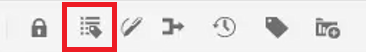

   Les balises s’affichent dans la rubrique. Avec la vue Balises sur , vous pouvez :

   - Sélectionnez le contenu d’un élément en cliquant sur la balise d’ouverture ou de fermeture.

   - Développez ou réduisez les balises en cliquant sur le signe « + » ou « - » dans la balise.

   - Utilisez le menu contextuel pour couper, copier ou coller l&#39;élément sélectionné.

   - Faites glisser et déposez des éléments en sélectionnant la balise et en déposant l’élément à un emplacement valide.

1. Cliquez à nouveau sur l’icône [!UICONTROL **Activer/désactiver la vue Balises**] pour masquer les balises.

Les balises disparaissent pour vous permettre de vous concentrer sur le texte.

## Verrouiller les ressources en cours d’utilisation

Le verrouillage (ou l’extraction) d’un fichier donne à l’utilisateur ou à l’utilisatrice un accès exclusif en écriture sur ce fichier. Lorsque le fichier est déverrouillé (ou archivé), les modifications sont enregistrées dans la version actuelle du fichier.

1. Cliquez sur l’icône [!UICONTROL **Verrouiller**] dans la barre d’outils secondaire.

   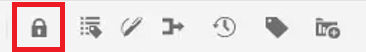

   Le fichier a été extrait et une icône de verrouillage s’affiche en regard du nom du fichier dans le référentiel.

1. Cliquez sur l’icône [!UICONTROL **Déverrouiller**].

   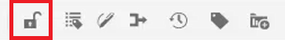

Le référentiel se met à jour pour indiquer que le fichier a été archivé.

## Insérer des caractères spéciaux

1. Cliquez sur l’icône [!UICONTROL **Insérer des caractères spéciaux**] dans la barre d’outils secondaire.

   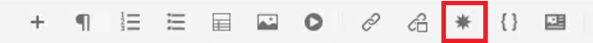

1. Dans la boîte de dialogue Insérer un caractère spécial, tapez le nom du caractère dans la barre de recherche.

   Vous pouvez également utiliser la liste déroulante Sélectionner une catégorie pour afficher tous les caractères d’une catégorie spécifique.

1. Sélectionnez le caractère souhaité.

1. Cliquez sur [!UICONTROL **Insérer**].

Le caractère spécial est inséré dans le texte.

## Basculez entre les modes Auteur, Source et Aperçu .

La barre d’outils située en haut à droite de l’écran vous permet de basculer entre les vues.

- Sélectionnez **Auteur** pour afficher la structure et le contenu lorsque vous utilisez une rubrique.

- Sélectionnez **** pour afficher le code XML sous-jacent qui constitue la rubrique.

- Sélectionnez **Aperçu** pour afficher une rubrique telle qu’elle sera affichée par un utilisateur dans son navigateur.

## Modifier le thème avec les Préférences utilisateur

Vous pouvez choisir parmi les thèmes clairs ou sombres pour l’éditeur. Avec le thème Clair , les barres d’outils et les panneaux utilisent un arrière-plan gris clair. En utilisant le thème Sombre , les barres d’outils et les panneaux utilisent un arrière-plan noir. Dans les deux thèmes, la zone de modification du contenu s’affiche avec un arrière-plan blanc.

1. Cliquez sur l’icône [!UICONTROL **Préférences utilisateur**] dans la barre d’outils supérieure.

   

1. Dans la boîte de dialogue Préférences utilisateur, cliquez sur le menu déroulant [!UICONTROL **Thème**].

1. Faites votre choix parmi les options disponibles.

   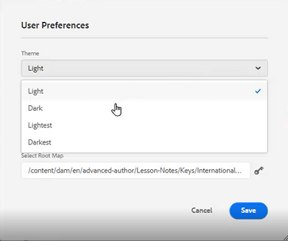

1. Cliquez sur [!UICONTROL **Enregistrer**].

L’éditeur est mis à jour pour afficher le thème de votre choix.

## Mettre à jour le chemin d’accès de base avec les préférences utilisateur

Vous pouvez mettre à jour le chemin d’accès de base afin que la vue du référentiel affiche le contenu d’un emplacement spécifique dès que vous lancez l’éditeur. Cela réduit le temps d’accès aux fichiers de travail.

1. Cliquez sur l’icône [!UICONTROL **Préférences utilisateur**] dans la barre d’outils supérieure.

   

1. Dans la boîte de dialogue Préférences utilisateur, cliquez sur l’icône [!UICONTROL **Dossier**] en regard du Chemin d’accès de base.

   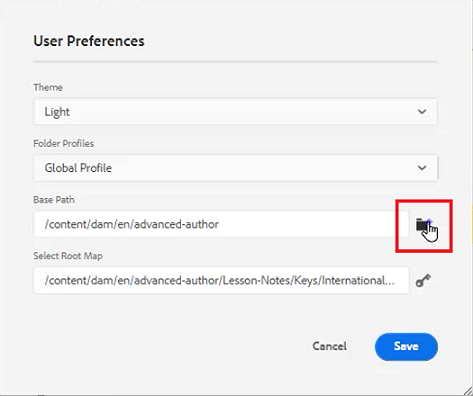

1. Dans la boîte de dialogue Sélectionner le chemin d’accès , cochez la case en regard d’un dossier spécifique.

1. Cliquez sur [!UICONTROL **Sélectionner**].

La prochaine fois que vous lancerez l’éditeur, le référentiel affichera les fichiers qui ont été spécifiés dans le chemin d’accès de base.

## Attribuer un nouveau profil de dossier

Le profil global est une valeur système par défaut. Les administrateurs peuvent créer des profils de dossier supplémentaires.

1. Cliquez sur l’icône [!UICONTROL **Préférences utilisateur**] dans la barre d’outils supérieure.

   

1. Dans la boîte de dialogue Préférences utilisateur, cliquez sur le menu déroulant [!UICONTROL **Profils de dossier**].

   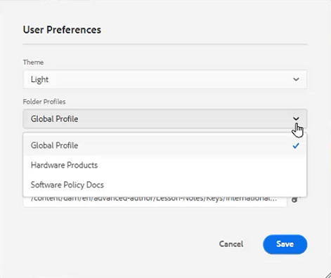

1. Choisissez un profil parmi les options disponibles.

1. Cliquez sur [!UICONTROL **Enregistrer**].

Le nouveau profil de dossier est maintenant affecté. Elle a modifié les options de la barre d’outils, les modes d’affichage, ainsi que les Conditions et Fragments de code dans le panneau de gauche. Elle peut également modifier l’aspect visuel du contenu dans l’éditeur.

## Modification du dictionnaire à l’aide des paramètres de l’éditeur

Les paramètres de l’éditeur sont disponibles pour les utilisateurs administrateurs. Ces préférences vous permettent de configurer différents paramètres, dont le dictionnaire utilisé par l’éditeur pour la vérification orthographique.

1. Cliquez sur l’icône [!UICONTROL **Paramètres de l’éditeur**] dans la barre d’outils supérieure.

   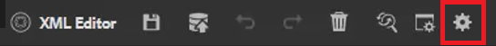

1. Dans la boîte de dialogue Paramètres de l’éditeur, cliquez sur l’onglet [!UICONTROL **Général**].

1. Sélectionnez le dictionnaire que vous souhaitez utiliser.

1. Cliquez sur [!UICONTROL **Enregistrer**].

Le dictionnaire est mis à jour. Notez que le passage à la vérification orthographique AEM vous permet d’utiliser une liste de mots personnalisée.

## Affichage et masquage des panneaux avec les paramètres de l’éditeur

Les panneaux sont l’une des fonctionnalités que vous pouvez personnaliser à l’aide des paramètres de l’éditeur. Plus précisément, vous pouvez sélectionner les panneaux affichés ou masqués dans l’éditeur.

1. Cliquez sur l’icône [!UICONTROL **Paramètres de l’éditeur**] dans la barre d’outils supérieure.

   

1. Dans la boîte de dialogue Paramètres de l’éditeur, cliquez sur l’onglet [!UICONTROL **Panneaux**].

1. Activez/désactivez les panneaux disponibles à afficher ou à masquer selon les besoins.

   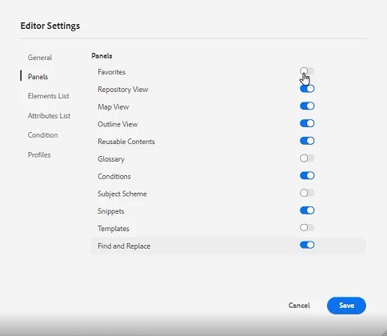

1. Cliquez sur [!UICONTROL **Enregistrer**].

Le panneau de gauche est maintenant configuré pour afficher uniquement les panneaux dont le bouton (bascule) est Afficher.

## Éléments de nom et de libellé dans les paramètres de l’éditeur

La liste Éléments vous permet de nommer un élément spécifique et de lui attribuer un libellé plus convivial. Le nom de l&#39;élément doit être un des éléments DITA. Le libellé peut être n’importe quelle chaîne.

1. Cliquez sur l’icône [!UICONTROL **Paramètres de l’éditeur**] dans la barre d’outils supérieure.

   

1. Dans la boîte de dialogue Paramètres de l’éditeur, cliquez sur l’onglet [!UICONTROL **Liste d’éléments**].

1. Saisissez un **Nom de l’élément** et un **Libellé** dans les champs respectifs.

1. Cliquez sur l’icône [!UICONTROL **Plus**] pour ajouter d’autres éléments à la liste.

   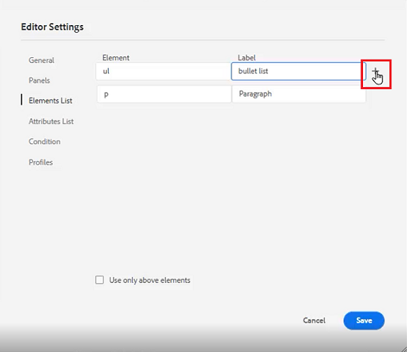

1. Cliquez sur [!UICONTROL **Enregistrer**].

Vous pouvez immédiatement voir la modification apportée à la liste des éléments dans les balises existantes dans l’éditeur. Vous pouvez également les voir dans les options fournies lorsque vous ajoutez un nouvel élément.

## Attributs de nom et de libellé dans les paramètres de l’éditeur

La liste des attributs fonctionne de la même manière que la liste des éléments. Dans les paramètres de l’éditeur, vous pouvez contrôler la liste des attributs et leurs noms d’affichage.

1. Cliquez sur l’icône [!UICONTROL **Paramètres de l’éditeur**] dans la barre d’outils supérieure.

   

1. Dans la boîte de dialogue Paramètres de l’éditeur, cliquez sur l’onglet [!UICONTROL **Liste d’attributs**].

1. Saisissez un **Nom de l’attribut** et un **Libellé** dans les champs respectifs.

1. Cliquez sur l’icône [!UICONTROL **Plus**] pour ajouter d’autres attributs à la liste.

## Configuration de conditions dans les paramètres de l’éditeur

L’onglet Condition vous permet de configurer plusieurs propriétés.

1. Cliquez sur l’icône [!UICONTROL **Paramètres de l’éditeur**] dans la barre d’outils supérieure.

   

1. Dans la boîte de dialogue Paramètres de l’éditeur, cliquez sur l’onglet [!UICONTROL **Condition**].

1. Cochez les cases des conditions à appliquer.

   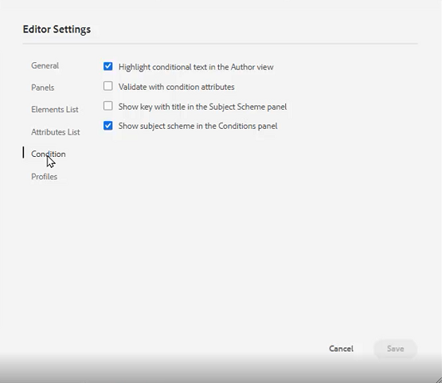

1. Cliquez sur [!UICONTROL **Enregistrer**].

## Créer un profil de publication dans les paramètres de l’éditeur

La publication de profils peut être utilisée pour publier la base de connaissances. Par exemple, Salesforce utilise une application configurée avec une clé du client et un secret du client. Ces informations peuvent être utilisées pour créer un profil de publication Salesforce.

1. Cliquez sur l’icône [!UICONTROL **Paramètres de l’éditeur**] dans la barre d’outils supérieure.

   

1. Dans la boîte de dialogue Paramètres de l’éditeur, cliquez sur l’onglet [!UICONTROL **Profils**].

1. Cliquez sur l’icône [!UICONTROL **Plus**] en regard de Profils.

1. Renseignez les champs selon vos besoins.

1. Cliquez sur [!UICONTROL **Enregistrer**].

Un profil de publication a été créé.
