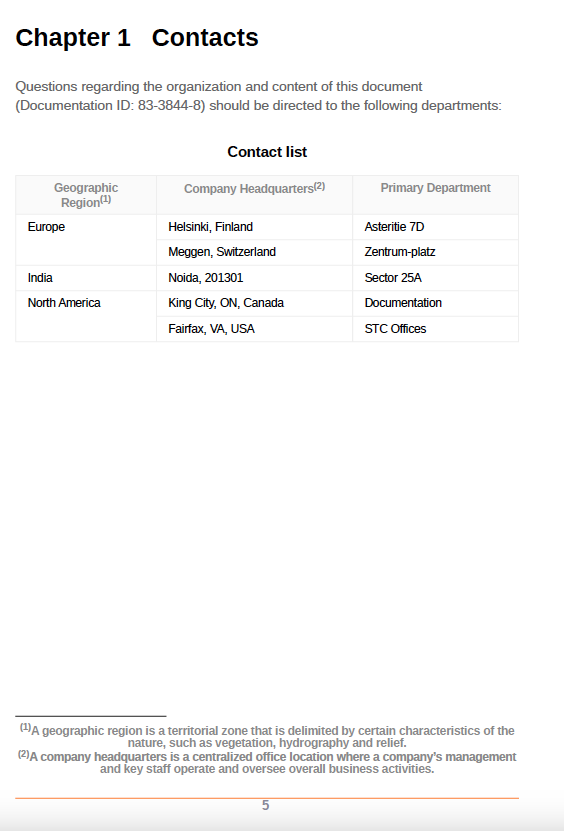

# Utilisation de styles personnalisés dans les notes de bas de page

Les notes de bas de page sont placées au bas d’une page qui commente ou cite une référence pour une partie désignée du texte.

Vous pouvez mettre en forme les numéros de l’appel de note de bas de page présents dans le contenu de la rubrique et le marqueur de note de bas de page. Par exemple, vous pouvez ajouter des crochets autour du nombre ou modifier leur couleur. Ces styles permettent d’identifier facilement les notes de bas de page dans le document.

```css
...
.footnote::footnote-call { 
content: "(" counter(footnote, decimal) ")"; 
} 

.footnote::footnote-marker { 
content: "(" counter(footnote, decimal) ")"; 
} 

...
```

Dans l’exemple donné, un crochet est ajouté avant et après l’appel de note de bas de page et le marqueur :

* Ajoutez le préfixe &quot;(&quot; et le suffixe &quot;)&quot; en utilisant l’attribut content dans la variable `footnote-call` style qui ajoute les crochets autour du numéro de note de bas de page dans le contenu de la rubrique.
* Ajoutez le préfixe &quot;(&quot; et le suffixe &quot;)&quot; en utilisant l’attribut content dans la variable `footnote-marker` style qui ajoute les crochets autour du numéro de la note de bas de page.


