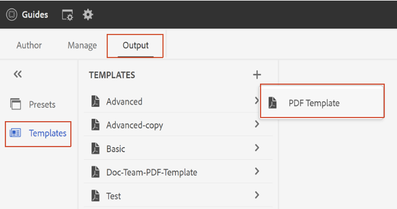

# Modèle de PDF {#PDF-template}

L’utilisation d’un modèle garantit la cohérence de la disposition et de la structure du contenu. Lorsque les modèles sont prédéfinis, vous pouvez éviter de retravailler les problèmes de mise en forme qui se produisent pour chaque nouveau projet ou mise à jour. Les modèles vous permettent de concevoir des mises en page de page, de mettre en forme le contenu et d’appliquer divers paramètres pour personnaliser votre PDF.

Bien que les auteurs puissent utiliser les paramètres prédéfinis du PDF pour générer la sortie, les développeurs peuvent créer leurs propres modèles. Des exemples de modèles prêts à l’emploi peuvent être personnalisés ou dupliqués par les développeurs en fonction de leurs besoins organisationnels.

## Créer un modèle de PDF {#create-pdf-template}

Vous pouvez créer des modèles de PDF personnalisés avec des mises en page spécifiques et définir la mise en forme des composants de mise en page (comme la table des matières, l’index, le glossaire) ou des composants DITA (comme l’en-tête, le paragraphe, la liste) à l’aide de feuilles de style. Vous pouvez créer un modèle entièrement nouveau ou le créer à partir d’un exemple de modèle.

Pour créer un modèle de PDF, procédez comme suit :
1. Dans l’éditeur Web, accédez à la **Sortie** .
1. Développez la barre latérale gauche et sélectionnez **Modèles**.

1. Dans le panneau **Modèles**, sélectionnez l’icône **+** en regard de **Modèles** et choisissez **Modèle PDF**.
1. Attribuez un nom au modèle dans la boîte de dialogue **Nouveau modèle**.
1. Cliquez sur **Terminé**.

Le nouveau modèle est créé et ajouté dans la variable *Modèles* du panneau.

## Dupliquer un modèle de PDF {#duplicate-pdf-template}

Si vous souhaitez créer un modèle avec les mêmes mises en page et mises en forme que le modèle existant, vous pouvez en créer une copie. Une fois qu’un modèle a été dupliqué, vous pouvez personnaliser davantage ses composants, si nécessaire.

Pour dupliquer un modèle de PDF existant, procédez comme suit :
1. Dans l’éditeur Web, accédez à la **Sortie** .
1. Développez la barre latérale gauche et sélectionnez **Modèles**.

   Le panneau Modèles s’ouvre alors.
1. Pointez sur le modèle à dupliquer, puis sélectionnez (*Options* icon) **..** et choisissez **Dupliquer** dans le menu contextuel.

   La boîte de dialogue Dupliquer le modèle s’ouvre alors.\
   
1. Attribuez un nom au modèle.

   La variable **Nom** est prérenseigné sous la forme d’une copie du même nom que le modèle source.

1. Pour spécifier un nom préféré, supprimez le nom prérenseigné et spécifiez un nom.
1. Cliquez sur **Terminé**.

   Un modèle en double est créé et ajouté sous Modèles.

## Personnalisation d’un modèle de PDF {#customize-pdf-template}

Vous pouvez personnaliser des modèles en ajustant les composants de modèle et en appliquant des formats de style à l’aide de feuilles de style.

Pour personnaliser un modèle de PDF, procédez comme suit :
1. Dans l’éditeur Web, accédez à l’onglet Sortie .
1. Développez la barre latérale gauche et sélectionnez Modèles.

   Le panneau Modèles s’ouvre alors.
1. Pour afficher les composants d’un modèle, effectuez l’une des opérations suivantes :

   * Sélectionnez l’icône > en regard d’un modèle ou double-cliquez sur le nom du modèle.
   * Pointez sur un modèle, sélectionnez l’icône ... (Options), puis choisissez Modifier dans le menu contextuel.

     Par défaut, le panneau Paramètres s’ouvre dans l’éditeur de modèles.
   

   >[!NOTE]
   >
   >  Votre administrateur peut télécharger les derniers modèles à partir du chemin suivant et remplacer les modèles existants :
   >
   > `/libs/fmdita/pdf`

   Les différents composants de modèle que vous pouvez personnaliser sont classés dans les sections suivantes :
   * Mise en page : un PDF type contient différentes pages, telles qu’une page de couverture ou de titre, la table des matières, le chapitre, l’index, les citations, etc. La section Mise en page vous permet de concevoir l’aspect des différentes pages qui constitueraient votre PDF. Pour plus d’informations, voir [Disposition de page](../native-pdf/components-pdf-template.md#page-layouts).

     En plus de l’aspect, vous pouvez définir la disposition des éléments de page, tels que l’en-tête, le pied de page et les zones de contenu d’une page. Pour en savoir plus sur la personnalisation de la mise en page d’une page, voir [Création et personnalisation de mises en page](components-pdf-template.md#create-customize-page-layout).

   * Feuilles de style : les paramètres de la section Feuilles de style vous permettent de personnaliser l’aspect des composants de mise en page tels que la table des matières, l’index, le glossaire, les citations, etc. En outre, vous pouvez également personnaliser les styles du contenu DITA comme les en-têtes, les paragraphes, les listes, etc. Pour plus d’informations sur l’utilisation des feuilles de style, voir [Utiliser des feuilles de style pour personnaliser PDF](components-pdf-template.md#stylesheet-customization).
   * Ressources : stockez les fichiers de ressources que vous devez personnaliser ou concevoir des modèles de PDF. Les ressources telles que les logos, les polices personnalisées, les images d’arrière-plan, etc., sont stockées dans les ressources. Pour en savoir plus sur l’utilisation des ressources, voir [Utilisation des ressources](components-pdf-template.md#work-with-resources).
   * Paramètres : configurez les paramètres de sortie pour générer un PDF à l’aide du modèle. Cette section vous permet de définir le mappage des modèles pour différentes pages d’un PDF, d’une page de début de chapitre, de marqueurs d’impression, de citations, etc.
Vous pouvez également organiser l’ordre dans lequel ils doivent apparaître dans la sortie finale du PDF.
Pour plus d’informations sur l’application des paramètres, voir [Paramètres du PDF avancé](components-pdf-template.md#advanced-pdf-settings).

1. Pour personnaliser un composant de modèle, double-cliquez sur un composant de modèle ou sélectionnez l’icône > devant celui-ci.

   Par exemple, double-cliquez sur *Disposition de page* ou sélectionnez l’option *>* avant *Disposition de page* pour afficher les mises en page disponibles.
1. Une fois les modifications souhaitées effectuées, sélectionnez *Enregistrer tout* (ou `Ctrl+S`).
