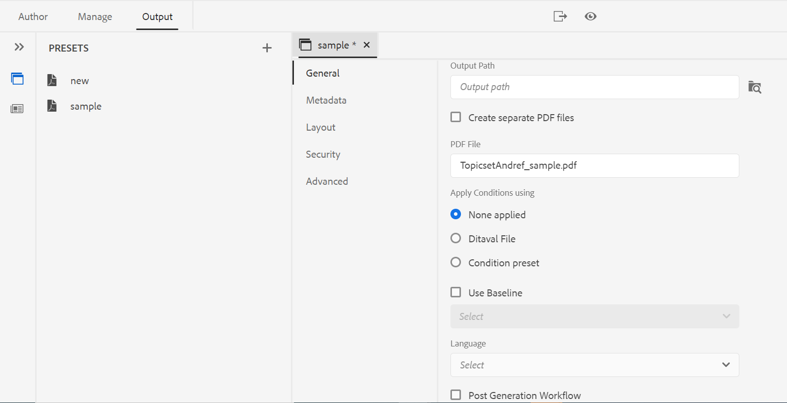

# Publier une sortie PDF

Avec la solution AEM Guides, vous pouvez générer des PDF de rubriques individuelles ou d’un fichier de mappage entier. Vous pouvez publier votre contenu dans un format PDF à l’aide de l’une des trois méthodes suivantes :

* **DITA-OT**

Utilisez cette méthode pour générer une sortie de PDF pour une carte à partir du tableau de bord de carte. Vous pouvez définir les propriétés de publication avant de générer le PDF en créant un paramètre prédéfini de sortie pour la carte ouverte dans le tableau de bord de la carte. Pour créer ou modifier un paramètre prédéfini de sortie, procédez comme suit : *Présentation des paramètres prédéfinis de sortie* dans la section [Guide de l’utilisateur d’AEM Guides as a Cloud Service](https://helpx.adobe.com/content/dam/help/en/xml-documentation-solution/cs-apr-22/XML-Documentation-for-Adobe-Experience-Manager_CS_User-Guide_EN.pdf).

Pour plus d’informations sur la génération d’un PDF à l’aide de la méthode DITA-OT, voir [Générer un PDF à l’aide de DITA-OT](https://help.adobe.com/en_US/xml-documentation-for-adobe-experience-manager/index.html#t=DXML-master-map%2Fgenerate-output-pdf.html).

* **FrameMaker Publishing Server (FMPS)**

Utilisez cette méthode pour générer une sortie de PDF à partir non seulement du contenu DITA, mais également des documents FrameMaker (.book et .fm) disponibles dans votre référentiel AEM. Le PDF peut être créé en configurant un paramètre prédéfini de sortie et publié à l’aide de FrameMaker Publishing Server (FMPS). Vous pouvez concevoir et configurer l’aspect de votre sortie pour les formats PDF et autres, puis les stocker dans un fichier de paramètres (.sts). Ce fichier de paramètres est ensuite utilisé par FMPS pour générer une sortie pour un mappage DITA ou un fichier .book. Pour créer ou modifier un paramètre prédéfini de sortie, voir  *Présentation des paramètres prédéfinis de sortie* dans la section [Guide de l’utilisateur d’AEM Guides as a Cloud Service](https://helpx.adobe.com/content/dam/help/en/xml-documentation-solution/cs-apr-22/XML-Documentation-for-Adobe-Experience-Manager_CS_User-Guide_EN.pdf).

Pour plus d’informations sur la configuration de FMPS, voir [Génération d’une sortie à partir de documents FrameMaker](https://help.adobe.com/en_US/xml-documentation-for-adobe-experience-manager/index.html#t=DXML-master-map%2Ffm-output-generatation.html).

* **Publication de PDF natifs**

Utilisez cette méthode pour générer une sortie de PDF riche en fonctionnalités basée sur les normes W3C CSS3 et CSS paged Media. Avec la publication avec des PDF natifs, vous pouvez utiliser des modèles pour définir la mise en page et le style de votre contenu et appliquer divers paramètres pour affiner votre PDF. En outre, vous pouvez modifier et créer vos propres modèles à l’aide de l’éditeur de modèles.

Pour plus d’informations sur la publication avec des PDF natifs, voir [Utilisation de la publication de PDF natifs](#native-pdf-publishing).

## Utilisation de la publication de PDF natif {#native-pdf-publishing}

Lors de la création de contenu, il devient essentiel de s’assurer que le contenu est optimisé pour l’affichage, la modification et l’impression. Grâce à des normes telles que le W3C CSS3 pour le style de contenu et les normes de médias paginés CSS pour les propriétés de définition de page telles que la taille, les marges, l’orientation, les sauts de page, les en-têtes, les pieds de page et la numérotation de pages, vous pouvez définir l’affichage et la mise en page de votre document de PDF pour garantir la cohérence et la convivialité. La fonction de publication de PDF natif utilise ces normes pour générer un PDF.

Avec la publication native de PDF, vous pouvez utiliser des modèles prédéfinis pour assurer la cohérence de la disposition et de la structure du contenu, appliquer des feuilles de style pour modifier l’aspect de votre sortie, optimiser le PDF, définir des repères d’impression, permettre la prise en charge des lecteurs d’écran, définir la conformité du PDF, incorporer des polices, etc.

La génération d’un PDF à l’aide de la publication d’un PDF natif comporte deux aspects :

* Utilisez les modèles pour appliquer un style au contenu, définir des mises en page et divers paramètres afin d’affiner votre PDF. Les auteurs peuvent choisir d’utiliser/de modifier les exemples de modèles fournis ou de créer des modèles personnalisés et de définir des options de configuration avancées utilisées par les éditeurs et les développeurs.

* Créez ou configurez un paramètre prédéfini de sortie du PDF pour contrôler les paramètres du PDF. Une fois que vous avez créé un paramètre prédéfini de sortie de PDF, vous pouvez générer le PDF.

Pour plus d’informations, voir [Génération d’une sortie de PDF](#generate-pdf-output).

## Création d’un paramètre prédéfini de sortie PDF {#create-output-preset}

La première étape de la génération d’une sortie de PDF consiste à créer un paramètre prédéfini de sortie de PDF, qui est un ensemble de propriétés de publication affectées à un mappage. Vous pouvez créer un paramètre prédéfini de sortie pour n’importe quel mappage ouvert dans le panneau Affichage des cartes ou configurer un paramètre prédéfini existant afin de générer rapidement un PDF pour le même mappage.

À partir du paramètre prédéfini de sortie du PDF, vous pouvez sélectionner un modèle, appliquer des conditions, définir des restrictions pour contrôler l’interaction d’un utilisateur avec votre PDF, configurer des paramètres avancés tels que la compression, la conformité, etc.

Pour créer ou configurer un paramètre prédéfini de sortie de PDF :

1. Dans l’onglet Sortie , cliquez sur **Paramètres prédéfinis** dans la barre latérale gauche.
Le panneau Paramètre prédéfini s’ouvre.
   
2. Dans la sortie **Paramètres prédéfinis** effectuez l’une des opérations suivantes :
   * Double-cliquez sur un paramètre prédéfini de sortie de PDF prédéfini pour l’afficher.
   * Cliquez sur l’icône + pour **Paramètres prédéfinis** pour ajouter un nouveau paramètre prédéfini de sortie de **Type : PDF**
3. Pour configurer les paramètres d’un paramètre prédéfini de PDF existant :
   * Cliquez sur le bouton  **Options**  en regard du paramètre prédéfini de sortie souhaité, puis sélectionnez **Modifier**.
Vous pouvez utiliser les paramètres suivants dans la variable **Général**, **Disposition**, **Sécurité**, et **Avancé** onglets pour configurer un paramètre prédéfini de sortie PDF :

**Général**

Utilisez pour spécifier les paramètres de sortie de base, tels que le chemin de sortie, le nom de fichier du PDF, etc.

| Configuration | Description |
| --- | --- |
| **Chemin d’accès de sortie** | Chemin d’accès dans le référentiel AEM où est stockée la sortie du PDF. Assurez-vous que le chemin d’accès de sortie ne se trouve pas dans le dossier du projet. Si rien n’est indiqué, la sortie est générée à l’emplacement de sortie du mappage DITA par défaut. |
| **Fichier PDF** | Indiquez un nom de fichier pour l’enregistrement du PDF. Par défaut, le nom de fichier du PDF ajoute le nom du mappage DITA avec le nom du paramètre prédéfini. Par exemple, ditamap est &quot;TestMap&quot; et le nom du paramètre prédéfini est &quot;preset1&quot;. Le nom par défaut du pdf sera &quot;TestMap_preset1.pdf&quot;. |
| **Appliquer les conditions à l’aide de** | Pour le contenu conditionnel, choisissez l’une des options ci-dessous afin de générer une sortie PDF basée sur ces conditions :  * **Aucun appliqué** Sélectionnez cette option si vous ne souhaitez appliquer aucune condition sur la carte et le contenu source.   * **Fichier Ditaval** Sélectionnez un fichier DITAVAL pour générer du contenu conditionnel. Pour sélectionner, cliquez sur paramètre prédéfini de condition et recherchez le fichier.   * **Paramètre prédéfini de condition** Sélectionnez un paramètre prédéfini de condition dans la liste déroulante pour appliquer une condition lors de la publication de la sortie. Cette option est visible si vous avez ajouté une condition pour le fichier de mappage DITA. Les paramètres conditionnels sont disponibles dans l’onglet Paramètres prédéfinis de condition de la console de mappage DITA. Pour en savoir plus sur le paramètre prédéfini de condition, voir [Utilisation des paramètres de condition prédéfinis](https://help.adobe.com/en_US/xml-documentation-for-adobe-experience-manager/index.html#t=DXML-master-map%2Fgenerate-output-use-condition-presets.html).   |
| **Utilisation de la ligne de base** | Si vous avez créé une ligne de base pour le mappage DITA sélectionné, sélectionnez cette option pour spécifier la version que vous souhaitez publier. Voir [Utilisation de la ligne de base](https://help.adobe.com/en_US/xml-documentation-for-adobe-experience-manager/index.html#t=DXML-master-map%2Fgenerate-output-use-baseline-for-publishing.html) pour plus d’informations. |

**Mise en page**

Utilisez pour définir des mises en page et des options de page vue pour la sortie du PDF, telles que l’affichage de la page et les niveaux de zoom.

| Configuration | Description |
| --- | --- |
| **Modèle de PDF** | Les modèles PDF fournissent une structure claire pour définir la mise en page, le style du contenu et l’application de divers paramètres à la sortie du PDF. Sélectionnez dans la liste déroulante Modèle de PDF pour choisir le modèle de votre choix. |
| **Affichage de page** | Utilisez l’affichage de page pour une page vue qui indique comment le PDF s’affiche à l’ouverture. Sélectionnez dans la liste déroulante Affichage de page pour choisir la vue souhaitée.  * **Par défaut**  S’affiche selon le paramètre par défaut de la visionneuse du PDF sur la machine d’un utilisateur.    * **Une seule page vue** Affiche une page à la fois.     * **Défilement d’une seule page** Affiche une seule page dans une colonne verticale continue.    * **Deux pages vues** Affiche côte à côte deux pages espacées. .  * **Défilement de deux pages** Affiche l’espacement de deux pages côte à côte avec défilement continu. |
| **Zoom** | Sélectionnez cette option pour redimensionner la page vue qui indique comment le PDF s’affiche à l’ouverture.   * **Par défaut** S’affiche selon le paramètre par défaut de la visionneuse du PDF sur la machine d’un utilisateur.      * **100 %** Fait apparaître la page dans sa taille réelle.       * **Page entière** Rend la largeur et la hauteur de la page compatibles avec le panneau du document. .  * **Ajuster la largeur de page** Remplit la largeur de la page dans le volet de document.    * **Ajuster la hauteur de page** Fait en sorte que la hauteur de la page soit remplie par celle du panneau de document. |

**Sécurité**

Protect votre PDF en ajoutant des restrictions pour ouvrir et lire le fichier. Utilisez les options ci-dessous pour éviter tout accès non autorisé.

| Configuration | Description |
| --- | --- |
| **Définition du mot de passe pour ouvrir le document** | Sélectionnez cette option pour ajouter un mot de passe sécurisé afin d’afficher votre fichier de PDF. Indiquez un mot de passe dans la variable **Mot de passe utilisateur** champ . Les utilisateurs peuvent ouvrir le PDF uniquement en saisissant le mot de passe fourni dans ce champ. |
| **Définition des restrictions du document** | Sélectionnez cette option pour restreindre la manière dont les utilisateurs peuvent interagir avec votre PDF. Indiquez un mot de passe dans la variable **Mot de passe du propriétaire** pour que les paramètres de restriction ci-dessous fonctionnent.   * **Impression** Sélectionnez cette option pour permettre à un utilisateur d’imprimer le PDF.   * **Impression de qualité Brouillon** Sélectionnez cette option pour permettre à un utilisateur d’imprimer le PDF avec une résolution inférieure.    * **Copie de contenu** Sélectionnez cette option pour permettre à un utilisateur de copier le contenu depuis le PDF.     * **Annotations** Sélectionnez cette option pour permettre à un utilisateur d’ajouter une note ou un commentaire dans le PDF.    * **Modifications du contenu** Sélectionnez cette option pour permettre à un utilisateur de modifier le contenu dans le PDF.    * **Copie de contenu pour accessibilité** Sélectionnez cette option pour permettre aux lecteurs d’écran de lire et de parcourir le contenu dans PDF.    * **Assemblage de documents** Sélectionnez cette option pour permettre aux utilisateurs d’insérer des pages dans le PDF.    **Remarque**: Les utilisateurs doivent saisir le mot de passe du propriétaire pour modifier les restrictions dans Fichier > Propriétés dans Adobe Acrobat. |

**Avancé**

Utilisez les options suivantes pour définir des paramètres avancés pour fusionner des PDF, utiliser la compression, sélectionner la norme de conformité, etc.

| Configuration | Description |
| --- | --- |
| **Créer un PDF accessible (balisé)** | Sélectionnez cette option pour générer un PDF avec des balises. Un PDF balisé permet aux lecteurs d’écran de lire et de parcourir plus facilement le contenu, les liens hypertexte, les signets, etc. Par exemple, si un tableau est balisé, le lecteur d’écran sait qu’il lit le tableau et pas seulement les lignes et le texte. |
| **Fusion des PDF inclus dans la table des matières** | Sélectionnez cette option pour fusionner des PDF existants dans votre sortie en les ajoutant à votre table des matières. Les PDF sont insérés à l’emplacement représenté dans la table des matières et les pages sont incrémentées en conséquence. |
| **Incorporer les polices utilisées** | Sélectionnez cette option lors de l’utilisation de polices qui ne peuvent pas être installées sur l’ordinateur de l’utilisateur final. Lorsque cette option est sélectionnée, les polices utilisées sont incorporées dans le PDF, ce qui permet à l’utilisateur de voir le PDF comme prévu, même si les polices ne sont pas installées sur son ordinateur.   **Remarque**: Une police ne peut être incorporée que si elle contient un paramètre du fournisseur de police qui lui permet d’être incorporée. Assurez-vous de disposer du paramètre ou de la licence requis avant d’incorporer une police. |
| **Utilisation de la césure automatique** | Lorsque la césure automatique est activée, les mots situés à la fin des lignes sont rompus dans des zones grammaticalement correctes avec un trait d’union. |
| **Activation de JavaScript** | Activez cette option si vous disposez d’un code JavaScript que vous souhaitez utiliser pour transformer dynamiquement votre contenu avant de générer un PDF. |
| **Incorporer des fichiers multimédias** | Sélectionnez cette option pour inclure tout contenu audio, vidéo et interactif dans le PDF. |
| **Utiliser la compression complète pour optimiser la taille du PDF** | Sélectionnez cette option si vous souhaitez compresser/réduire la taille d’un PDF volumineux. N’oubliez pas que la compression du PDF peut réduire la qualité du fichier. |
| **Utiliser la compression d’image pour optimiser la taille du PDF** | Sélectionnez cette option si vous souhaitez compresser/réduire la taille des images utilisées, dans votre PDF. N’oubliez pas que la compression d’une image peut réduire la qualité de l’image. |
| **Utiliser la résolution personnalisée (pixels par pouce)** | Il s’agit de la résolution d’affichage de la page en pixels par pouce. Saisissez la valeur souhaitée dans le champ qui s’affiche lorsque cette option est sélectionnée. La valeur par défaut est de 96 pixels par pouce. Si vous définissez une valeur inférieure, définissez une valeur plus élevée afin d’y placer plus de contenu par pouce, et vice versa. |
| **Afficher le filigrane** | Sélectionnez cette option pour effectuer le rendu des équations MathML présentes dans votre contenu. Les équations seront ignorées dans le cas contraire. |
| **Activation des équations MathML** | Sélectionnez cette option pour effectuer le rendu des équations MathML présentes dans votre contenu. Dans le cas contraire, les équations seront ignorées par défaut. |
| **Conformité du PDF** | Il s’agit de la norme à laquelle vous envisagez d’enregistrer votre PDF pour vous assurer qu’il est conforme. Sélectionnez dans la liste déroulante pour effectuer un choix dans la liste des normes de PDF disponibles. Pour plus d’informations sur les normes prises en charge, voir [A propos des normes PDF](https://helpx.adobe.com/acrobat/using/pdf-conversion-settings.html#about_pdf_x_pdf_e_and_pdf_a_standards). |

## Génération d’une sortie de PDF {#generate-pdf-output}

Une fois que vous avez configuré le paramètre prédéfini de sortie, vous pouvez générer une sortie à partir du panneau Paramètres prédéfinis, à l’aide de la fonction **Générer un paramètre prédéfini** fonction .

1. Sous , **Auteur** , sélectionnez la variable **Référentiel** Afficher.\
   Le panneau Référentiel s’ouvre alors.

2. Dans le panneau Repository, ouvrez le fichier de mappage DITA dans **Vue Carte**.

3. Dans le **Sortie** , cliquez sur **Paramètres prédéfinis** pour afficher le panneau Paramètre prédéfini.
Pour créer ou configurer un paramètre prédéfini de sortie, voir [Création d’un paramètre prédéfini de sortie PDF](#create-output-preset).
4. Pour enregistrer vos paramètres, cliquez sur le bouton **Enregistrer tout**  dans le coin supérieur gauche de la barre d’outils standard de la vue Output.
5. Cliquez sur le bouton **Générer un paramètre prédéfini**  sur la barre supérieure.
Vous pouvez afficher une barre de progression en regard du paramètre prédéfini de sortie sélectionné dans le panneau Paramètres prédéfinis de sortie.
6. Une fois la génération de la sortie terminée, cliquez sur  **Afficher la sortie**  sur la barre supérieure pour afficher la sortie.\
   A **Succès** est visible dans le coin inférieur droit de l’écran.
Si une sortie échoue, le message d’erreur ci-dessous s’affiche.
   

Pour afficher le journal des erreurs, cliquez sur **Ignorer**, passez la souris sur l’onglet de paramètre prédéfini sélectionné, puis cliquez sur  **Options** > **Afficher le journal**.
